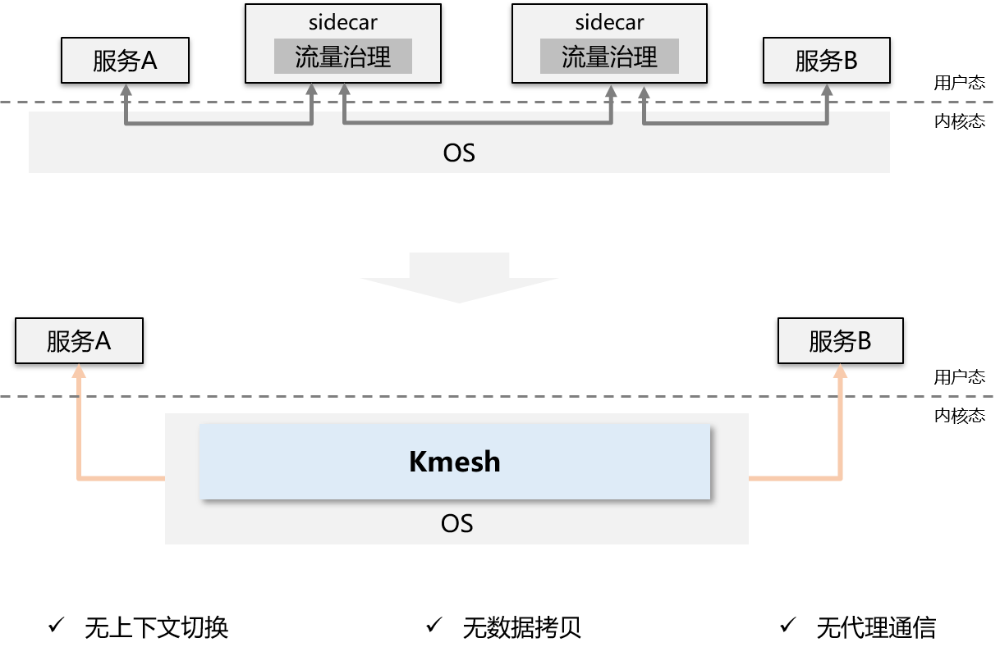

### 介绍

Kmesh是一种基于可编程内核实现的高性能服务网格数据面；提供服务网格场景下高性能的服务通信基础设施。

### 为什么需要Kmesh

#### 服务网格数据面的挑战

Istio为代表的服务网格已逐步流行，成为云上基础设施的重要组成；但当前的服务网格仍面临一定的挑战：

- **代理层引入额外时延开销**：服务访问单跳增加[2~3ms](https://istio.io/latest/docs/ops/deployment/performance-and-scalability/#data-plane-performance)，无法满足时延敏感应用的SLA诉求；虽然社区基于该问题演进出了多种数据面方案，但仍无法完全消减代理引入的开销；
- **资源占用大**：代理占用额外CPU/MEM开销，业务容器部署密度下降；

#### Kmesh：内核级原生流量治理

Kmesh创新性的提出将流量治理下沉OS，在数据路径上无需经过代理层，构建应用透明的sidecarless服务网格。



#### Kmesh关键特性

**平滑兼容**

- 应用透明的流量治理
- 自动对接Istiod

**高性能**

- 网格转发时延**60%↓**
- 服务启动性能**40%**↑

**低开销**

- 网格底座开销**70%↓**

**安全隔离**

- ebpf虚机安全
- cgroup级编排隔离

**全栈可视化**

- 端到端指标采集*
- 主流观测平台对接*

**开放生态**

- 支持XDS协议标准

注：* 规划中；

### 快速开始

- 前提条件

  - Kmesh当前是对接Istio控制面，启动Kmesh前，需要提前安装好Istio的控制面软件；具体安装步骤参考：https://istio.io/latest/docs/setup/getting-started/#install
  - 完整的Kmesh能力依赖对OS的增强，需确认执行环境是否在Kmesh支持的[OS列表](docs/kmesh_support-zh.md)中，对于其他OS环境需要参考[Kmesh编译构建](docs/kmesh_compile-zh.md)；

- Kmesh容器镜像准备

  ```sh
  # /etc/docker/daemon.json 中添加镜像源 hub.oepkgs.net
  [root@ ~]# cat /etc/docker/daemon.json
      {
              "insecure-registries": [
              		...,
                      "hub.oepkgs.net"
              ]
      }
  
  # docker pull
  [root@ ~]# docker pull hub.oepkgs.net/oncn/kmesh:latest
  ```
  
- 启动Kmesh容器

  ```sh
  # get kmesh.yaml：来自代码仓 build/docker/kmesh.yaml
  [root@ ~]# kubectl apply -f kmesh.yaml
  ```
  
  默认使用Kmesh功能，可通过调整yaml文件中的启动参数进行功能选择
  
- 查看kmesh服务启动状态

  ```sh
  [root@ ~]# kubectl get pods -A -owide | grep kmesh
  default        kmesh-deploy-j8q68                   1/1     Running   0          6h15m   192.168.11.6    node1   <none> 
  ```

- 查看kmesh服务运行状态

    ```sh
    [root@ ~]# kubectl logs -f kmesh-deploy-j8q68
    time="2023-07-25T09:28:37+08:00" level=info msg="options InitDaemonConfig successful" subsys=manager
    time="2023-07-25T09:28:38+08:00" level=info msg="bpf Start successful" subsys=manager
    time="2023-07-25T09:28:38+08:00" level=info msg="controller Start successful" subsys=manager
    time="2023-07-25T09:28:38+08:00" level=info msg="command StartServer successful" subsys=manager
    ```

  更多Kmesh编译构建方式，请参考[Kmesh编译构建](docs/kmesh_compile-zh.md)

### Kmesh性能

基于fortio对比测试了Kmesh和envoy的数据面执行性能；测试结果如下：


完整的性能测试请参考[Kmesh性能测试](test/performance/README.md)；

### 软件架构


Kmesh的主要部件包括：

- kmesh-controller：

  kmesh管理程序，负责Kmesh生命周期管理、XDS协议对接、观测运维等功能；

- kmesh-api：

  kmesh对外提供的api接口层，主要包括：xds转换后的编排API、观测运维通道等；

- kmesh-runtime：

  kernel中实现的支持L3~L7流量编排的运行时；

- kmesh-orchestration：

  基于ebpf实现L3~L7流量编排，如路由、灰度、负载均衡等；

- kmesh-probe：

  观测运维探针，提供端到端观测能力；

### 特性说明

- Kmesh命令列表

  [Kmesh命令列表](docs/kmesh_commands-zh.md)

- demo演示

  [Kmesh demo演示](docs/kmesh_demo-zh.md)

### Kmesh能力地图

| 特性域       | 特性                     |          2023.H1           |          2023.H2           |          2024.H1           |          2024.H2           |
| ------------ | ------------------------ | :------------------------: | :------------------------: | :------------------------: | :------------------------: |
| 流量管理     | sidecarless网格数据面    |  |                            |                            |                            |
|              | sockmap加速              |                            |  |                            |                            |
|              | 基于ebpf的可编程治理     |  |                            |                            |                            |
|              | http1.1协议              |  |                            |                            |                            |
|              | http2协议                |                            |                            |                            |  |
|              | grpc协议                 |                            |                            |                            |  |
|              | quic协议                 |                            |                            |                            |  |
|              | tcp协议                  |                            |  |                            |                            |
|              | 重试                     |                            |                            |  |                            |
|              | 路由                     |  |                            |                            |                            |
|              | 负载均衡                 |  |                            |                            |                            |
|              | 故障注入                 |                            |                            |  |                            |
|              | 灰度发布                 |                            |  |                            |                            |
|              | 熔断                     |                            |                            |  |                            |
|              | 限流                     |                            |                            |  |                            |
| 服务安全     | mTLS                     |                            |                            |                            |  |
|              | L7授权                   |                            |                            |                            |  |
|              | 治理pod级隔离            |  |                            |                            |                            |
| 流量监控     | 基础观测（治理指标监控） |                            |  |                            |                            |
|              | E2E可观测                |                            |                            |                            |  |
| 可编程       | 插件式扩展能力           |                            |                            |                            |  |
| 生态协作     | 数据面协同（Envoy等）    |                            |  |                            |                            |
| 运行环境支持 | 容器                     |  |                            |                            |                            |

