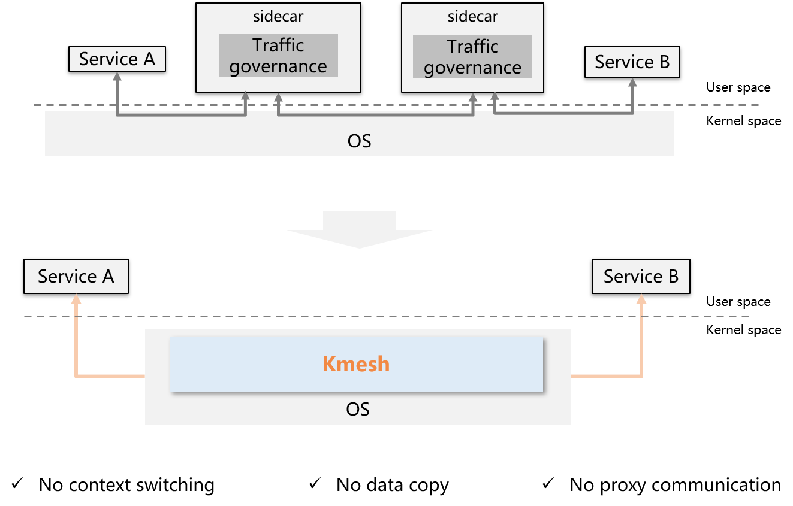

## Introduction

Kmesh is a high-performance service mesh data plane software based on programmable kernel. Provides high-performance service communication infrastructure in service mesh scenarios.

## Why Kmesh

### Challenges of the Service Mesh Data Plane

The service mesh software represented by Istio has gradually become popular and has become an important component of cloud infrastructure. However, the current service mesh still face some challenges:

- **Extra latency overhead at the proxy layer**: Single hop service access increases by [2~3ms](https://istio.io/latest/docs/ops/deployment/performance-and-scalability/#data-plane-performance), which cannot meet the SLA requirements of latency-sensitive applications. Although the community has come up with a variety of data plane solutions to this problem, the overhead introduced by agents cannot be completely reduced.
- **High resources occupation**: The agent occupies extra CPU/MEM overhead, and the deployment density of service container decreases.

### Kmesh：Kernel-native traffic governance

Kmesh innovatively proposes to move traffic governance to the OS, and build a transparent sidecarless service mesh without passing through the proxy layer on the data path.

### Key features of Kmesh

**Smooth Compatibility**

- Application-transparent Traffic Management
- Automatically interconnecting with Istiod

**High Performance**

- Forwarding delay **60%↓**
- Service startup performance **40%↑**

**Low Overhead**

- ServiceMesh data plane overhead **70%↓**

**Safety Isolation**

- eBPF Virtual machine security
- Cgroup level orchestration isolation

**Full Stack Visualization**

- E2E observation*
- Integration with Mainstream Observability Platforms*

**Open Ecology**

- Supports XDS protocol standards

Note: * Planning

## Quick Start

Please refer to [quick start](https://kmesh.net/en/docs/setup/quickstart/).

## Kmesh Performance

Based on Fortio, the data plane execution performance of Kmesh and Envoy was compared and tested. The test results are as follows:

For a complete performance test, please refer to [Kmesh Performance Test](test/performance/README.md).

## Software Architecture

The main components of Kmesh include:

- Kmesh-daemon: The management program responsible for Kmesh lifecycle management, XDS protocol integration, observability, and other functions.
- Ebpf orchestration: The traffic orchestration implemented based on eBPF, including routing, canary deployments, load balancing, and more.
- Waypoint: Based on istio proxy to adapt to Kmesh protocol, responsible for L7 traffic governance.

## Feature Description

- Command List

  [Kmesh Command List](docs/kmesh_commands.md)

- Demo

  [Kmesh demo demonstration](docs/kmesh_demo.md)

## Kmesh Capability Map

| Feature Field       | Feature                     |          2023.H1           |          2023.H2           |          2024.H1           |          2024.H2           |
| ------------ | ------------------------ | :------------------------: | :------------------------: | :------------------------: | :------------------------: |
| Traffic management     | sidecarless mesh data  plane   | √ |                            |                            |                            |
|              | sockmap accelerate       |                            | √ |                            |                            |
|              | Programmable governance based on ebpf | √ |                            |                            |                            |
|              | http1.1 protocol         | √ |                            |                            |                            |
|              | http2 protocol           |                            |                            |                            | √ |
|              | grpc protocol            |                            |                            |                            | √ |
|              | quic protocol            |                            |                            |                            | √ |
|              | tcp protocol             |                            | √ |                            |                            |
|              | Retry                    |                            |                            | √ |                            |
|              | Routing                  | √ |                            |                            |                            |
|              | load balance             | √ |                            |                            |                            |
|              | Fault injection |                            |                            | √ |                            |
|              | Gray release   |                            | √ |                            |                            |
|              | Circuit Breaker |                            |                            | √ |                            |
|              | Rate Limits    |                            |                            | √ |                            |
| Service security | mTLS |                            |                            |                            | √ |
|              | L7 authorization |                            |                            |                            | √ |
|              | Cgroup-level isolation | √ |                            |                            |                            |
| Traffic monitoring | Governance indicator monitoring |                            | √ |                            |                            |
|              | End-to-End observability |                            |                            |                            | √ |
| Programmable | Plug-in expansion capability |                            |                            |                            | √ |
| Ecosystem collaboration | Data plane collaboration (Envoy etc.) |                            | √ |                            |                            |
| Operating environment support | container                | √ |                            |                            |                            |

## Contact

If you have questions, feel free to reach out to us in the following ways:

- [meeting notes](https://docs.google.com/document/d/1fFqolwWMVMk92yXPHvWGrMgsrb8Xru_v4Cve5ummjbk)
- [mailing list](https://groups.google.com/forum/#!forum/kmesh)
- [slack](https://cloud-native.slack.com/archives/C06BU2GB8NL)
- [twitter](https://twitter.com/kmesh_net)

## Contributing

If you're interested in being a contributor and want to get involved in developing the Kmesh code, please see [CONTRIBUTING](CONTRIBUTING.md) for details on submitting patches and the contribution workflow.

## License

Kmesh is under the Apache 2.0 license. See the [LICENSE](LICENSE) file for details.

Kmesh documentation is under the [CC-BY-4.0 license](https://creativecommons.org/licenses/by/4.0/legalcode).

## Credit

This project was initially incubated in the [openEuler community](https://gitee.com/openeuler/Kmesh), thanks openEuler Community for the help on promoting this project in early days.
