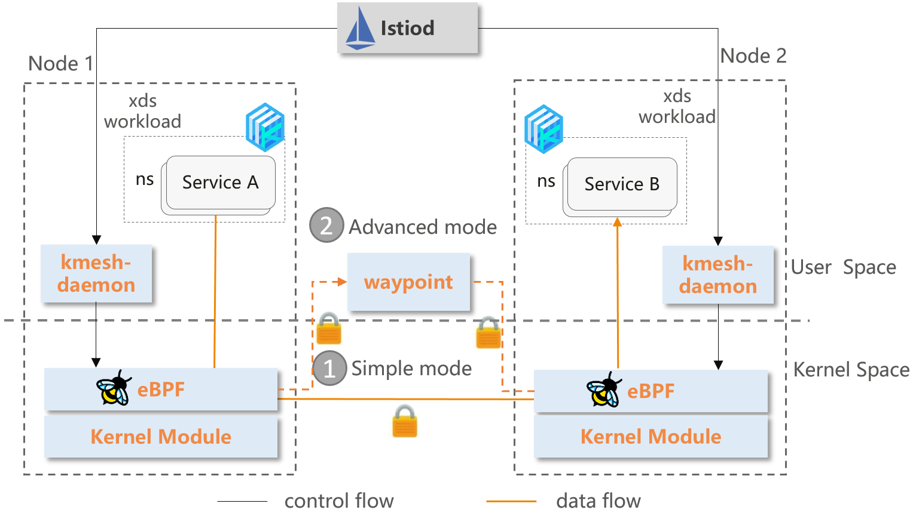
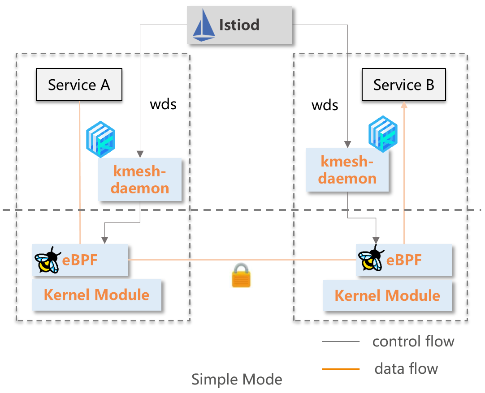
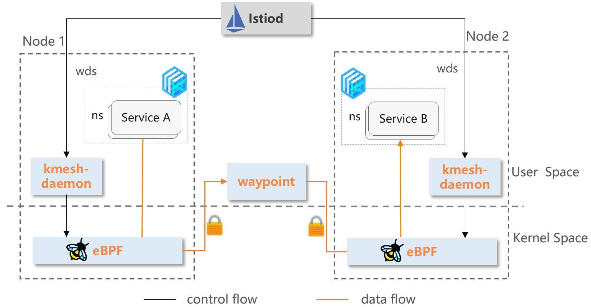

## Introduction

Kmesh is a high-performance and low overhead service mesh data plane based on eBPF and programmable kernel. Kmesh brings traffic management, security and monitoring to service communication without needing application code changes. It is natively sidecarless, zero intrusion and without adding any resource cost to application container.

## Why Kmesh

### Challenges of the Service Mesh Data Plane

Service mesh software represented by Istio has gradually become popular and become an important component of cloud native infrastructure. However, there are still some challenges faced:

- **Extra latency overhead at the proxy layer**: Add [2~3ms](https://istio.io/v1.19/docs/ops/deployment/performance-and-scalability/) latency, which cannot meet the SLA requirements of latency-sensitive applications. Although the community has come up with a variety of optimizations, the overhead introduced by sidecar cannot be completely reduced.
- **High resources occupation**: Occupy 0.5 vCPU and 50 MB memory per 1000 requests per second going through the proxy, and the deployment density of service container decreases.

### Kmesh Architecture

Kmesh transparently intercept and forward traffic based on node local eBPF without introducing extra connection hops, both the latency and resource overhead are negligible.

The main components of Kmesh include:

- Kmesh-daemon: The management component per node responsible for bpf prog management, xDS configuration subscribe, observability, and etc.
- Ebpf orchestration: The traffic orchestration implemented based on eBPF, supports L4 load balancing, traffic encryption, monitoring and Simple L7 dynamic routing.
- Waypoint: Responsible for advanced L7 traffic governance, can be deployed separately per namespace, per service.

Kmesh innovatively sinks Layer 4 and Simple Layer 7 (HTTP) traffic governance to the kernel, and build a transparent sidecarless service mesh without passing through the proxy layer on the data path.

Kmesh also provide an advanced mode, which makes use of eBPF and waypoint to process L4 and L7 traffic separately, thus allow you to adopt Kmesh incrementally, enabling a smooth transition from no mesh, to a secure L4, to full L7 processing.

### Key features of Kmesh

**Smooth Compatibility**

- Application-transparent Traffic Management

**High Performance**

- Forwarding delay **60%↓**
- Workload startup performance **40%↑**

**Low Resource Overhead**

- ServiceMesh data plane overhead **70%↓**

**Zero Trust**

- Provide zero trust security with default mutual TLS
- Policy enforcement both in eBPF and waypoints

**Safety Isolation**

- eBPF Virtual machine security
- Cgroup level orchestration isolation

**Open Ecology**

- Supports XDS protocol standards
- Support [Gateway API](https://gateway-api.sigs.k8s.io/)

## Quick Start

Please refer to [quick start](https://kmesh.net/en/docs/setup/quickstart/) and [user guide](docs/kmesh_demo.md) to try Kmesh quickly.

## Performance

Based on [Fortio](https://github.com/fortio/fortio), the performance of Kmesh and Envoy was tested. The test results are as follows:

For a complete performance test result, please refer to [Kmesh Performance Test](test/performance/README.md).

## Contact

If you have any question, feel free to reach out to us in the following ways:

- [meeting notes](https://docs.google.com/document/d/1fFqolwWMVMk92yXPHvWGrMgsrb8Xru_v4Cve5ummjbk)
- [mailing list](https://groups.google.com/forum/#!forum/kmesh)
- [slack](https://cloud-native.slack.com/archives/C06BU2GB8NL)
- [twitter](https://twitter.com/kmesh_net)

## Contributing

If you're interested in being a contributor and want to get involved in developing Kmesh, please see [CONTRIBUTING](CONTRIBUTING.md) for more details on submitting patches and the contribution workflow.

## License

Kmesh is under the Apache 2.0 license. See the [LICENSE](LICENSE) file for details.

Kmesh documentation is under the [CC-BY-4.0 license](https://creativecommons.org/licenses/by/4.0/legalcode).

## Credit

This project was initially incubated in the [openEuler community](https://gitee.com/openeuler/Kmesh), thanks openEuler Community for the help on promoting this project in early days.
