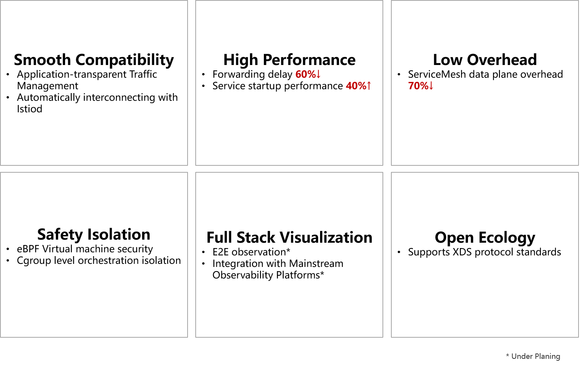

### Introduction

Kmesh is a high-performance service mesh data plane software based on programmable kernel. Provides high-performance service communication infrastructure in service mesh scenarios.

### Why Kmesh

#### Challenges of the Service Mesh Data Plane

The service mesh software represented by Istio has gradually become popular and has become an important component of cloud infrastructure. However, the current service mesh till face some challenges:

- **Extra latency overhead at the proxy layer**: Single hop service access increases by [2~3ms](https://istio.io/latest/docs/ops/deployment/performance-and-scalability/#data-plane-performance), which cannot meet the SLA requirements of latency-sensitive applications. Based on this problem, the community has developed multiple solutions on the service mesh data plane, such as grpc proxyless, Cilium Mesh, and Ambient Mesh. These solutions can reduce latency overhead to some extent, but cannot completely reduce latency overhead.
- **High resources occupation**: The agent occupies extra CPU/MEM overhead, and the deployment density of service container decreases.

#### Kmesh：Kernel level native traffic governance

Kmesh innovatively proposes to move traffic governance to the OS, and build a transparent sidecarless service mesh without passing through the proxy layer on the data path.


#### Key features of Kmesh



Note: * Under planning

### Quick Start

#### Cluster start mode

- Kmesh container image prepare

  Download the corresponding version of Kmesh container image

  ```sh
  [root@ ~]# docker load -i Kmesh.tar
  ```

- Start Kmesh container

  Download the yaml file

  ```sh
  [root@ ~]# kubectl apply -f kmesh.yaml
  ```

  By default, the Kmesh base function is used, other function can be selected by adjusting the startup parameters in the yaml file

- Check kmesh service status

  ```sh
  [root@ ~]# kubectl get pods -A -owide | grep kmesh
  default        kmesh-deploy-j8q68                   1/1     Running   0          6h15m   192.168.11.6    node1   <none> 
  ```

  View the running status of kmesh service

  ```sh
  [root@ ~]# kubectl logs -f kmesh-deploy-j8q68
  time="2023-07-25T09:28:37+08:00" level=info msg="options InitDaemonConfig successful" subsys=manager
  time="2023-07-25T09:28:38+08:00" level=info msg="bpf Start successful" subsys=manager
  time="2023-07-25T09:28:38+08:00" level=info msg="controller Start successful" subsys=manager
  time="2023-07-25T09:28:38+08:00" level=info msg="command StartServer successful" subsys=manager
  ```

#### Local start mode

- Download the corresponding version software package of Kmesh

  ```sh
  https://github.com/kmesh-net/kmesh/releases
  ```

- Configure Kmesh service

  ```sh
  # Optional, If you are currently not in a service mesh environment and only want to start Kmesh on a standalone basis, you can disable the ads switch. Otherwise, you can skip this step
  [root@ ~]# vim /usr/lib/systemd/system/kmesh.service
  ExecStart=/usr/bin/kmesh-daemon -enable-kmesh -enable-ads=false
  [root@ ~]# systemctl daemon-reload
  ```

- Start Kmesh service

  ```sh
  [root@ ~]# systemctl start kmesh.service
  # View the running status of Kmesh service
  [root@ ~]# systemctl status kmesh.service
  ```

- Stop Kmesh service

  ```sh
  [root@ ~]# systemctl stop kmesh.service
  ```


#### Compile and Build

- Code download

  ```sh
  [root@ ~]# git clone https://github.com/kmesh-net/kmesh.git
  ```

- Code compilation

  ```sh
  [root@ ~]# cd kmesh/
  [root@ ~]# ./build.sh -b
  ```

- Program installation

  ```sh
  # The installation script displays the locations of all installation files for Kmesh
  [root@ ~]# ./build.sh -i
  ```

- Compilation cleanup

  ```sh
  [root@ ~]# ./build.sh -c
  ```

- Program uninstallation

  ```sh
  [root@ ~]# ./build.sh -u
  ```

More compilation methods of Kmesh, See: [Kmesh Compilation and Construction](https://github.com/kmesh-net/kmesh/blob/main/docs/kmesh_compile.md)

### Demo

The bookinfo service of istio is used as an example to demonstrate the percentage gray access process after Kmesh is deployed.

- Start Kmesh

  ```sh
  [root@vm-x86-11222]# systemctl start kmesh.service
  ```

- Bookinfo environment preparation

  For the process of deploying istio and starting bookinfo, See: [Bookinfo Environment Deployment](https://istio.io/latest/docs/setup/getting-started/), Note that you do not need to inject the `istio-injection` tag into the namespace, that is, you do not need to start the istio data plane agent.

  Therefore, pay attention to the following information in the prepared environment:

  ```sh
  # default ns not set sidecar injection of istio
  [root@vm-x86-11222 networking]# kubectl get namespaces --show-labels
  NAME              STATUS   AGE   LABELS
  default           Active   92d   <none>
  ```

- Access bookinfo

  ```sh
  [root@vm-x86-11222 networking]# productpage_addr=`kubectl get svc -owide | grep productpage | awk {'print $3'}`
  [root@vm-x86-11222 networking]# curl http://$productpage_addr:9080/productpage
  ```

- Demo demonstration

  The demo shows how to implement percentage routing rules for the reviews service of bookinfo based on Kmesh and successfully access the service.

  

### Kmesh Performance

Based on Fortio, the data plane execution performance of Kmesh and Envoy was compared and tested. The test results are as follows:


For a complete performance test, please refer to [Kmesh Performance Test](test/performance/README.md).

### Software Architecture


The main components of Kmesh include:

- kmesh-controller：

  Kmesh management program, responsible for Kmesh lifecycle management, XDS protocol docking, observation and DevOps, and other functions.

- kmesh-api：

  The API interface layer provided by Kmesh mainly includes: orchestration API after xds conversion, observation and DevOps channels, etc.

- kmesh-runtime：

  The runtime implemented in the kernel that supports L3~L7 traffic orchestration.

- kmesh-orchestration：

  Implement L3-L7 traffic scheduling based on ebpf, such as routing, grayscale, load balance, etc.

- kmesh-probe：

  Observation and DevOps probes, providing end-to-end observation capabilities.

### Feature Description

- Development Guide

  [Kmesh Development Guide](docs/kmesh_development_guide.md)

- Command List

  [Kmesh Command List](docs/kmesh_commands.md)

- Test Framework

  [Kmesh Test Framework](test/README.md)

### Kmesh Capability Map

| Feature Field       | Feature                     |          2023.H1           |          2023.H2           |          2024.H1           |          2024.H2           |
| ------------ | ------------------------ | :------------------------: | :------------------------: | :------------------------: | :------------------------: |
| Traffic management     | sidecarless mesh data  plane   |  |                            |                            |                            |
|              | sockmap accelerate       |                            |  |                            |                            |
|              | Programmable governance based on ebpf |  |                            |                            |                            |
|              | http1.1 protocol         |  |                            |                            |                            |
|              | http2 protocol           |                            |                            |                            |  |
|              | grpc protocol            |                            |                            |                            |  |
|              | quic protocol            |                            |                            |                            |  |
|              | tcp protocol             |                            |  |                            |                            |
|              | Retry                    |                            |                            |  |                            |
|              | Routing                  |  |                            |                            |                            |
|              | load balance             |  |                            |                            |                            |
|              | Fault injection |                            |                            |  |                            |
|              | Gray release   |                            |  |                            |                            |
|              | Circuit Breaker |                            |                            |  |                            |
|              | Rate Limits    |                            |                            |  |                            |
| Service security | SSL-based two-way authentication |                            |                            |                            |  |
|              | L7 authorization |                            |                            |                            |  |
|              | Cgroup-level isolation |  |                            |                            |                            |
| Traffic monitoring | Governance indicator monitoring |                            |  |                            |                            |
|              | End-to-End observability |                            |                            |                            |  |
| Programmable | Plug-in expansion capability |                            |                            |                            |  |
| Ecosystem collaboration | Data plane collaboration (Envoy etc.) |                            |  |                            |                            |
| Operating environment support | container                |  |                            |                            |                            |

