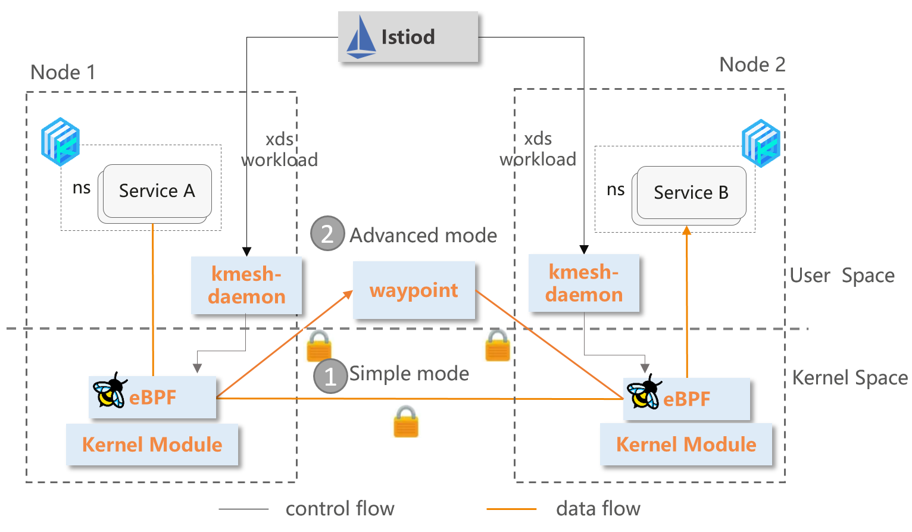

### 介绍

Kmesh是一种基于可编程内核实现的高性能服务网格数据面；提供服务网格场景下高性能的服务通信基础设施。

### 为什么需要Kmesh

#### 服务网格数据面的挑战

Istio为代表的服务网格已逐步流行，成为云上基础设施的重要组成；但当前的服务网格仍面临一定的挑战：

- **代理层引入额外时延开销**：服务访问单跳增加[2~3ms](https://istio.io/latest/docs/ops/deployment/performance-and-scalability/#data-plane-performance)，无法满足时延敏感应用的SLA诉求；基于该问题，社区在网格数据面演进出了多种方案，典型的如：grpc proxyless、Cilium Mesh、ambient Mesh等，一定程度上可以缓解时延开销，但很难完全消减；
- **资源占用大**：代理占用额外CPU/MEM开销，业务容器部署密度下降；

#### Kmesh：内核级原生流量治理

Kmesh创新性的提出将流量治理下沉OS，在数据路径上无需经过代理层，构建应用透明的sidecarless服务网格。


#### Kmesh关键特性


注：* 规划中；

### 快速开始

#### 集群启动模式

##### Kmesh容器镜像准备

下载对应版本Kmesh容器镜像后，使用如下命令将镜像加载到环境中

```sh
[root@ ~]# docker load -i Kmesh.tar
```

##### 启动Kmesh容器

下载对应版本yaml文件，启动Kmesh

```sh
[root@ ~]# kubectl apply -f kmesh.yaml
```

默认使用Kmesh功能，可通过调整yaml文件中的启动参数进行功能选择

##### 查看kmesh服务启动状态

```sh
[root@ ~]# kubectl get pods -A -owide | grep kmesh
default        kmesh-deploy-j8q68                   1/1     Running   0          6h15m   192.168.11.6    node1   <none> 
```

查看kmesh服务运行状态

```sh
[root@ ~]# kubectl logs -f kmesh-deploy-j8q68
time="2023-07-25T09:28:37+08:00" level=info msg="options InitDaemonConfig successful" subsys=manager
time="2023-07-25T09:28:38+08:00" level=info msg="bpf Start successful" subsys=manager
time="2023-07-25T09:28:38+08:00" level=info msg="controller Start successful" subsys=manager
time="2023-07-25T09:28:38+08:00" level=info msg="command StartServer successful" subsys=manager
```

#### 本地启动模式

下载对应版本Kmesh软件包

##### 安装Kmesh软件包

```
[root@ ~]# yum install Kmesh
```

##### 配置Kmesh服务

```sh
# 禁用ads开关
[root@ ~]# vim /usr/lib/systemd/system/kmesh.service
ExecStart=/usr/bin/kmesh-daemon -enable-kmesh -enable-ads=false
[root@ ~]# systemctl daemon-reload
```

##### 启动Kmesh服务

```sh
[root@ ~]# systemctl start kmesh.service
# 查看Kmesh服务运行状态
[root@ ~]# systemctl status kmesh.service
```

##### 停止Kmesh服务

```sh
[root@ ~]# systemctl stop kmesh.service
```


#### 编译构建

##### 源码编译

- 代码下载

  ```sh
  [root@ ~]# git clone https://github.com/kmesh-net/kmesh.git
  ```

- 代码编译

  ```sh
  [root@ ~]# cd kmesh/
  [root@ ~]# ./build.sh -b
  ```

- 程序安装

  ```sh
  # 安装脚本显示了Kmesh所有安装文件的位置
  [root@ ~]# ./build.sh -i
  ```

- 编译清理

  ```sh
  [root@ ~]# ./build.sh -c
  ```

- 程序卸载

  ```sh
  [root@ ~]# ./build.sh -u
  ```

更多Kmesh编译方式，请参考[Kmesh编译构建](https://github.com/kmesh-net/kmesh/blob/main/docs/kmesh_compile.md)

### demo演示

以istio的bookinfo示例服务为例，演示部署Kmesh后进行百分比灰度访问的执行过程；

- 启动Kmesh

  ```sh
  [root@vm-x86-11222]# systemctl start kmesh.service
  ```

- bookinfo环境准备

  部署istio及启动bookinfo的流程可参考[bookinfo环境部署](https://istio.io/latest/docs/setup/getting-started/)；需要注意的是，无需为namespace注入`istio-injection` 标记，即不需要启动istio的数据面代理程序；

  因此准备好的环境上关注如下信息：

  ```sh
  # default ns未设置istio的sidecar注入
  [root@vm-x86-11222 networking]# kubectl get namespaces --show-labels
  NAME              STATUS   AGE   LABELS
  default           Active   92d   <none>
  ```

- 访问bookinfo

  ```sh
  [root@vm-x86-11222 networking]# productpage_addr=`kubectl get svc -owide | grep productpage | awk {'print $3'}`
  [root@vm-x86-11222 networking]# curl http://$productpage_addr:9080/productpage
  ```

- demo演示

  demo演示了基于Kmesh，对bookinfo的reviews服务实施百分比路由规则，并成功访问；

  

### Kmesh性能

基于fortio对比测试了Kmesh和envoy的数据面执行性能；测试结果如下：


完整的性能测试请参考[Kmesh性能测试](test/performance/README.md)；

### 软件架构



Kmesh的主要部件包括：

- kmesh-controller：

  kmesh管理程序，负责Kmesh生命周期管理、XDS协议对接、观测运维等功能；

- kmesh-api：

  kmesh对外提供的api接口层，主要包括：xds转换后的编排API、观测运维通道等；

- kmesh-runtime：

  kernel中实现的支持L3~L7流量编排的运行时；

- kmesh-orchestration：

  基于ebpf实现L3~L7流量编排，如路由、灰度、负载均衡等；

- kmesh-probe：

  观测运维探针，提供端到端观测能力；

### 特性说明

#### Kmesh开发指南

[Kmesh开发指南](docs/kmesh_development_guide.md)

#### Kmesh命令列表

[Kmesh命令列表](docs/kmesh_commands.md)

#### 测试框架

[Kmesh测试框架](./test/README.md)

### Kmesh能力地图

| 特性域       | 特性                     |          2023.H1           |          2023.H2           |          2024.H1           |          2024.H2           |
| ------------ | ------------------------ | :------------------------: | :------------------------: | :------------------------: | :------------------------: |
| 流量管理     | sidecarless网格数据面    |  |                            |                            |                            |
|              | sockmap加速              |                            |  |                            |                            |
|              | 基于ebpf的可编程治理     |  |                            |                            |                            |
|              | http1.1协议              |  |                            |                            |                            |
|              | http2协议                |                            |                            |                            |  |
|              | grpc协议                 |                            |                            |                            |  |
|              | quic协议                 |                            |                            |                            |  |
|              | tcp协议                  |                            |  |                            |                            |
|              | 重试                     |                            |                            |  |                            |
|              | 路由                     |  |                            |                            |                            |
|              | 负载均衡                 |  |                            |                            |                            |
|              | 故障注入                 |                            |                            |  |                            |
|              | 灰度发布                 |                            |  |                            |                            |
|              | 熔断                     |                            |                            |  |                            |
|              | 限流                     |                            |                            |  |                            |
| 服务安全     | 基于SSL的双向认证        |                            |                            |                            |  |
|              | L7授权                   |                            |                            |                            |  |
|              | 治理pod级隔离            |  |                            |                            |                            |
| 流量监控     | 基础观测（治理指标监控） |                            |  |                            |                            |
|              | E2E可观测                |                            |                            |                            |  |
| 可编程       | 插件式扩展能力           |                            |                            |                            |  |
| 生态协作     | 数据面协同（Envoy等）    |                            |  |                            |                            |
| 运行环境支持 | 容器                     |  |                            |                            |                            |

