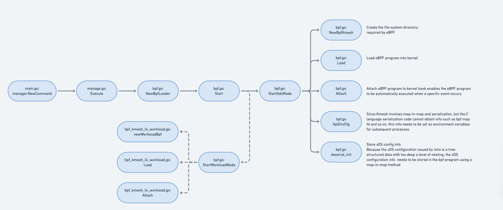
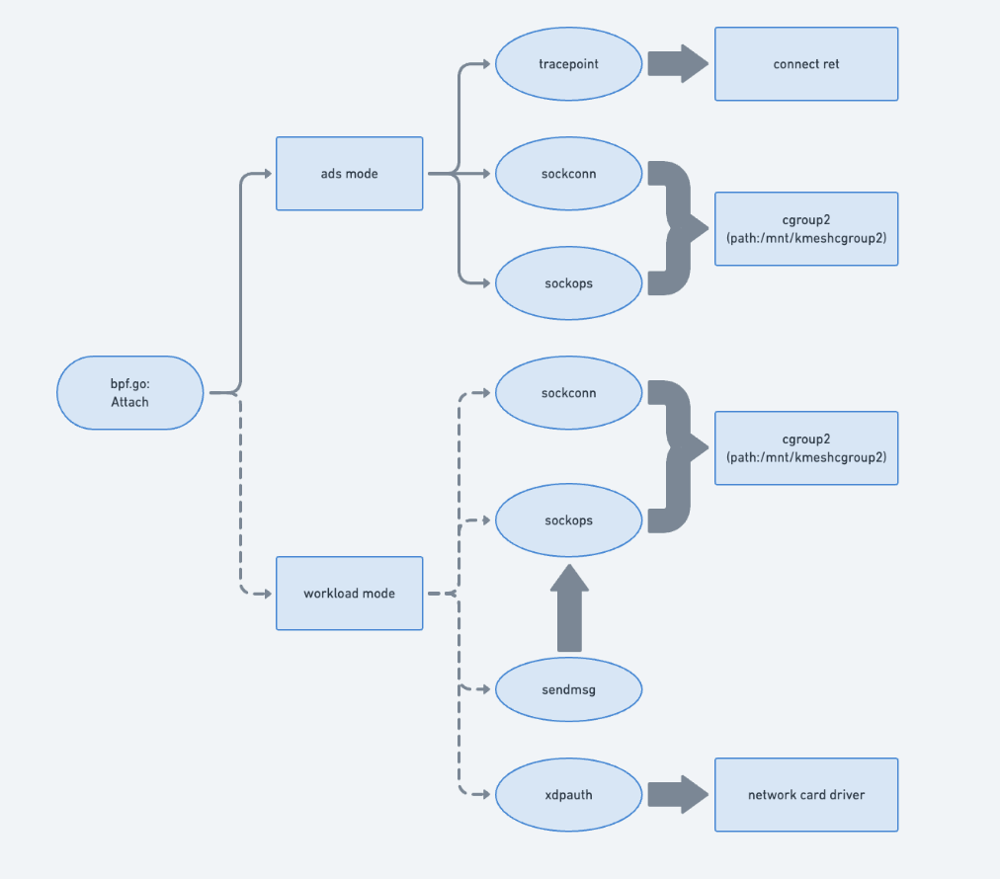

### Introduction

Kmesh is a high-performance, low-overhead service mesh, involving data plane and control plane. The data plane is based on eBPF. This chapter will introduce the eBPF startup process.

### Function call flow chart

The following figure shows the main process of enabling eBPF programs, from preparation to program effectiveness

`Newbpfloader` will generate configuration information based on the information filled in the startup configuration item to selectively start the Kmesh function

`load` will call the BPF_PROG_LOAD system call to load the compiled eBPF program into the kernel. Before the loading takes effect, it will undergo security verification by the verifier, including security check, memory check, program size and complexity limit check, recursion check, etc.

#### Startup process in ads mode (StartAdsMode)

- NewbpfKmesh: Create the file system directory required by eBPF according to the configuration, including the file path of BPF map and prog
- Load: Load the eBPF program of Kmesh, obtain the type and additional type of the program, and update the tail call program to implement the routing forwarding function
- Attach: Attach the eBPF program of Kmesh to the specified cgroup and manage the eBPF program using bpflink
Three main eBPF programs involved in ads mode have different attach points. The eBPF programs of sockconn and sockops types are mounted on cgroup2, and the path is /mnt/kmesh_cgroup2. The eBPF program of tracepoint type is mounted on the return value of the connect system call to support the delayed link establishment function of Kmesh

- ApiEnvCfg：Since Kmesh involves map-in-map and serialization, but the C language serialization code cannot obtain info such as bpf map fd and so on, this info needs to be set as environment variables for subsequent processes.
- deserial_init: Because the xDS configuration issued by istio is a tree-structured data with too deep level of nesting, the xDS configuration info needs to be stored in the bpf program using a map-in-map method

#### Startup process in workload mode (StartworkloadMode)

- NewWorkloadBpf: Create the file system directory required by eBPF according to the configuration, including the file path of BPF map and prog
- Load: Load the e BPF program of Kmesh, obtain the type and additional type of the program, and update the tail call program to implement the routing forwarding function
- Attach: Attach the eBPF program of Kmesh to the specified cgroup and manage the eBPF program using bpflink
The four main eBPF programs involved in workload mode, the eBPF programs of sockconn and sockops types are mounted on cgroup2, and the path is /mnt/kmesh_cgroup2. The eBPF program of sendmsg type is mounted on the eBPF program of sockops type, and the xdpauth eBPF program is mounted in the network card driver of the pod managed by Kmesh.

Most of the processes are the same as Ads mode. The difference is that the eBPF programs loaded in workload mode and ads mode and the mounting hook points are different. Another difference is that there is no need to add additional storage and parsing for map-in-map, because the configuration information issued by istio in workload mode can be stored in the workload structure provided by istio.