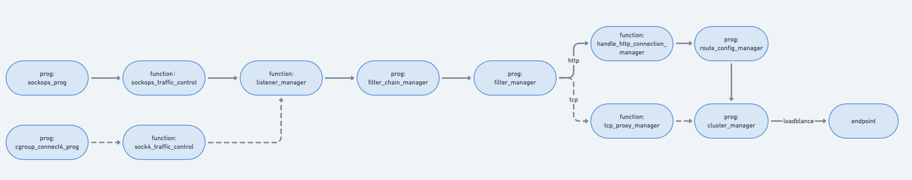

### Introduction

Kmesh sinks into the kernel and uses short-circuiting network protocol stacks to achieve network acceleration. However, the data plane needs to cooperate with the control plane to achieve the effect of accelerating network forwarding. The control plane is responsible for issuing xDS configurations, and the data plane needs to convert these configurations into data structures that can be read and written by eBPF programs to forward data package, and finally achieve network acceleration，This chapter will introduce the forward principle of data plane

### How  to record socket

In Kmesh, there is a cgroup_connect4_prog eBPF program that is used to mark all pods managed by kmesh with a delayed link establishment flag, and then the specific traffic management process is carried out in sockops_prog

The basic steps to accelerate the service mesh dataplane are as follows:
When the pods on the current node communicate with each other over the network, the client communicates with the server. During the first three-way handshake, Kmesh attaches an eBPF program (type BPF_PROG_TYPE_SOCK_OPS) to intercept the TCP connection establishment of all pods managed by Kmesh, and save the socket information of both communicating parties in the Sockmap table.

During the sendmsg process, an eBPF program (type BPF_PROG_TYPE_SK_MSG) is attached to intercept the message sending action. The program searches the Sockmap table based on the current socket information, associates it with the socket information of the destination party, and directly redirects the traffic to the receiving queue of the destination socket.

### How to find destination 

The key information in the xDS configuration is converted and stored as eBPF maps, mainly involving kmesh_listener, kmesh_filter_chain, kmesh_cluster and other eBPF maps. The method of finding the destination IP is to find it through the collaboration of different eBPF programs. 

The entire process is implemented through a combination of different eBPF programs, with calls between these programs executed via tail calls in bpf. The dotted line represents the data forwarding process at the L4 layer, while the solid line indicates the flow at the L7 layer.