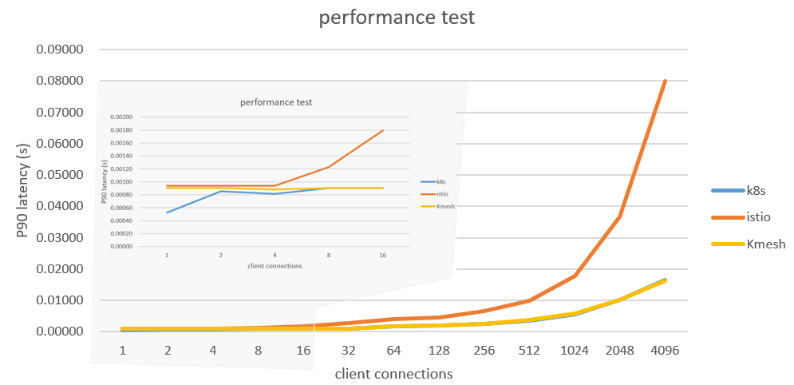

# Kmesh Performance

Kmesh is built to keep the data-plane cost of a service mesh small.
This page collects the publicly referenced performance numbers and
points at the test harness that produced them, so anyone reading
the project docs can reproduce the result locally.

## Headline numbers

The numbers below come from the Fortio-based comparison between
Kmesh and an Istio + Envoy sidecar, as already summarised in the
top-level [README](../../README.md#performance):



| Metric                         | Kmesh vs Envoy sidecar |
| ------------------------------ | ---------------------- |
| Forwarding latency             | ~60% lower             |
| Workload startup time          | ~40% faster            |
| Data-plane resource overhead   | ~70% lower             |

Exact values depend on kernel version, cluster size, and the
workload shape used in the run, so treat the table as an order-of-
magnitude indicator rather than a contract.

## Test setup

- **Load generator:** [Fortio](https://github.com/fortio/fortio)
- **Compared against:** Istio with the default Envoy sidecar
- **Cluster:** local kind, single control-plane + workers
- **Workloads:** bookinfo, density, qps, long/short connections
- **Metrics collected:** TP90 / TP99 latency, QPS, CPU, RSS

For the full configuration, scripts, and raw outputs, see
[test/performance/README.md](../../test/performance/README.md).

## Reproducing the numbers

The scripts under `test/performance/` are designed to run against a
local kind cluster. Prereqs and step-by-step instructions are in
the README in that directory. The short version is:

```sh
# bring up a kind cluster and install istio
kind create cluster
istioctl install

# build kmesh and load the image into kind
make build
kind load docker-image out/amd64/kmesh-daemon

# pick one of the test scenarios, e.g. bookinfo
cd test/performance/bookinfo_test/shell
./bookinfo.sh
```

If a result you see locally disagrees with the table above by more
than the usual run-to-run noise, please open an issue with the
kernel version, workload, and Fortio output attached.
