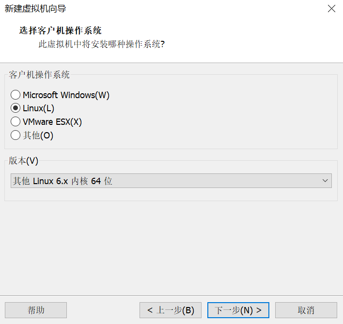

# Use Enhanced Kernel in Kmesh

Some features of kmesh depend on enhanced kernel (e.g., L7 traffic control in ads mode). To utilize it, you can use `openEuler 24.03-LTS`, which natively supports all features.

You can follow the steps below to use enhanced kernel:

+ Download `openEuler 24.03-LTS` image on: <https://repo.openeuler.org/openEuler-24.03-LTS/ISO/>.
+ Install the operation system: Here, we take [VMware](https://www.vmware.com/products/workstation-pro/html.html) for example (you can also use other VM management tools).

    

    Notice that `openEuler 24.03-LTS`'s kernel version is **6.6.0**. So you should select `其他 Linux 6.x 内核 64位`(`Linux 6.x kernel 64bit`).

    Then, you can follow the [official blog](https://www.openeuler.org/zh/blog/20240306vmware/20240306vmware.html) to install it.

+ Install kernel headers: Kmesh determines whether the enhanced kernel is utilized according to some kernel headers(e.g., `bpf.h`). So, you should install kernel headers by:

    ```shell
    yum install kernel-headers
    ```

    Then, you should be able to find the kernel headers in the path `/usr/include/linux`.

+ Check whether you are ready to use enhanced kernel:
  
    ```shell
    grep -q "FN(parse_header_msg)" /usr/include/linux/bpf.h && echo "enhanced" || echo "unenhanced"
    ```

Now you can follow the [deploy and develop guide](./kmesh_deploy_and_develop_in_kind.md) to explore kmesh's full features.
