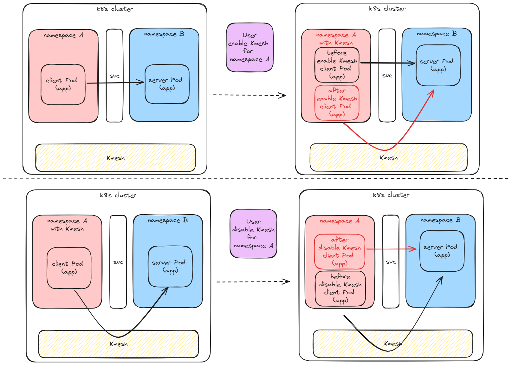
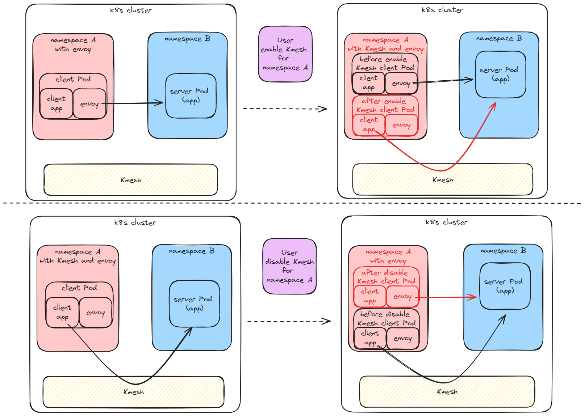
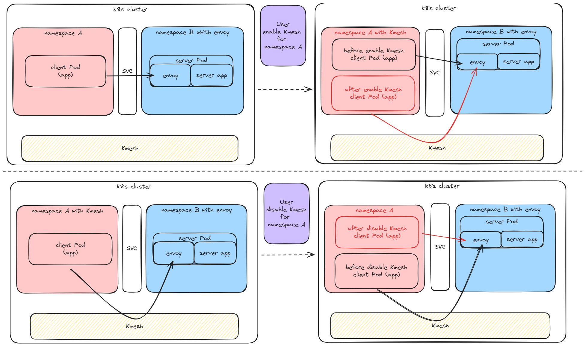
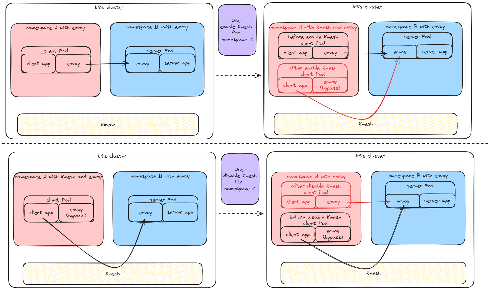
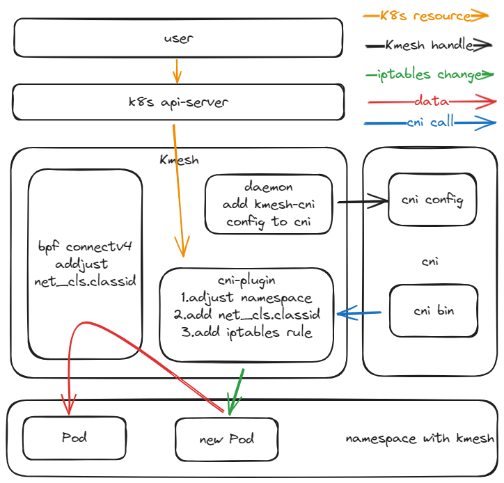

# Multi-grid Data Surface Collaborative Design Document

## Background

Traditional serviceMesh uses namespaces as the granularity to enable serviceMesh functions.In different namespaces, different serviceMesh dataplane may be used.As one of the data plane software of serviceMesh, Kmesh may work together with different serviceMesh dataplane during use. This document mainly describes the scenarios where Kmesh as a data plane works together with other dataplanes.

## Supported usage scenarios

Kmesh is used as the client side：

1. Use Kmesh nanotube pod to communicate with ordinary pod
2. Both ends use Kmesh for communication
3. Use Kmesh to communicate with pods in the sidecar (Envoy) mesh data plane

Kmesh is used as a server:

1. Kmesh only uses iptables to bypass sidecar（Envoy） when the Server side has Envoy injection tags

The current problematic scenario:

Currently, Kmesh does not support bypass the sidecar (Envoy) on the server side and communicating with Pods that use the sidecar (Envoy) as the client side.  The reason is that when the client sidecar (Envoy) is sending data, if it recognizes that there is also a sidecar (Envoy) on the server side, it will use mTLS for encrypted communication.  Currently, Kmesh cannot decrypt this communication. It is planned to support this feature in future versions.

## Specification Constraints

1. Using Kmesh Pods based on namespace granularity
2. After the Kmesh namespace takes effect, it only affects newly launched Pods and has no impact on existing Pods.  The same applies to the end of Kmesh's namespace.

## Value of Scenario

Within the same cluster, multiple mesh data planes may be deployed.  Kmesh needs to communicate with Pods in the namespace of meshless and other types of mesh agents, and it is necessary to ensure that the communication results between Pods are normal.

## User Scenario 1: Communication Analysis between Kmesh Proxy Pod and Ordinary Pod:

scene description

- There is no envoy on the pod.
	- The user specifies the namespace to use Kmesh as the data plane
		- The newly launched Pod accesses the server side through Kmesh orchestration addressing
		- The existing Pods are not affected and still use the k8s native svc addressing to access the server side
	- The user-specified namespace no longer uses Kmesh as the data plane
		- The newly launched Pod accesses the server side through the k8s native svc
		- The existing Pods are not affected, and the containers of the Kmesh agent still access the server side after being orchestrated by Kmesh.
		

- There is Envoy on the Pod.
	- The user specifies the namespace to use Kmesh as the data plane, and the corresponding pod in this namespace and the accessed svc are both installed with Envoy
		- The newly launched Pods are addressed through Kmesh orchestration and access the server side through Envoy short circuiting
		- The existing Pods are not affected, and the server side is accessed through Envoy for orchestration
	- The user-specified namespace no longer uses Kmesh as the data plane, and the corresponding pod in this namespace and the accessed svc has Envoy installed
		- Newly launched Pods access server side through Envoy orchestration
		- The existing Pods are not affected, and the containers that are managed by Kmesh still address and access the server side through Kmesh orchestration and short-circuit envoy.
		

## User Scenario 2: Communication Analysis between Kmesh Nano-tube Pods and Pods in the Kmesh Data Plane:

scene description
Currently, Kmesh acts as a server proxy and does not perform any operations on connections to the service.  Therefore, the connection scenario is the same as the user scenario.

- There is no envoy on the pod.
	- The user specifies the namespace to use Kmesh as the data plane.  Envoy is not installed in this namespace, but the node in the accessed svc has Kmesh installed
		- The newly launched Pod accesses the server side through Kmesh orchestration addressing, and the server side Kmesh has no processing, directly accessing the server service
		- The existing Pods are not affected.  Accessing the server side through the k8s native svc, the server side Kmesh does not process, and the server service is directly accessible.
	- The user-specified namespace no longer uses Kmesh as the data plane, and Envoy is not installed in this namespace.  The accessed svc has Kmesh installed on the Node.
		- The newly launched Pod accesses the server side through the k8s native svc, and the server side Kmesh does not process it, passing it directly to the server service
		- The existing Pods are not affected, and the containers that are managed by Kmesh still access the server side after being orchestrated by Kmesh.  There is no processing on the server side of Kmesh, and the server service is directly accessible.

- The Pod with the container has the envoy
	- The user specifies the namespace to use Kmesh as the data plane, and this namespace, the accessed svc, and the Node are installed with Kmesh
		- The newly launched Pods are addressed through Kmesh orchestration and access the server side through Envoy short circuiting.  The server side Kmesh has no processing and passes directly to the server service
		- The existing Pods are not affected.  The server side is accessed through Envoy, and the server side Kmesh does not process it, and it is directly connected to the server service.
	- The user-specified namespace no longer uses Kmesh as the data plane, and this namespace, the accessed svc, and the Node have installed Kmesh
		- The newly launched Pod accesses the server side through Envoy orchestration, and the server side Kmesh has no processing, passing directly through the server service
		- The existing Pods are not affected.  The containers that are managed by Kmesh still use Kmesh orchestration to address and short-circuit Envoy to access the server side.  There is no processing on the server side of Kmesh, and it is directly connected to the server service.

## User Scenario 3: Communication analysis between Kmesh pod and pod in the data plane of sidecar (Envoy):

scene description

- There is no envoy on the pod.
	- The user specifies the namespace to use Kmesh as the data plane, but Envoy is not installed in this namespace.  The accessed service has Envoy installed in the pod
		- The newly launched Pod accesses the server side through Kmesh orchestration addressing, and the server is received and managed by Envoy
		- The existing Pods are not affected, and the server is accessed through the k8s native svc, and the server is received and managed by Envoy.
	- The user-specified namespace no longer uses Kmesh as the data plane, and Envoy is not installed in this namespace.  The accessed service has Envoy installed in the pod.
		- The newly launched Pod accesses the server side through the k8s native svc, and the server is received and managed by Envoy
		- The existing Pods are not affected, and the containers that are being managed by Kmesh still access the server side through Kmesh orchestration.  The server is received and managed by Envoy.

- There is Envoy on the Pod.
	- The user specifies the namespace to use Kmesh as the data plane, and the corresponding pod in this namespace and the accessed svc are both installed with Envoy
		- The newly launched Pods are addressed through Kmesh orchestration and access the server side through Envoy short circuiting.  The server is received and managed by Envoy
		- The existing Pods are not affected.  The server is accessed through Envoy for orchestration, and the server is managed by Envoy.
	- The user-specified namespace no longer uses Kmesh as the data plane, and the corresponding pod in this namespace and the accessed svc have both installed Envoy
		- The newly launched Pod accesses the server side through Envoy orchestration, and the server is received and managed by Envoy
		- The existing Pods are not affected, and the containers that are being managed by Kmesh still use Kmesh orchestration to address and short-circuit Envoy to access the server side.  The server is received and managed by Envoy.

## Use Case

### Using interface design

	# Enable Kmesh for the specified namespace
	kubectl label namespace xxx label istio.io/dataplane-mode=Kmesh
	# Close Kmesh for the specified namespace
	kubectl label namespace xxx label istio.io/dataplane-mode-

## Function implementation principle:
### Component Design
To achieve the above functions, from the user specifying the enabling of Kmesh for a specific namespace to the overall function taking effect, the components involved are shown in the following diagram

The following components need to be modified in Kmesh:

#### daemon

The daemon needs to manage the cni plugin.  When Kmesh is started and the cni pod is restarted, the cni plugin call information is written to the corresponding conflist in /etc/cni/net.d. The format of calico's conflist is as follows:
	
	{
		"name": "k8s-pod-network",
		"cniVersion": "0.3.1",
		"plugins": [
			{
				"type": "calico",
				"log_level": "info",
				...
			},
			{
				"type": "portmap",
				...
			},
			...
			// Add cni-plugin for kmesh
			{
				"type": "Kmesh-cniplugin",
			}
		]
	}

The format of flannel's conflist is as follows:

	{
		"name": "cbr0",
		"cniVersion": "0.3.1",
		"plugins": [
			{
				"type": "flannel",
				...
			},
			...
			// Add the cni-plugin for kmesh
			{
				"type": "Kmesh-cniplugin",
			}
		]
	}

The daemon changes are as follows:

- When kmesh is enabled, write the Kemsh plugin configuration to the CNI conflist

	When kmesh-daemon starts, it automatically writes the cni plugin configuration `{"type":"kmesh-cni"}` to the configuration file (.conflist) in the /etc/cni/net.d/ directory

- Clean up the kmesh plugin configuration from the cni conflist when removing kmesh

	When kmesh-daemon exits, automatically delete the cni plugin configuration `{"type":"kmesh-cni"}` from the configuration file (.conflist) in the /etc/cni/net.d/ directory

#### cni-plugin
When cni is used to create a new Pod in a cluster, it determines whether the Pod belongs to a namespace with the Kmesh label.

- Without `istio.io/dataplane-mode=Kmesh`, nothing will be done
- If you have 'istio.io/dataplane-mode=Kmesh', modify the net_cls.classid to 0x1000 in the newly created Pod's cgroups.Currently, only cgroupsfs is supported, not systemd.The path for cgroupsfs is as follows: /sys/fs/PID_FS/net\_cls/kubepods/podxxxxxx/net\_cls.classid
- If there is 'istio.io/dataplane-mode=Kmesh' and 'istio-injection=enabled', you will enter the newly created Pod and add the following iptables rules

All packets on the receiving path are short-circuited to Envoy:

	iptables -t nat -I 1 PREROUTING -j RETURN

All packets on the contract path are short-circuited to Envoy:

	iptables -t nat -I 1 OUTPUT -j RETURN

#### ebpf PID group/connectv4

connectv4, get the classid of the current process.  If it is 0x1000, Kmesh ebpf will be used for management, and the subsequent 4-layer forwarding or ULP framework replacement will be used.

## Default behavior after modification

Before modification: After enabling Kmesh, it will take effect on all Pods in the environment by default, and Pods will access svc through Kmesh.

After modification: After enabling Kmesh, it does not take effect on any Pod in the environment by default.  Users need to manually specify the namespace configuration 'istio.io/dataplane-mode=Kmesh' to use Kmesh to take effect on Pods under the namespace.

## dfx design
- Log design
- Each time a Pod is created, if the Pod in the specified namespace fails to start and execute, the cniplugin log will be recorded in the /var/run/kmesh folder