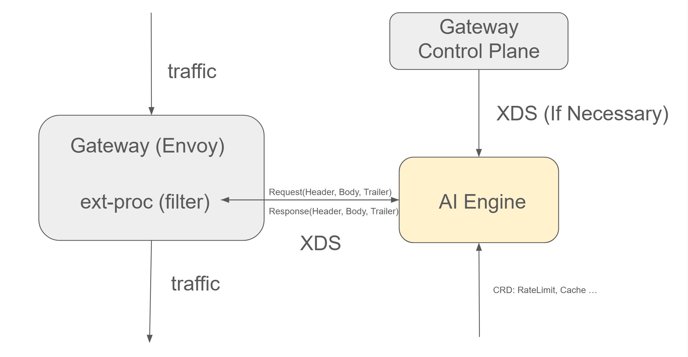

## AI Gateway Capabilities in Kmesh


### Summary

This proposal shows how to bring AI Gateway capabilities into Kmesh, mainly including architecture design and API design.

### Motivation

With the explosion of Generative AI, more and more Large Language Models have been deployed based on Kubernetes and the proportion of AI traffic has become more prominent. As a beneficial supplement to Kubernetes, Service Mesh can already manage traffic well, and AI traffic is no exception. But AI has its own particularity. For example, when managing AI traffic, tokens are the core unit instead of traditional requests or connections. In addition, the current cost of using LLM is still very high, so we should rate limit and also need to use semantic caching to speed up response speed, reduce costs, and minimize the resource occupation of LLM by repeated queries.

As a powerful Traffic Management Engine, Kmesh should be specially optimized for AI scenarios to make AI traffic management smoother.

#### Goals

- Bring various AI traffic management capabilities into Kmesh ecosystem, such as AI rate limit, cache, fallback, etc.

- Implement AI plugin that is compatible with various mainstream Gateways based on Envoy and provides capability enhancement for AI scenarios.

- The AI traffic management AIPs (CRDs) can work with mainstream APIs such as Gateway API while maintaining scalabitily to allow AI governance capabilities to be added incrementally.

#### Non-Goals

- Implement a new Gateway from scratch.

### Proposal

Currently AI traffic management is mainly focused on the north-south direction, that is, the traffic entering from the Gateway. For general north-south traffic management functions, the open source community has already provided good support and provided multiple implementations, such as Istio Ingress Gateway, Envoy Gateway, and so on.

Kmesh can now be seamlessly integrated with these Gateways. Obviously, the work of implementing a new Gateway from scratch is huge, and the implementation of most common functions will be a repetitive work. In addition, most Gateways are implemented based on Envoy, which is famous for its powerful extensibility. Therefore, we decided to implement Kmesh's AI capabitlity in the form of extensions plugins, which can not only reuse the community's existing capabilities, but also bring incremental benefits.

The Kmesh's AI plugin should have the following advantages:

1. Built as an external plugin (independent of Envoy process), independently deployed and enabled on demand.
2. Gateway agnostic, able to adapt to various cloud native Gateways built on Envoy, perfectly compatible with the cloud native tech stack.
3. Built on Golang, dev-friendly, easy to extend and customize.


### Design Details



As we all known, Envoy's extensibility is based on its [filter mechanism](https://www.envoyproxy.io/docs/envoy/latest/api-v3/config/filter/filter). We can add custom filters at various stages of Envoy's request processing to customize the processing logic.

There are many ways to write filters. For example you can directly use c++ to build an In-Tree filter. Although this method has the best performance, it is difficulty to develop and is not dev-friendly. Another way is to use Lua or Wasm to build an Out-Of-Tree filter. This method is easier to develop, but the performance and hard to debug. Envoy even allows you to develop plugins directly in [Golang](https://www.envoyproxy.io/docs/envoy/latest/configuration/http/http_filters/golang_filter), but this does not seem stable enough and will introduce additional abstractions and complex mechanisms that are not easy to debug as well.

So we finally chose Envoy's [External Processing Filter](https://www.envoyproxy.io/docs/envoy/latest/configuration/http/http_filters/ext_proc_filter). It connects to an external service, called an "external processor", to the filter chain. The processing service itself implements a gRPC interface that allows it to respond to events in the lifecycle of an HTTP request/response by examining and modifying the headers, body, and trailers of each message, or by returning a brand-new response.

In this way, our AI plugin can be built as an external independent service and can be deployed on demand when AI traffic needs to be processed. At the same time, we can use any dev language, not necessarily C++. Of course, we use Golang. Also it is isolated from the complexity of Envoy to greatest extent, and only needs to process traffic requests/responses from gRPC connections. This fully ensures that development is simple, flexible and friendly.

For functions like rate limit, we only need to handle them during the traffic forwarding process, so we can use `External Processing Filter` in the usual way. However, for advanced traffic management functions, such as traffic splitting, traffic failover and even for AI traffic, we sometimes hope to select the best answer from the responses of multiple LLM models. This involves routing decision in `External Processing Filter` and need to override the original routing in Envoy, because `Route Filter` is always the last filter in Envoy. It also involves retries between multiple clusters and Envoy generally only supports retries between multiple endpoints in a cluster. It is even more impossible for Envoy to send a request to multiple backends at the same time and filter the responses.

Therefore, for AI traffic, we decided to let AI Plugin directly hijack the traffic and forward the traffic to the backend models. Now we will no longer be restricted by Envoy's existing capabilities and can do any traffic management functions we want.

However, since `External Processing Filter` doesn't take hijacking into consideration, it has the following limitations:

1. We can only return the processing result of the model through [ImmediateResponse](https://www.envoyproxy.io/docs/envoy/latest/api-v3/service/ext_proc/v3/external_processor.proto#envoy-v3-api-msg-service-ext-proc-v3-immediateresponse), but the original intention of it is to retrun error, so it's one-time. Usually the model response are streaming. If we wait until we get all the responses of the model and then send them all at onece, the delay will be very large, resulting in a bad user experience. We may need to make some customized modifications to `External Processing Filter` later.

2. `External Processing Filter` will process header/body/trailer synchronously, whlie AI traffic is mainly processed based on body. So the processing result of header has been returned to Envoy at this time. Fortunately, from the test results, the processed header will not be sent to upstream immediately, but cached, so it will not cause trouble to the backend model.

3. After the traffic is hijacked by `External Processing Filter`, the general traffic management functions configured on the gateway (i.e., connection-level and request-level management) are actually skipped. But after careful consideration, you will find that this is not a problem, because the traffic accessing the model will become east-west traffic, which is the inherent capabilities of Kmesh. We can still perform general traffic management functions on the traffic sent from the AI Plugin to the model.

#### AI Plugin CRD

#### VirtualModel

`VirtualModel` defines the traffic management strategy from the model specified by the user in the request (which can even be set to empty) to the model actually deployed on the backend.

API:

```go
// VirtualModel is the Schema for the virtualmodels API.
type VirtualModel struct {
	metav1.TypeMeta   `json:",inline"`
	metav1.ObjectMeta `json:"metadata,omitempty"`

	Spec   VirtualModelSpec   `json:"spec,omitempty"`
	Status VirtualModelStatus `json:"status,omitempty"`
}

// VirtualModelSpec defines the desired state of VirtualModel.
type VirtualModelSpec struct {
	Models []string `json:"models,omitempty"`

	Rules []*Rule `json:"rules"`
}

type Rule struct {
	Name  string              `json:"name,omitempty"`
	Match []*MatchCondition   `json:"match,omitempty"`
	Route []*RouteDestination `json:"route"`

	Timeout *metav1.Duration `json:"timeout,omitempty"`
	Retries *Retry           `json:"retries,omitempty"`
}

type MatchCondition struct {
	// Implement if necessary.
}

type RouteDestination struct {
	Destination *Destination `json:"destination"`
	Weight      int32        `json:"weight,omitempty"`
}

type Destination struct {
	Host  string `json:"host"`
	Model string `json:"model"`
}

type Retry struct {
	Attempts int32 `json:"attempts"`
}
```

The config example of the above Go code API converted into yaml format is as follows:

```yaml
apiVersion: ai.kmesh.net/v1alpha1
kind: VirtualModel
metadata:
  name: llama
  namespace: ollama
spec:
  models:
  - "llama"
  rules:
  - name: "llama-route-32"
  # match: 
    route:
    - destination:
        host: "http://ollama.ollama.svc.cluster.local:11434"
        model: "ollama/llama3.2"
      weight: 70
    - destination:
        host: "http://ollama.ollama-test.svc.cluster.local:11434"
        model: "ollama/llama3.2"
      weight: 30
    timeout: 10s
    retries:
      attempts: 3

```

#### AIExtension
We need to rely on CRD to describe the config related to AI traffic management. The config consists of the following two parts:

1. Hostname: usually an LLM Provider will contain multiple models. The user will specify the LLM provider (such as "www.openai.com") in the hostname of the HTTP request and then specify model to be used in this reques in the `model` field of the body. We hope that the AI Plugin can be shared by multiple LLM Providers and the strategies can be isolated between different LLM Provdiers.

2. Specific AI traffic management policy: such as rate limit, cache, fallback, etc. Allow users to configure any number and type of policies.

API:

```go
// AIExtension is the Schema for the aiextensions API.
type AIExtension struct {
	metav1.TypeMeta   `json:",inline"`
	metav1.ObjectMeta `json:"metadata,omitempty"`

	Spec   AIExtensionSpec   `json:"spec,omitempty"`
	Status AIExtensionStatus `json:"status,omitempty"`
}

// AIExtensionSpec defines the desired state of AIExtension.
type AIExtensionSpec struct {
	Hostname string  `json:"hostname"`
	Options  Options `json:"options"`
}

type Options struct {
	RateLimits []RateLimit `json:"rateLimits,omitempty"`
	// Add more polices as needed.
}

// +kubebuilder:validation:Enum=second;minute;hour;day;month
type RateLimitUnit string

const (
	Second RateLimitUnit = "second"
	Minute RateLimitUnit = "minute"
	Hour   RateLimitUnit = "hour"
	Day    RateLimitUnit = "day"
	Month  RateLimitUnit = "month"
)

// RateLimit Policy for AI traffic.
type RateLimit struct {
	TokensPerUnit uint32        `json:"tokensPerUnit"`
	Unit          RateLimitUnit `json:"unit"`
	Model         string        `json:"model"`
}

// AIExtensionStatus defines the observed state of AIExtension.
type AIExtensionStatus struct {
}
```

Only the `RateLimit` policy config is shown above. The data structure of new polices can be added directly to the `Options` structure as needed.

The config example of the above Go code API converted into yaml format is as follows:

```yaml
apiVersion: ai.kmesh.net/v1alpha1
kind: AIExtension
metadata:
  name: ai-extensions
  namespace: ollama
spec:
  hostname: www.ollama.com
  options:
    rateLimits:
      - tokensPerUnit: 10
        unit: minute
        model: llama3.2
```

`hostname` is the LLM provider we want to access and specific AI polices are configured under `options`. Currently all AI policies are configured in the `AIExtension` CRD. If necessary, separate CRDs can be built for different policies in the future.

#### Integration with Existing Gateways

The integration of various existing gateways and AI plugins is also very convenient. For example, Envoy Gateway provides a dedicated CRD for External Processing. As follows:

```yaml
apiVersion: gateway.envoyproxy.io/v1alpha1
kind: EnvoyExtensionPolicy
metadata:
  name: ext-proc-example
  namespace: ollama
spec:
  targetRefs:
    - group: gateway.networking.k8s.io
      kind: HTTPRoute
      name: ollama
  extProc:
  - backendRefs:
    - name: aiengine
      port: 9002
    processingMode:
      request:
        body: Buffered
      response:
        body: Streamed

```

The above config shows that all traffic sent to the service `ollama` will first be sent to the `aiengine` service for external processing. At the same time, we can also specify in `processingMode` whether the request/response body is externally processed in the form of `Stream` or `Buffered`.

Istio Ingress Gateway can also use EnvoyFilter to add External Processing Filters on demand. No matter how the various Gateway implementations encapsulate, it will eventually be converted into the XDS config of the [External Processing Filter](https://www.envoyproxy.io/docs/envoy/latest/api-v3/extensions/filters/http/ext_proc/v3/ext_proc.proto#envoy-v3-api-msg-extensions-filters-http-ext-proc-v3-externalprocessor) of Envoy.

So, if necessary, as shown in the above arch picture, Envoy can be directly connected to AI plugin (it may no longer be appropriate to call it AI plugin), and then the AI plugin connects to the control plane of Gateway. The AI plugin modifies the XDS obtained from the control plane, for example, currently adding External Processing Filters, and finally sends the modified XDS to Envoy. This further improves the Gateway-agnosticity of the AI plugin and no additional configuration is required for different Gateway implementations.

#### Test Plan

<!--
**Note:** *Not required until targeted at a release.*

Consider the following in developing a test plan for this enhancement:
- Will there be e2e and integration tests, in addition to unit tests?
- How will it be tested in isolation vs with other components?

No need to outline all test cases, just the general strategy. Anything
that would count as tricky in the implementation, and anything particularly
challenging to test, should be called out.

-->

### Alternatives

<!--
What other approaches did you consider, and why did you rule them out? These do
not need to be as detailed as the proposal, but should include enough
information to express the idea and why it was not acceptable.
-->

<!--
Note: This is a simplified version of kubernetes enhancement proposal template.
https://github.com/kubernetes/enhancements/tree/3317d4cb548c396a430d1c1ac6625226018adf6a/keps/NNNN-kep-template
-->