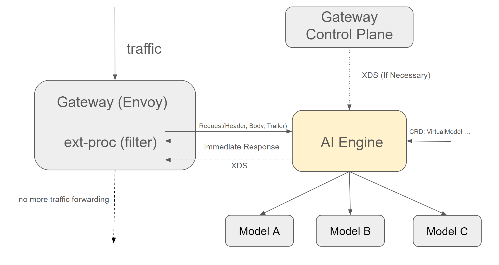

## AI Gateway Capabilities in Kmesh


### Summary

This proposal shows how to bring AI Gateway capabilities into Kmesh, mainly including architecture design and API design.

### Motivation

With the explosion of Generative AI, more and more Large Language Models have been deployed based on Kubernetes and the proportion of AI traffic has become more prominent. As a beneficial supplement to Kubernetes, Service Mesh can already manage traffic well, and AI traffic is no exception. But AI has its own particularity. For example, when managing AI traffic, tokens are the core unit instead of traditional requests or connections. In addition, the current cost of using LLM is still very high, so we should rate limit and also need to use semantic caching to speed up response speed, reduce costs, and minimize the resource occupation of LLM by repeated queries.

As a powerful Traffic Management Engine, Kmesh should be specially optimized for AI scenarios to make AI traffic management smoother.

Currently AI traffic management is mainly focused on the north-south direction, that is, the traffic entering from the Gateway. For general north-south traffic management functions, the open source community has already provided good support and provided multiple implementations, such as Istio Ingress Gateway, Envoy Gateway, and so on.

Kmesh can now be seamlessly integrated  with these Gateways. Obviously, the work of implementing a new Gateway from scratch is huge, and the implementation of most common functions will be a repetitive work. In addition, most Gateways are implemented based on Envoy, which is famous for its powerful extensibility. Therefor, we decided to implement Kmesh's AI capabitlity in the form of extensions plugins, which can not only reuse the community's existing capabilities, but also bring incremental benefits.

#### Goals

- Implement AI plugin that is compatible with various mainstream Gateways based on Envoy and provides capability enhancement for AI scenarios.

- Design a set of AIPs (CRDs) for AI traffic management that can work with mainstream APIs such as Gateway API while maintaining scalabitily to allow AI governance capabilities to be added incrementally.

#### Non-Goals

- Implement a new Gateway from scratch.

### Proposal

Currently AI traffic management is mainly focused on the north-south direction, that is, the traffic entering from the Gateway. For general north-south traffic management functions, the open source community has already provided good support and provided multiple implementations, such as Istio Ingress Gateway, Envoy Gateway, and so on.

Kmesh can now be seamlessly integrated  with these Gateways. Obviously, the work of implementing a new Gateway from scratch is huge, and the implementation of most common functions will be a repetitive work. In addition, most Gateways are implemented based on Envoy, which is famous for its powerful extensibility. Therefor, we decided to implement Kmesh's AI capabitlity in the form of extensions plugins, which can not only reuse the community's existing capabilities, but also bring incremental benefits.

The Kmesh's AI plugin should have the following advantages:

1. Built as an external plugin (independent of Envoy process), independently deployed and enabled on demand.
2. Gateway agnostic, able to adapt to various cloud native Gateways built on Envoy, perfectly compatible with the cloud native tech stack.
3. Built on Golang, dev-friendly, easy to extend and customize.


### Design Details



As we all known, Envoy's extensibility is based on its [filter mechanism](https://www.envoyproxy.io/docs/envoy/latest/api-v3/config/filter/filter). We can add custom filters at various stages of Envoy's request processing to customize the processing logic.

There are many ways to write filters. For example you can directly use c++ to build an In-Tree filter. Although this method has the best perfermance, it is difficulty to develop and is not dev-friendly. Another way is to use Lua or Wasm to build an Out-Of-Tree filter. This method is easier to develop, but the performance and hard to debug. Envoy even allows you to develop plugins directly in [Golang](https://www.envoyproxy.io/docs/envoy/latest/configuration/http/http_filters/golang_filter), but this does not seem stable enough and will introduce additional abstractions and complex mechanisms that are not easy to debug as well.

So we finally chose Envoy's [External Processing Filter](https://www.envoyproxy.io/docs/envoy/latest/configuration/http/http_filters/ext_proc_filter). It connects to an external service, called an "external processor", to the filter chain. The processing service itself implements a gRPC interface that allows it to respond to events in the lifecycle of an HTTP request/response by examining and modifying the headers, body, and trailers of each message, or by returning a brand-new response.

In this way, our AI plugin can be built as an external independent service and can be deployed on demand when AI traffic needs to be processed. At the same time, we can use any dev language, not necessarily C++. Of course, we use Golang. Also it is isolated from the complexity of Envoy to greatest extent, and only needs to process traffic requests/responses from gRPC connections. This fully ensures that development is simple, flexible and friendly.

#### Integration with Existing Gateways

The integration of various existing gateways and AI plugins is also very convenient. For example, Envoy Gateway provides a dedicated CRD for External Processing. As follows:

```yaml
apiVersion: gateway.envoyproxy.io/v1alpha1
kind: EnvoyExtensionPolicy
metadata:
  name: ext-proc-example
  namespace: ollama
spec:
  targetRefs:
    - group: gateway.networking.k8s.io
      kind: HTTPRoute
      name: ollama
  extProc:
  - backendRefs:
    - name: aiengine
      port: 9002
    processingMode:
      request:
        body: Buffered
      response:
        body: Streamed

```

Istio Ingress Gateway can also use EnvoyFilter to add External Processing Filters on demand. Also, if necessary, as shown in the above arch picture, Envoy can be directly connected to AI plugin (it may no longer be appropriate to call it AI plugin), and then the AI plugin connects to the control plane of Gateway. The AI plugin modifies the XDS obtained from the control plane, for example, currently adding External Processing Filters, and finally sends the modified XDS to Envoy. This further improves the Gateway-agnosticity of the AI plugin and no additional configuration is required for different Gateway implementations.


#### AI Plugin CRD

Finally, we need to rely on CRD to describe the config related to AI traffic management. The config consists of the following two parts:

1. Associated Service: The AI model is ultimately deployed in a service. We hope that only the service configured with the corresponding AI policy will forward traffic to the AI plugin and all AI services in the cluster can share the same AI plugin deployment without having to deploy one for each Service. In addition, if a service configured with AI policy, traffic can be directly forwarded to the AI plugin. Whether it's through automatically generating resource objects such as `EnvoyExtensionPolicy` or modifying XDS. It's believed that it will bring a better user experience.

2. Specific AI traffic management policy: such as rate limit, cache, fallback, etc.

The specific examples are as follows:

```yaml
apiVersion: ai.kmesh.net/v1alpha1
kind: AIExtension
metadata:
  name: ai-extensions
  namespace: ollama
spec:
  targetRefs:
    - group: gateway.networking.k8s.io
      kind: HTTPRoute
      name: ollama
  options:
    rateLimits:
      - requestsPerUnit: 10
        unit: minute
        model: llama3.2
    caches:
      ...
```

In accordance with the Gateway API convention, the service is associated with `HTTPRoute` in `targetRefs`, and then the specific AI policies are configured under `options`. Currently all AI policies are configured in the `AIExtension` CRD. If necessary, separate CRDs can be built for different policies in the future.

#### Test Plan

<!--
**Note:** *Not required until targeted at a release.*

Consider the following in developing a test plan for this enhancement:
- Will there be e2e and integration tests, in addition to unit tests?
- How will it be tested in isolation vs with other components?

No need to outline all test cases, just the general strategy. Anything
that would count as tricky in the implementation, and anything particularly
challenging to test, should be called out.

-->

### Alternatives

<!--
What other approaches did you consider, and why did you rule them out? These do
not need to be as detailed as the proposal, but should include enough
information to express the idea and why it was not acceptable.
-->

<!--
Note: This is a simplified version of kubernetes enhancement proposal template.
https://github.com/kubernetes/enhancements/tree/3317d4cb548c396a430d1c1ac6625226018adf6a/keps/NNNN-kep-template
-->