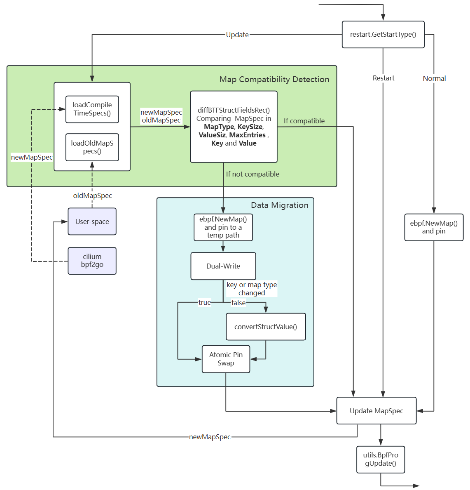

## Kmesh-daemon upgrades traffic without disruption

### Summary

Add traffic-preserving upgrades to Kmesh-daemon.

### Motivation

Currently, Kmesh supports traffic-preserving restarts but does not support traffic-preserving upgrades. During upgrades, existing eBPF map state may be discarded if the map definitions change, leading to connection drops, policy resets, or performance metric loss.

This proposal improves the upgrade experience by:

- Preserving important state (flows, policies, metrics) across versions
- Allowing safe, autonomous rolling upgrades in Kubernetes environments
- Reducing operational risk and improving reliability in production deployments

#### Goals

The purpose of this proposal is to enable seamless traffic continuity during version upgrades by detecting map changes and migrating data safely.

### Design Details

#### Map Compatibility Detection

1.**Runtime MapSpec Loader**: The comparison logic begins by loading each map’s runtime `MapSpec` which includes `MapType`, `KeySize`, `ValueSize`, `MaxEntries`, `Key` and `Value`.
Runtime map compatibility inspection is done by calling `loadCompileTimeSpecs`, which loads each embedded CollectionSpec generated by bpf2go. This function iterates over the enabled BPF engines (e.g., KernelNative, DualEngine, General) based on config and returns a nested registry keyed first by a logical package name (e.g., KmeshCgroupSock) and then by map name.

```go
func loadCompileTimeSpecs(config *options.BpfConfig) (map[string]map[string]*ebpf.MapSpec, error) {
    specs := make(map[string]map[string]*ebpf.MapSpec)

    if config.KernelNativeEnabled() {
        // KernelNative: cgroup_sock
        if coll, err := kernelnative.LoadKmeshCgroupSock(); err != nil {
            return nil, fmt.Errorf("load KernelNative KmeshCgroupSock spec: %w", err)
        } else {
            specs["KmeshCgroupSock"] = coll.Maps
        }
        ... // other KernelNative
    } else if config.DualEngineEnabled() {
        // DualEngine: cgroup_sock workload
        if coll, err := dualengine.LoadKmeshCgroupSockWorkload(); err != nil {
            return nil, fmt.Errorf("load DualEngine KmeshCgroupSockWorkload spec: %w", err)
        } else {
            specs["KmeshCgroupSockWorkload"] = coll.Maps
        }
        ... // other DualEngine
    }

    // General: tc_mark_encrypt
    if coll, err := general.LoadKmeshTcMarkEncrypt(); err != nil {
        return nil, fmt.Errorf("load General KmeshTcMarkEncrypt spec: %w", err)
    } else {
        specs["KmeshTcMarkEncrypt"] = coll.Maps
    }
    ... // other General

    return specs, nil
}
```

2.**MapSpec Snapshot**: During Kmesh-daemon startup, each `MapSpec` generated from the compiled BPF object is stored in a user-space registry on normal startup or Update-type startup. Because raw btf.Type objects can’t be directly marshaled, a custom representation is used:

1. MemberInfo: records each struct field’s name, typeName, offset, and bitfieldSize. If the field itself is a struct, it carries a nested StructInfo.

2. StructInfo: represents a whole struct, storing its name and a slice of MemberInfo entries. If the structure of the Key/Value is not a structure (e.g., int), the `Name` will save the structure name and the `Members` will be null.

3. PersistedMapSpec: stores the metadata for each map — name, type, sizes, max entries, flags — along with the `StructInfo` for its key and value.

The structure that ends up being written to disk is the `PersistedSnapshot` which is keyed first by a logical package name (e.g., KmeshCgroupSock) and then by map name.

```go
type MemberInfo struct {
    Name     string `json:"name"`
    TypeName string `json:"typeName"`
    Offset   uint32 `json:"offset"`
    BitfieldSize     uint32 `json:"bitfieldsize"`  // only have value when the type is bitfield
    Nested   *StructInfo `json:"nested,omitempty"`
}

type StructInfo struct {
    Name    string       `json:"name"`
    Members []MemberInfo `json:"members"`
}

type PersistedMapSpec struct {
    Name       string     `json:"name"`
    Type       string     `json:"type"`       // MapType.String()
    KeySize    uint32     `json:"keySize"`
    ValueSize  uint32     `json:"valueSize"`
    MaxEntries uint32     `json:"maxEntries"`
    Flags      uint32     `json:"flags"`
    KeyInfo    StructInfo `json:"keyInfo"`    // get from btf.Struct
    ValueInfo  StructInfo `json:"valueInfo"`
}

type PersistedSnapshot struct {
   Maps    map[string]map[string]PersistedMapSpec `json:"maps"`
}
```

3.**Persisted MapSpec Loader**: The daemon reads the previously written snapshot file and unmarshals the JSON into the `PersistedSnapshot` structure. This provides the baseline oldMapSpec set used for compatibility checking against newly compiled specs.

4.**Layout Diffing**: A recursive function `diffStructInfoAgainstBTF` is implemented to compare old and new btf.Struct definitions field by field. It detects field additions, removals, type changes, offset shifts, and nested structure changes, and uses a visited map to avoid infinite recursion in recursive types. This function provides a fine-grained structural diff to guide compatibility decisions.

```go
type StructDiff struct {
    Removed       bool // fields present in A but missing in B
    Added         bool // fields present in B but missing in A
    TypeChanged   bool // same-name fields whose type changed
    OffsetChanged bool // same-name fields whose offset changed
    NestedChanged bool // same-name fields of struct type whose nested layout changed
}
```

#### Map Migration Logic

1.**New Map Creation**: When a layout change is detected, a new map is created based on the latest `MapSpec`, with its path set to the old map path appended with "_tmp", and temporarily pinned to an alternate location. If no change is detected, the existing map is left intact and no further action is taken.

2.**Atomic Pin Swap**: Once data migration completes, the daemon proceeds to unpin the old map. It then closes the old map’s file descriptor, attempts to remove the old map’s pin file, and finally renames the temporary pinned path of the new map to the original map’s pin path.

```go
if err := oldMap.Unpin(); err != nil && !os.IsNotExist(err) {
   log.Warnf("failed to unpin old map %s: %v (continuing)", pinPath, err)
}
if err := oldMap.Close(); err != nil {
   log.Warnf("failed to close old map FD: %v (continuing)", err)
}
if err := os.Remove(pinPath); err != nil && !os.IsNotExist(err) {
   return nil, fmt.Errorf("remove old pin %s failed: %w", pinPath, err)
}
if err := os.Rename(tmpPinPath, pinPath); err != nil {
   return nil, fmt.Errorf("rename tmp pin %s to old pin %s failed: %w", tmpPinPath, pinPath, err)
}
```

#### Hot Program Replacement

**Atomic Swap**: Once all maps are migrated, new BPF programs are attached. The upgrade process uses `utils.BpfProgUpdate()` to atomically swap the loaded program with a new one. BpfProgUpdate(progPinPath, cgopt) actually does two steps:

1. LoadPinnedLink: Reopens the existing `bpf_link` from the pinned path before reloading, recovering the same link object in the kernel as the kernel has attached.

2. link.Update(newProgFD): Atomically swaps the BPF program FD on that link to `cgopt.Program`, preserving the existing hook and any accumulated state.

This approach ensures there is no packet loss during the transition. Take `BpfSockOps` for example, if the process is detected as a Restart or Update, the existing pinned link is recovered and updated with the new program:

```go
func (sc *BpfSockOps) Attach() error {
   var err error
   cgopt := link.CgroupOptions{
      Path:    sc.Info.Cgroup2Path,
      Attach:  sc.Info.AttachType,
      Program: sc.KmeshSockopsObjects.SockopsProg,
      }
   // pin bpf_link
   progPinPath := filepath.Join(sc.Info.BpfFsPath, constants.Prog_link)
   if restart.GetStartType() == restart.Restart || restart.GetStartType() == restart.Update {
      if sc.Link, err = utils.BpfProgUpdate(progPinPath, cgopt); err != nil {
         return err
         }
      } else {
         sc.Link, err = link.AttachCgroup(cgopt)
         if err != nil {
            return err
         }
         if err = sc.Link.Pin(progPinPath); err != nil {
            return err
         }
      }
   return nil
}
```

#### Workflow



#### Testing Plan

1.**Unit Tests**: Validate the functionality of key functions, including `LoadCompileTimeSpecs`, `diffStructInfoAgainstBTF`, `SnapshotSpecsByPkg` and `LoadPersistedSnapshot`.

2.**E2E Tests**: Run Kmesh upgrades with live traffic and verify data continuity, no packet loss, and zero connection resets.
