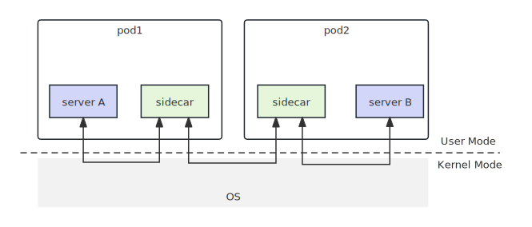
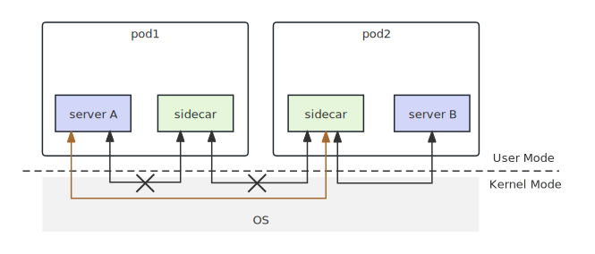
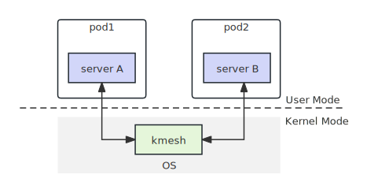
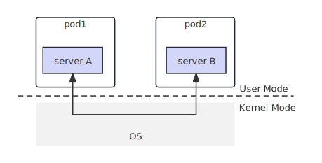
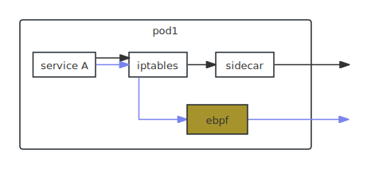
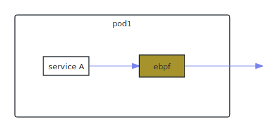

## Background

Currently, if the mesh service is turned on when communication between servers fails, it is difficult to determine whether the problem is caused by the mesh service taking over the traffic, or whether there is a logic error in the application itself. Therefore, we provide a feature to shut down the mesh service and remove it from the communication traffic path to pinpoint whether the problem is caused by the mesh service or an error in the application itself.

## Bypass Function Design

Bypass is a general mesh function used to remove sidecar/kmesh mesh services from the traffic path. The following two scenes show the traffic path after the bypass function is enabled.

### Scene 1: sidecar

Among these two figures, the mesh service is enabled in the cluster to take over the traffic. The first figure shows the traffic path before the bypass function is enabled. We can see from it that the traffic path is server A -> sidecar -> sidecar - > server B, when the communication between server A and server B fails, from the black box level, the user cannot determine whether there is a problem with the sidecar or the server itself. In Figure 2, the bypass function of pod1 is enabled, so that the sidecar in pod1 is removed from the traffic path. If server A and server B can communicate normally at this time, it proves that there is a problem with the sidecar.





### Scene 2: kmesh

In Figure 1, the traffic path is service A->kmesh->service B. In Figure 2, after the bypass function is enabled, it will be judged in the eBPF program of kmesh that the bypass function has been enabled, so kmesh will not take over the data sent by service A, and the traffic path is service A->service B. If service A and service B can communicate normally at this time, it proves that there is a problem with kmesh.





## Bypass fields

```c
struct bpf_map_def SEC("maps") bypass_fliter_map = {
    .type = BPF_MAP_TYPE_HASH,
    .key_size = sizeof(__u32),
    .value_size = sizeof(__u8),
    .max_entries = 256,
};
```

The key represents the IP address of the pod, and the value represents whether the bypass function is enabled for the current pod, represented by 0/1. When this ebpf program is executed, it will check whether the corresponding pod has the bypass function enabled. If enabled, all subsequent iptables rules will be short-circuited and inbound and outbound traffic will be short-circuited, otherwise, subsequent iptables rules will not be short-circuited.

## How to enable bypass

Users can label pods with the following command:

```shell
kubectl label pod <pod_name> kmesh.net/bypass=enabled
```

This causes the inbound and outbound traffic of the mesh service on the pod to be short-circuited.

## How to watch label

The Kmesh Daemon observes changes in the Kubernetes API Server and implements observation of specific labels using a Field Selector. It communicates with the kube-apiserver, filters the desired resource objects, and thus only observes changes specific to certain labels.

```go
informerFactory := informers.NewSharedInformerFactoryWithOptions(client, 0,
    informers.WithTweakListOptions(func(options *metav1.ListOptions) {
        options.FieldSelector = fmt.Sprintf("spec.nodeName=%s", nodeName)
        options.LabelSelector = "kmesh.net/bypass=enabled"
    }))

podInformer := informerFactory.Core().V1().Pods()
```

## Traffic governance process

### Scene 1: sidecar



The path represented by the black arrow in the above figure is the traffic path before the bypass function is enabled, and the blue arrow is the traffic path after the bypass function is enabled. The difference is that after the bypass function is enabled, two will be added to the top layer of the iptables rules by kmesh mda. The rules are:

```shell
iptables -t nat -I OUTPUT -m bpf --object-pinned /sys/fs/bpf/bypass -j RETURN
iptables -t nat -I PREROUTING -m bpf --object-pinned /sys/fs/bpf/bypass -j RETURN
```

These two rules will cause the traffic path to be updated in the ebpf program. The ebpf program will determine whether the current pod has the bypass function enabled. If the function is enabled, the data will be sent directly to the peer instead of the mesh service.

### Scene 2: kmesh



In this scenario, the path represented by the blue arrow in the above figure is the traffic path before and after the bypass function is enabled. The difference lies in the addition of judgment on the bypass function in the original ebpf program of the kmesh program. The basis for whether the current kmesh takes over traffic is whether the ebpf program obtains a class that is consistent with the class defined by kmesh. If it is consistent, the traffic will be taken over. After the bypass function is turned on, it will be judged again whether the bypass function is enabled.

## Note

- The current bypass function only shortens the network service traffic of a single pod, rather than the network service on the entire traffic path. To address the issue that one end of the network service is short circuited, causing the network service on the other end to be unable to parse the encrypted messages received. Before enabling the bypass function, it is necessary to configure the mesh service to send messages in plaintext format
- Currently, bypass will short-circuit the inbound and outbound traffic of a single pod. Later, the inboundand outbound traffic will be subdivided. For example, only the outbound direction traffic will be short-circuited.
