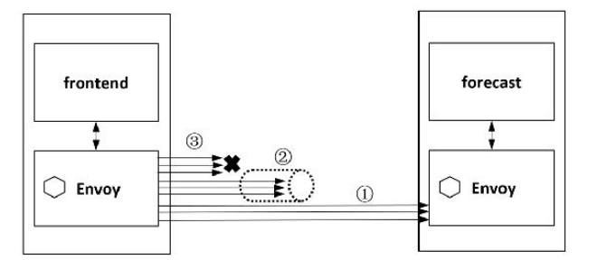
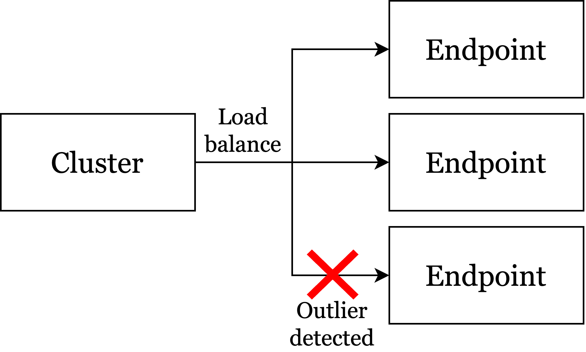
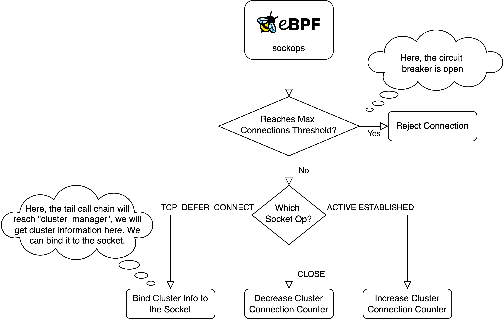
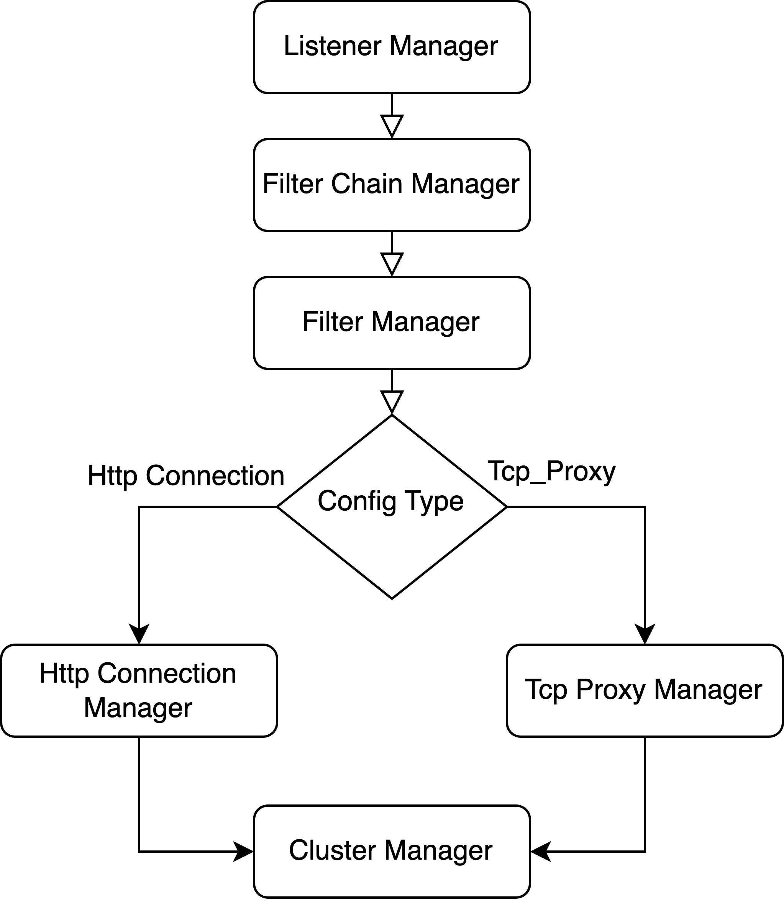

## Add circuit breaker function in Kmesh

### Summary

Main target:

+ Support circuit breaker.
+ Support outlier detection.
+ Add sufficient unit tests.

### Motivation

The circuit breaker mechanism is typically used to prevent the spread of failures between services, safeguarding system stability and avoiding system crashes or cascading failures caused by a large number of requests. Kmesh currently does not implement the circuit breaker mechanism.

Common scenarios that trigger circuit breakers include:
+ High error rate in the service
+ High latency in the service
+ Exhaustion of service resources
+ Service unavailability
+ Service requests hit the maximum limit
+ Service connections hit the maximum limit

#### Goals

+ Support circuit breaker. Kmesh should be able to parse the circuit breaker config from xds stream and enable corresponding circuit breakers.
+ Support circuit breaker. Kmesh should be able to parse the outlier detection config from xds stream and support outlier detection.
+ Add sufficient unit tests to test the correctness of the functions.

### Design Details

#### Circuit Breaker in Istio

Envoy supports cluster and per-host thresholds(but only the `max_connections` field is now available in per-host thresholds). For more details, please check the [official document](https://www.envoyproxy.io/docs/envoy/latest/api-v3/config/cluster/v3/circuit_breaker.proto).

> per_host_thresholds
> (repeated config.cluster.v3.CircuitBreakers.Thresholds) Optional per-host limits that apply to each host in a cluster.

Here is the comparison table for settings between Envoy and Istio.

| Envoy                       | Target Object            | Istio                    | Target Object |
| --------------------------- | ------------------------ | ------------------------ | ------------- |
| max_connection              | cluster.circuit_breakers | maxConnection            | TcpSettings   |
| max_pending_requests        | cluster.circuit_breakers | http1MaxPendingRequests  | HttpSettings  |
| max_requests                | cluster.circuit_breakers | http2MaxRequests         | HttpSettings  |
| max_retries                 | cluster.circuit_breakers | maxRetries               | HttpSettings  |
| connection_timeout_ms       | cluster                  | connectTimeout           | TcpSettings   |
| max_requests_per_connection | cluster                  | maxRequestsPerConnection | HttpSettings  |

The Circuit Breaker used by Envoy does not adopt the traditional "Open"-"Half Open"-"Close" three-state definition, but instead, once the threshold is exceeded (or falls below), the circuit breaker will open (close).

<div align="center">
    
</div>

Here is the example based on the figure above:

1. When the requests from the frontend service to the target service `forecast` do not exceed the configured maximum connection count, they are allowed through.
2. When the requests from the frontend service to the target service `forecast` do not exceed the configured maximum pending requests count, they enter the connection pool to wait.
3. When the requests from the frontend service to the target service `forecast` exceed the configured maximum pending requests count, they are directly rejected.

Take threshold `max_connection,` for example; if the number of active connections exceeds the threshold, it will open a circuit breaker.

`canCreateConnection` simply checks whether the number of active actions is below the cluster or per host's thresholds.

```c++
bool canCreateConnection(Upstream::ResourcePriority priority) const override {
    if (stats().cx_active_.value() >= cluster().resourceManager(priority).maxConnectionsPerHost()) {
        return false;
    }
    return cluster().resourceManager(priority).connections().canCreate();
}
```

If cannot create a new connection, the `upstream_cx_overflow_` counter in cluster traffic stats will be increased.

```c++
ConnPoolImplBase::tryCreateNewConnection(float global_preconnect_ratio) {
    const bool can_create_connection = host_->canCreateConnection(priority_);

    if (!can_create_connection) {
        host_->cluster().trafficStats()->upstream_cx_overflow_.inc();
    }

    // If we are at the connection circuit-breaker limit due to other upstreams having
    // too many open connections, and this upstream has no connections, always create one, to
    // prevent pending streams being queued to this upstream with no way to be processed.
    if (can_create_connection || (ready_clients_.empty() && busy_clients_.empty() &&
                                    connecting_clients_.empty() && early_data_clients_.empty())) {
        ENVOY_LOG(debug, "creating a new connection (connecting={})", connecting_clients_.size());
        // here are some logics for establishing a connection 
    } else {
        ENVOY_LOG(trace, "not creating a new connection: connection constrained");
        return ConnectionResult::NoConnectionRateLimited;
    }
}
```

Envoy also supports outlier detection. If an endpoint produces too many exceptions (e.g., returning 5xx HTTP status), it will be temporarily removed from the connection pool.

<div align="center">
    
</div>

After some time, it will be added back, but if it continues to fail, it will be removed again. Each time it's removed, the wait time to be added back increases.

So, Istio's circuit breaker has two main functionalities that involve both L4 and L7 management, as shown in the table below:

| Function                 | Network Management                                   |
| ------------------------ | ---------------------------------------------------- |
| Connection Pool Settings | L4, connection statistic, traffic control            |
| Outlier Detection        | L4 & L7, http status code statistic, traffic control |

#### Implement the connection pool settings

Here are some counters and gauges in Envoy:

+ Host Stats

    | Variable        | Type    |
    | --------------- | ------- |
    | cx_connect_fail | COUNTER |
    | cx_total        | COUNTER |
    | rq_error        | COUNTER |
    | rq_success      | COUNTER |
    | rq_timeout      | COUNTER |
    | rq_total        | COUNTER |
    | cx_active       | GAUGE   |
    | rq_active       | GAUGE   |

+ Cluster Stats

    Please check [config-cluster-manager-cluster-stats](https://www.envoyproxy.io/docs/envoy/latest/configuration/upstream/cluster_manager/cluster_stats#config-cluster-manager-cluster-stats).

We can define similar bpf map for cluster resources and cluster traffic stats. We can define some bpf maps like following:

```c
struct resource {
    __u64 curr;
    __u64 max;
};

struct cluster_resources {
    struct resource connections;
};

struct cluster_traffic_stats {
    __u64 upstream_cx_overflow;
};

struct {
    __uint(type, BPF_MAP_TYPE_HASH);
    __uint(key_size, CLUSTER_NAME_MAX_LEN);
    __uint(value_size, sizeof(struct cluster_resources));
    __uint(map_flags, BPF_F_NO_PREALLOC);
    __uint(max_entries, MAP_SIZE_OF_CLUSTER);
} map_of_cluster_resources SEC(".maps");

struct {
    __uint(type, BPF_MAP_TYPE_HASH);
    __uint(key_size, CLUSTER_NAME_MAX_LEN);
    __uint(value_size, sizeof(struct cluster_traffic_stats));
    __uint(map_flags, BPF_F_NO_PREALLOC);
    __uint(max_entries, MAP_SIZE_OF_CLUSTER);
} map_of_cluster_traffic_stats SEC(".maps");
```

We can initialize the max value of cluster resources through the given istio config (please check the first table). We can do this in user space, when calling `ClusterUpdate` or `ClusterDelete` in `ClusterCache.Flush`:

```c
// Flush flushes the cluster to bpf map.
func (cache *ClusterCache) Flush() {
	var err error
	cache.mutex.Lock()
	defer cache.mutex.Unlock()
	for name, cluster := range cache.apiClusterCache {
		switch cluster.GetApiStatus() {
		case core_v2.ApiStatus_UPDATE:
			err = maps_v2.ClusterUpdate(name, cluster)
			if err == nil {
				// reset api status after successfully updated
				cluster.ApiStatus = core_v2.ApiStatus_NONE
			}
            // TODO:Update cluster resources here
		case core_v2.ApiStatus_DELETE:
			err = maps_v2.ClusterDelete(name)
			if err == nil {
				delete(cache.apiClusterCache, name)
				delete(cache.resourceHash, name)
			}
            // TODO:Update cluster resources here
		}
		if err != nil {
			log.Errorf("cluster %s %s flush failed: %v", name, cluster.ApiStatus, err)
		}
	}
}
```

To monitor current active tcp connections, we need to create a `BPF_MAP_TYPE_SK_STORAGE` map:

```c
struct cluster_sock_data {
    char cluster_name[BPF_DATA_MAX_LEN];
};

struct {
    __uint(type, BPF_MAP_TYPE_SK_STORAGE);
    __uint(map_flags, BPF_F_NO_PREALLOC);
    __type(key, int);
    __type(value, struct cluster_sock_data);
} map_of_cluster_sock SEC(".maps");
```

We can manage the lifecycle of a socket based on it.

Then, we can follow the flow chart below:

<div align="center">
    
</div>

We can monitor socket operations in eBPF "sockops" hooks. First, we judge whether the active connections for a cluster have reaches max thresholds. If so, we should reject the connection (how to do so is still TBD). Otherwise, we allow the connection, and handle it based on the type of socket op.

+ TCP_DEFER_CONNECT:

    We will enter sockops traffic control flow in this branch. It will trigger a series of chain calls, finally reaching `cluster_manager` (check the following image).

    <div align="center">
        
    </div>

    We will get cluster information here (e.g, cluster name). We can store the cluster name (as the identifier of the cluster) in the `cluster_sock_data`. Here, we have bound the cluster to the socket.

    We can do so by calling this function below in `cluster_manager`:

    ```c
    static inline void on_cluster_sock_bind(struct bpf_sock *sk, const char* cluster_name) {
        BPF_LOG(DEBUG, KMESH, "record sock bind for cluster %s\n", cluster_name);
        struct cluster_sock_data *data = NULL;
        if (!sk) {
            BPF_LOG(WARN, KMESH, "provided sock is NULL\n");
            return;
        }

        data = bpf_sk_storage_get(&map_of_cluster_sock, sk, 0, BPF_LOCAL_STORAGE_GET_F_CREATE);
        if (!data) {
            BPF_LOG(ERR, KMESH, "record_cluster_sock call bpf_sk_storage_get failed\n");
            return;
        }

        bpf_strncpy(data->cluster_name, BPF_DATA_MAX_LEN, (char *)cluster_name);
        BPF_LOG(DEBUG, KMESH, "record sock bind for cluster %s done\n", cluster_name);
    }
    ```

+ PASSIVE/ACTIVE ESTABLISHED

    Here, the tcp connection has been established. We can check whether the current socket targets a cluster. If so, we should increase cluster connection counter here.

    We can call the function here:

    ```c
    static inline struct cluster_sock_data* get_cluster_sk_data(struct bpf_sock *sk) {
        struct cluster_sock_data *data = NULL;
        if (!sk) {
            BPF_LOG(DEBUG, KMESH, "provided sock is NULL\n");
            return NULL;
        }

        data = bpf_sk_storage_get(&map_of_cluster_sock, sk, 0, 0);
        return data;
    }

    static inline void on_cluster_sock_connect(struct bpf_sock *sk) {
        struct cluster_sock_data *data = get_cluster_sk_data(sk);
        if (!data) {
            return;
        }
        BPF_LOG(DEBUG, KMESH, "record sock connection for cluster %s\n", data->cluster_name);
        // increase cluster connection counter here.
    }
    ```

+ TCP CLOSE

    Once the tcp connection is closed. We should decrease the counter:

    ```c
    static inline void on_cluster_sock_close(struct bpf_sock *sk) {
        struct cluster_sock_data *data = get_cluster_sk_data(sk);
        if (!data) {
            return;
        }
        BPF_LOG(DEBUG, KMESH, "record sock close for cluster %s", data->cluster_name);
    }
    ```


#### Implement the outlier detection function

Outlier Detection in Istio and Envoy is a mechanism used to enhance the resilience and stability of microservice systems. Its primary goal is to detect and isolate instances of services that are performing abnormally, preventing these instances from affecting the overall performance and availability of the system.

It has two main functions:

+ Outlier Detection monitors the health status of service instances and identifies abnormal performance based on predefined metrics, such as the number of consecutive failed requests or the failure rate of requests.

+ Once an anomaly is detected, Outlier Detection temporarily removes the instance from the load balancing pool, effectively "ejecting" the instance to prevent it from receiving new requests. After a certain period, the system will reassess the health status of the instance and, if it has returned to normal, will reintegrate it into the load balancing pool.

We can monitor HTTP return statuses in eBPF to determine if a service is experiencing 5xx errors. When the number of such errors reaches a certain threshold, we need to exclude the corresponding endpoints from the load balancing selection.

The process of monitor and traffic management is similar to the function of connection pool settings.
