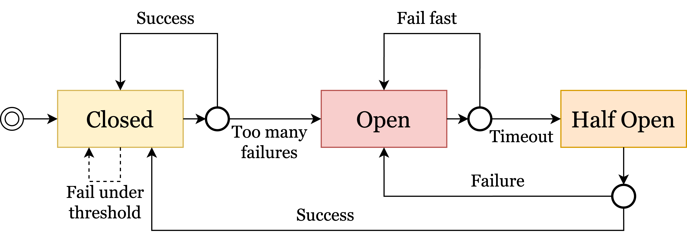
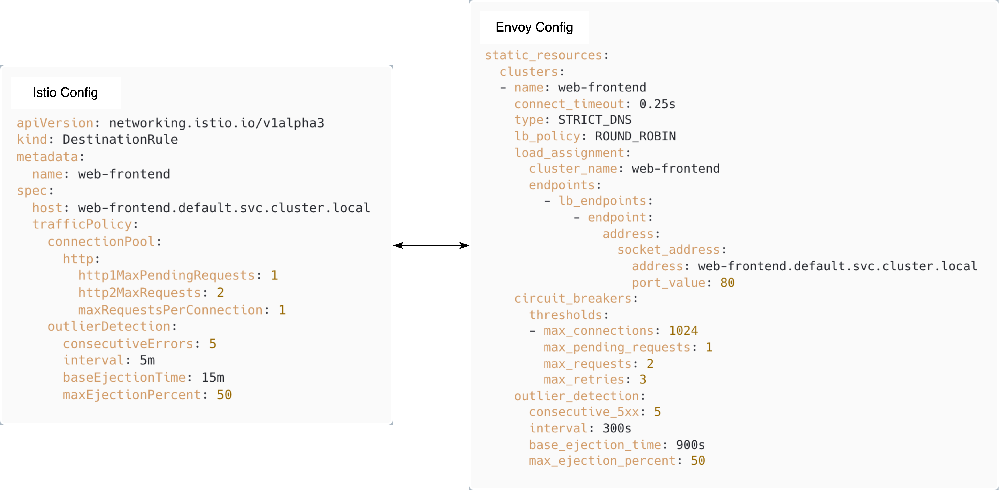
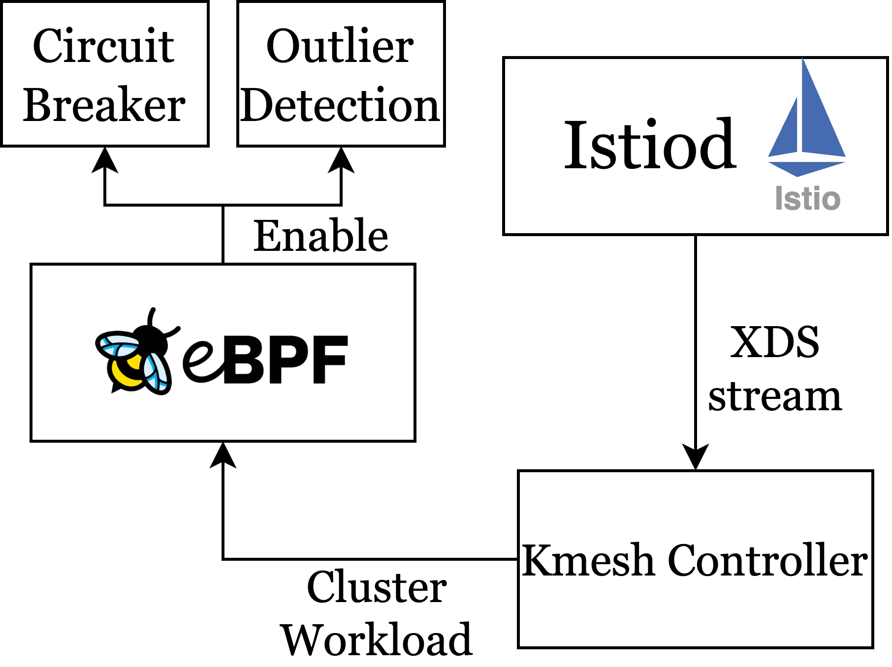

## Add circuit breaker function in Kmesh

### Summary

Roadmap:

+ Support circuit breaker.
+ Support outlier detection.
+ Add sufficient unit tests.

### Motivation

The circuit breaker mechanism is typically used to prevent the spread of failures between services, safeguarding system stability and avoiding system crashes or cascading failures caused by a large number of requests. Kmesh currently does not implement the circuit breaker mechanism.

Common scenarios that trigger circuit breakers include:
+ High error rate in the service
+ High latency in the service
+ Exhaustion of service resources
+ Service unavailability

#### Goals

+ Support circuit breaker. Kmesh should be able to parse the circuit breaker config from xds stream and enable corresponding circuit breakers.
+ Support circuit breaker. Kmesh should be able to parse the outlier detection config from xds stream and support outlier detection.
+ Add sufficient unit tests to test the correctness of the functions.

### Design Details

#### Implement the state machine of a circuit breaker



We can implement a circuit breaker mechanism to ensure system stability and reliability while minimizing access to faulty services. First, we need to implement a circuit breaker with three states: closed, open, and half-open.

In the closed state, all requests pass through normally and are sent to the target service, even if occasional failures occur, without triggering the circuit breaker. However, when the number of failed requests exceeds a preset threshold, the circuit breaker quickly switches to the open state. In this state, all requests immediately fail, avoiding sending requests to a service known to be failing, thus reducing the system's burden.

In the open state, the circuit breaker starts a timeout timer. After the timeout period, the circuit breaker transitions to the half-open state. In the half-open state, the system allows a small number of requests to go through to test whether the target service has recovered. If these requests succeed, the circuit breaker closes again, allowing the service to handle more requests. If the requests fail, the circuit breaker reopens, maintaining protection for the system against the potentially faulty service.

This mechanism effectively monitors the health of the service and dynamically adjusts the state of the circuit breaker based on the actual situation, ensuring the system can quickly respond appropriately to failures. This, in turn, enhances system stability and reliability.

To implement the aforementioned functionality, we can maintain several counters in eBPF to calculate the number of requests reaching each cluster (including the number of successful requests, timed-out requests, failed requests, etc.). Once certain conditions are met, we can trigger the circuit breaker mechanism to reject traffic destined for a particular cluster.

#### Implement the outlier detection function


Outlier Detection in Istio and Envoy is a mechanism used to enhance the resilience and stability of microservice systems. Its primary goal is to detect and isolate instances of services that are performing abnormally, preventing these instances from affecting the overall performance and availability of the system.

It has two main functions:

+ Outlier Detection monitors the health status of service instances and identifies abnormal performance based on predefined metrics, such as the number of consecutive failed requests or the failure rate of requests.

+ Once an anomaly is detected, Outlier Detection temporarily removes the instance from the load balancing pool, effectively "ejecting" the instance to prevent it from receiving new requests. After a certain period, the system will reassess the health status of the instance and, if it has returned to normal, will reintegrate it into the load balancing pool.

We can monitor HTTP return statuses in eBPF to determine if a service is experiencing 5xx errors. When the number of such errors reaches a certain threshold, we need to exclude the corresponding endpoints from the load balancing selection.

#### Circuit breaker and outlier detection config

In Istio, circuit breaking can be configured in the `TrafficPolicy` field of the Istio CRD `Destination Rule`. Under `TrafficPolicy`, there are two fields related to circuit breaking: `ConnectionPoolSettings` and `OutlierDetection`. In `ConnectionPoolSettings`, you can configure the number of connections for a service. `OutlierDetection` is used to control the eviction of unhealthy services from the load balancing pool. For example, `ConnectionPoolSettings` controls the maximum number of requests, pending requests, retries, or timeouts, while `OutlierDetection` controls the number of errors a service must have before being ejected from the connection pool, and you can set the minimum ejection duration and the maximum ejection percentage (Istio [related documentation](https://istio.io/latest/docs/reference/config/networking/destination-rule/#ConnectionPoolSettings)).

The diagram below shows the relevant configurations in Istio and Envoy.



We can utilize the existing CircuitBreaker data structure (this data structure is stored within the Cluster workload). If necessary, we can also add new fields to this data structure:

```protobuf
message CircuitBreakers {
  core.RoutingPriority priority = 1;
  uint32 max_connections = 2;
  uint32 max_pending_requests = 3;
  uint32 max_requests = 4;
  uint32 max_retries = 5;
  uint32 max_connection_pools = 7;
}
```

Here is the control flow depicted in the following diagram.



