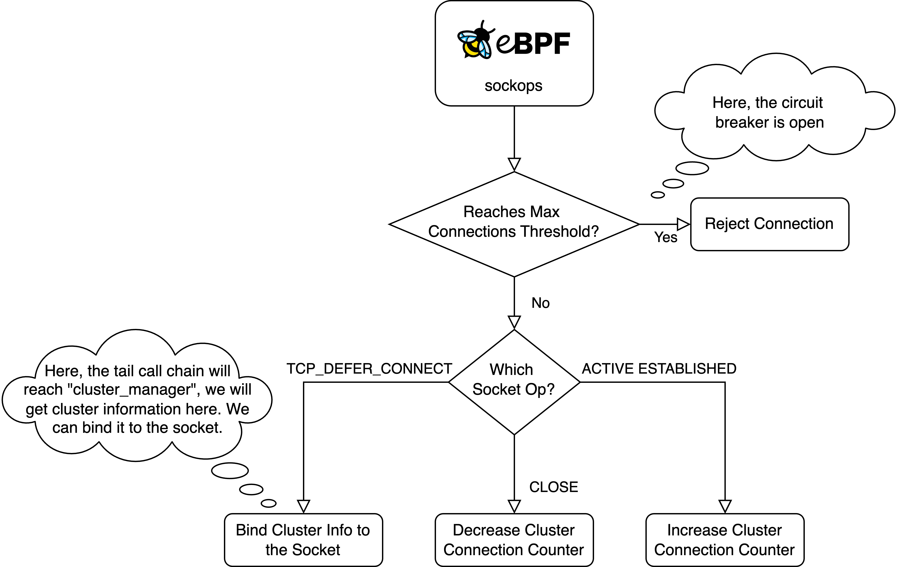
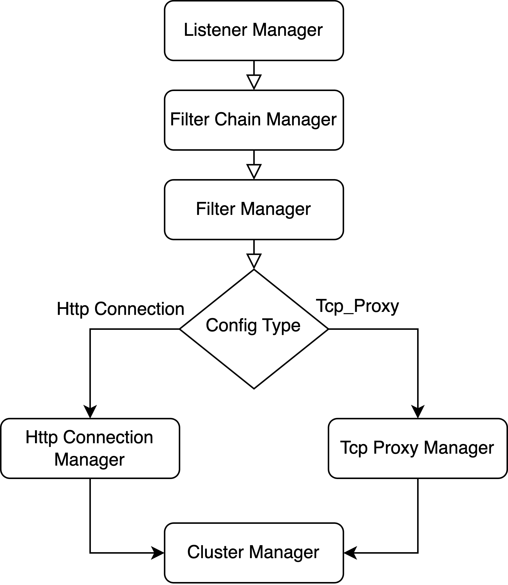

## 在 Kmesh 中添加 circuit breaker 功能

### 概述

主要目标:

+ 支持 circuit breaker 机制。
+ 支持异常检测。
+ 添加充分的单元测试。

### 动机

circuit breaker 机制通常用于防止服务间故障扩散，保障系统稳定性，避免因大量请求导致系统崩溃或级联故障。当前 Kmesh 尚未实现 circuit breaker 机制。

触发 circuit breaker 的常见场景包括：
+ 服务错误率过高
+ 服务延迟过高
+ 服务资源耗尽
+ 服务不可用
+ 服务请求达到最大限制
+ 服务连接达到最大限制

#### 目标

+ 支持 circuit breaker 功能：Kmesh 应能从 XDS 流解析 circuit breaker 配置并启用相应 circuit breaker。
+ 支持异常检测：Kmesh 应能从 XDS 流解析异常检测配置并支持异常检测。
+ 添加充分单元测试以验证功能正确性。

### 设计细节

#### Istio 中的 circuit breaker 机制

Envoy 支持集群级和单主机级阈值（但目前单主机级阈值仅 `max_connections` 字段可用）。更多细节请查阅[官方文档](https://www.envoyproxy.io/docs/envoy/latest/api-v3/config/cluster/v3/circuit_breaker.proto).

> per_host_thresholds
> (重复的 config.cluster.v3.CircuitBreakers.Thresholds)可选的单主机限制，适用于集群中的每个主机。

以下是 Envoy 与 Istio 配置项的对比表：

| Envoy                       | 目标对象            | Istio                    | 目标对象 |
| --------------------------- | ------------------------ | ------------------------ | ------------- |
| max_connection              | cluster.circuit_breakers | maxConnection            | TcpSettings   |
| max_pending_requests        | cluster.circuit_breakers | http1MaxPendingRequests  | HttpSettings  |
| max_requests                | cluster.circuit_breakers | http2MaxRequests         | HttpSettings  |
| max_retries                 | cluster.circuit_breakers | maxRetries               | HttpSettings  |
| connection_timeout_ms       | cluster                  | connectTimeout           | TcpSettings   |
| max_requests_per_connection | cluster                  | maxRequestsPerConnection | HttpSettings  |

Envoy 使用的 circuit breaker 未采用传统的 "Open"-"Half Open"-"Close" 三态定义，而是一旦超过（或低于）阈值，circuit breaker 就会打开（关闭）。

<div align="center">
    
</div>

基于上图的示例说明：

1. 当前端服务对目标服务forecast的请求未超过配置的最大连接数时，请求被允许通过。
2. 当前端服务对目标服务forecast的请求未超过配置的最大挂起请求数时，请求进入连接池等待。
3. 当前端服务对目标服务forecast的请求超过配置的最大挂起请求数时，请求直接被拒绝。

以阈值 `max_connection,` 为例：当活动连接数超过阈值时，circuit breaker 将打开。

`canCreateConnection` 函数仅检查活动连接数是否低于集群或单主机的阈值：

```c++
bool canCreateConnection(Upstream::ResourcePriority priority) const override {
    if (stats().cx_active_.value() >= cluster().resourceManager(priority).maxConnectionsPerHost()) {
        return false;
    }
    return cluster().resourceManager(priority).connections().canCreate();
}
```

若无法创建新连接，集群流量统计中的 `upstream_cx_overflow_` 计数器将增加：

```c++
ConnPoolImplBase::tryCreateNewConnection(float global_preconnect_ratio) {
    const bool can_create_connection = host_->canCreateConnection(priority_);

    if (!can_create_connection) {
        host_->cluster().trafficStats()->upstream_cx_overflow_.inc();
    }

    // If we are at the connection circuit-breaker limit due to other upstreams having
    // too many open connections, and this upstream has no connections, always create one, to
    // prevent pending streams being queued to this upstream with no way to be processed.
    if (can_create_connection || (ready_clients_.empty() && busy_clients_.empty() &&
                                    connecting_clients_.empty() && early_data_clients_.empty())) {
        ENVOY_LOG(debug, "creating a new connection (connecting={})", connecting_clients_.size());
        // here are some logics for establishing a connection 
    } else {
        ENVOY_LOG(trace, "not creating a new connection: connection constrained");
        return ConnectionResult::NoConnectionRateLimited;
    }
}
```

Envoy 还支持异常检测：若某个端点产生过多异常（如返回 5xx HTTP 状态码），会被临时从连接池中移除。

<div align="center">
    
</div>

一段时间后该端点会被重新加入，但如果继续失败则会再次被移除，且每次移除后的等待时间会递增。

因此，Istio 的断路器包含 L4 和 L7 层管理的两大核心功能，如下表所示：


| 功能                 | 网络管理                                   |
| ------------------------ | ---------------------------------------------------- |
| 连接池设置 | L4 层，连接统计与流量控制            |
| 异常检测        | L4 & L7 层，HTTP 状态码统计与流量控制 |

#### 实现连接池设置

以下是 Envoy 中的一些计数器和计量表：

+ 主机统计

    | 变量        | 类型    |
    | --------------- | ------- |
    | cx_connect_fail | COUNTER |
    | cx_total        | COUNTER |
    | rq_error        | COUNTER |
    | rq_success      | COUNTER |
    | rq_timeout      | COUNTER |
    | rq_total        | COUNTER |
    | cx_active       | GAUGE   |
    | rq_active       | GAUGE   |

+ 集群统计

    请查阅 [config-cluster-manager-cluster-stats](https://www.envoyproxy.io/docs/envoy/latest/configuration/upstream/cluster_manager/cluster_stats#config-cluster-manager-cluster-stats).

我们可以为集群资源和集群流量统计信息定义类似的 bpf 映射。我们可以定义一些 bpf 映射，如下所示：

我们应该使用以下数据结构和 bpf 映射记录每个集群的状态：

```c
struct cluster_stats {
    __u32 active_connections;
};

struct cluster_stats_key {
    __u64 netns_cookie;
    __u32 cluster_id;
};

struct {
    __uint(type, BPF_MAP_TYPE_HASH);
    __uint(key_size, sizeof(struct cluster_stats_key));
    __uint(value_size, sizeof(struct cluster_stats));
    __uint(map_flags, BPF_F_NO_PREALLOC);
    __uint(max_entries, MAP_SIZE_OF_CLUSTER);
} map_of_cluster_stats SEC(".maps");
```
在这里，键由两部分组成： `netns_cookie` 和 `cluster_id`。前者用于标识 Pod，而后者代表集群。但是，cluster 的标识符是其名称。如果我们使用名称为 `cluster_id`，我们很容易超过 bpf 堆栈的大小限制。因此，我们需要使用 hash 将 cluster name 映射到一个整数：

```c
// Flush flushes the cluster to bpf map.
func (cache *ClusterCache) Flush() {
	cache.mutex.Lock()
	defer cache.mutex.Unlock()
	for name, cluster := range cache.apiClusterCache {
		if cluster.GetApiStatus() == core_v2.ApiStatus_UPDATE {
			err := maps_v2.ClusterUpdate(name, cluster)
			if err == nil {
				// reset api status after successfully updated
				cluster.ApiStatus = core_v2.ApiStatus_NONE
				cluster.Id = cache.hashName.StrToNum(name)
			} else {
				log.Errorf("cluster %s %s flush failed: %v", name, cluster.ApiStatus, err)
			}
		} else if cluster.GetApiStatus() == core_v2.ApiStatus_DELETE {
			err := maps_v2.ClusterDelete(name)
			if err == nil {
				delete(cache.apiClusterCache, name)
				delete(cache.resourceHash, name)
				cache.hashName.Delete(name)
			} else {
				log.Errorf("cluster %s delete failed: %v", name, err)
			}
		}
	}
}
```
你可以看到我们引入了一个 hashName 来将字符串映射到整数。

在这里，我们还向 cluster 添加了一个新字段 `id`：

```protobuf
message Cluster {
  enum LbPolicy {
    ROUND_ROBIN = 0;
    LEAST_REQUEST = 1;
    RANDOM = 3;
  }

  core.ApiStatus api_status = 128;
  string name = 1;
  uint32 id = 2;
  uint32 connect_timeout = 4;
  LbPolicy lb_policy = 6;

  endpoint.ClusterLoadAssignment load_assignment = 33;
  CircuitBreakers circuit_breakers = 10;
}
```
要监控当前活跃的 tcp 连接，我们需要创建一个 `BPF_MAP_TYPE_SK_STORAGE` 映射：

```c
struct cluster_sock_data {
    __u32 cluster_id;
};

struct {
    __uint(type, BPF_MAP_TYPE_SK_STORAGE);
    __uint(map_flags, BPF_F_NO_PREALLOC);
    __type(key, int);
    __type(value, struct cluster_sock_data);
} map_of_cluster_sock SEC(".maps");
```

我们可以基于它来管理 socket 的生命周期。

然后，我们可以按照下面的流程图进行作：

<div align="center">
    
</div>

我们可以监控 eBPF “sockops” hooks 中的 socket作。首先，我们判断集群的活跃连接数是否达到最大阈值。如果是这样，我们应该拒绝该连接（如何做到这一点仍然待定）。否则，我们允许连接，并根据 socket op 的类型进行处理。

+ TCP_DEFER_CONNECT:

    我们将在此分支中输入 sockops 流量控制流。它将触发一系列链式调用，最终达到`cluster_manager`  （查看下图）。

    <div align="center">
        
    </div>

    我们将在此处获取集群信息（例如，集群 ID）。我们可以将集群 ID 存储在`cluster_sock_data` 中。在这个阶段，我们已经将集群绑定到 socket。

    我们可以通过在下面的 `cluster_manager` 中调用这个函数来实现这一点：

    ```c
    static inline void on_cluster_sock_bind(struct bpf_sock *sk, const char* cluster_name) {
        BPF_LOG(DEBUG, KMESH, "record sock bind for cluster %s\n", cluster_name);
        struct cluster_sock_data *data = NULL;
        if (!sk) {
            BPF_LOG(WARN, KMESH, "provided sock is NULL\n");
            return;
        }

        data = bpf_sk_storage_get(&map_of_cluster_sock, sk, 0, BPF_LOCAL_STORAGE_GET_F_CREATE);
        if (!data) {
            BPF_LOG(ERR, KMESH, "record_cluster_sock call bpf_sk_storage_get failed\n");
            return;
        }

        bpf_strncpy(data->cluster_name, BPF_DATA_MAX_LEN, (char *)cluster_name);
        BPF_LOG(DEBUG, KMESH, "record sock bind for cluster %s done\n", cluster_name);
    }
    ```

+ ACTIVE ESTABLISHED

    在这里，TCP 连接已建立。我们可以检查当前 socket 是否指向集群。如果是，我们应该在这里增加集群连接计数器。

    我们可以在这里调用这个函数:

    ```c
    static inline void on_cluster_sock_connect(struct bpf_sock_ops *ctx)
    {
        if (!ctx) {
            return;
        }
        struct cluster_sock_data *data = get_cluster_sk_data(ctx->sk);
        if (!data) {
            return;
        }
        __u64 cookie = bpf_get_netns_cookie(ctx);
        struct cluster_stats_key key = {0};
        key.netns_cookie = cookie;
        key.cluster_id = data->cluster_id;
        BPF_LOG(
            DEBUG,
            KMESH,
            "increase cluster active connections(netns_cookie = %lld, cluster id = %ld)",
            key.netns_cookie,
            key.cluster_id);
        update_cluster_active_connections(&key, 1);
        BPF_LOG(DEBUG, KMESH, "record sock connection for cluster id = %ld\n", data->cluster_id);
    }
    ```

+ TCP CLOSE

    一旦 TCP 连接关闭，我们应该减少计数器:

    ```c
    static inline void on_cluster_sock_close(struct bpf_sock_ops *ctx)
    {
        if (!ctx) {
            return;
        }
        struct cluster_sock_data *data = get_cluster_sk_data(ctx->sk);
        if (!data) {
            return;
        }
        __u64 cookie = bpf_get_netns_cookie(ctx);
        struct cluster_stats_key key = {0};
        key.netns_cookie = cookie;
        key.cluster_id = data->cluster_id;
        update_cluster_active_connections(&key, -1);
        BPF_LOG(
            DEBUG,
            KMESH,
            "decrease cluster active connections(netns_cookie = %lld, cluster id = %ld)",
            key.netns_cookie,
            key.cluster_id);
        BPF_LOG(DEBUG, KMESH, "record sock close for cluster id = %ld", data->cluster_id);
    }
    ```

我们可以从集群数据中获取 circuit breaker 信息：
```c
static inline Cluster__CircuitBreakers *get_cluster_circuit_breakers(const char *cluster_name)
{
    const Cluster__Cluster *cluster = NULL;
    cluster = map_lookup_cluster(cluster_name);
    if (!cluster) {
        return NULL;
    }
    Cluster__CircuitBreakers *cbs = NULL;
    cbs = kmesh_get_ptr_val(cluster->circuit_breakers);
    if (cbs != NULL)
        BPF_LOG(DEBUG, KMESH, "get cluster's circuit breaker: max connections = %ld\n", cbs->max_connections);
    return cbs;
}
```
然后，我们可以从 `Cluster__CircuitBreakers` 获取所有阈值，并确定 circuit breaker 是否应该打开。

#### 实现异常值检测函数

Istio 和 Envoy 中的异常检测是一种增强微服务系统弹性和稳定性的机制。其主要目标是检测和隔离表现异常的服务实例，防止这些实例影响系统的整体性能和可用性。

它有两个主要功能：

+ 异常检测监控服务实例的健康状态，并根据预定义的度量标准识别异常性能，例如连续失败请求的数量或请求的失败率。

+ 一旦检测到异常，异常检测会暂时将该实例从负载均衡池中移除，有效地“驱逐”该实例以防其接收新的请求。经过一段时间后，系统会重新评估该实例的健康状态，如果其已经恢复正常，将会将其重新纳入负载均衡池。

我们可以在 eBPF 中监控 HTTP 返回状态，以确定服务是否出现 5xx 错误。当此类错误的数量达到某个阈值时，我们需要将相应的端点排除在负载均衡选择之外。

监控和流量管理的过程类似于连接池设置的功能。
