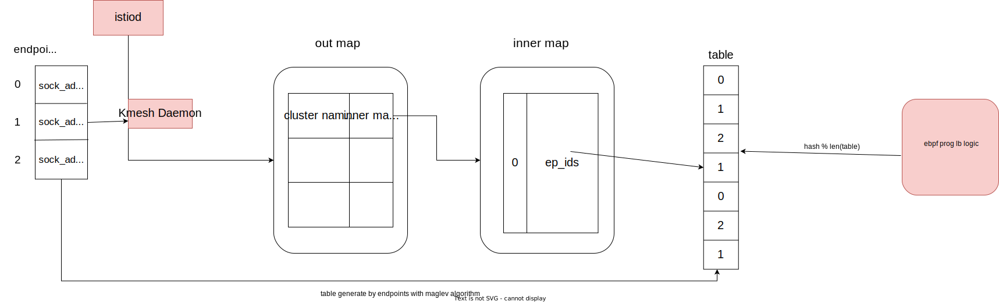

## Your short, descriptive title

Add Consistent hash based LB in ebpf prog

### Summary

<ol>
<li>Maglev consistent hash algorithm</li>
<li>IP tuple info based hash</li>
<li>L7 http header based hash</li>
</ol>

#### Goals

<ol>
<li>Networking load balance</li>
<li>Guarrant a client conn always send request to same backend</li>
<li>Minimize remapping</li>
</ol>

### Proposal

#### maglev
Algorithm main purpose: map all backends into a fixed look up table, require even mapping, and try to minimize mapping changes when backend change (remove or add a backend), avoid global remapping.


#### ebpf implement situation or point
<ol>
<li>Cgroup level</li>
In cgroup socket implement l4 and l7 header based consistent hash.
<li>Container veth tc level</li>
In tc level implement l4 based and l7 based consistent hash.
</ol>


### Design Details


#### maglev 
main steps:

<ol>
<li>Map endpoints of Cluster to a fixed table</li>
Based on Cluster config from istiod to generate a integer table, the value of table is endpoints index;


<li>Base l4 or l7 info compute a hash value</li>
use hash value get an table index, which is <code>index=hash%len(table)</code>;
<li>Use index to access table</li>
<code>ep=tables[index]</code>
</ol>


#### L4 implement
<ol>
<li>(saddr,daddr,sport,dport,protocol)-->hash</li>
<li>then execute above second step.</li>
</ol>

#### L7 implement
```
apiVersion: networking.istio.io/v1alpha3
kind: DestinationRule
metadata:
  name: helloworld
spec:
  host: helloworld
  trafficPolicy:
    loadBalancer:
      consistentHash: 
        httpHeaderName: testHeader
        maglev:
          tableSize: 
```
<ol>
<li>specify which l7 header is selected to do hash</li>
<li>extract l7 header info from http header</li>
<li>compute a hash value base header value</li>
<li>then execute above second step</li>
</ol>

##### Risk in l7 header value to compute a hash
Because in ebpf prog, there is a lack of string-based hash compute.
<br>
Below is a simple string-based hash method.Probability we need an effective hash method. 
```
static inline __u32 lb_hash_based_header(unsigned char *header_name) {
    __u32 hash = 0;
    struct bpf_mem_ptr *msg_header = NULL;
    char *msg_header_v = NULL;
    __u32 msg_header_len = 0;
    __u32 k;
    __u32 c;
    char msg_header_cp[KMESH_PER_HASH_POLICY_MSG_HEADER_LEN] = {'\0'};

    if (!header_name)
        return hash;
     // when header name is not null, compute a hash value.
    BPF_LOG(INFO, ROUTER_CONFIG, "Got a header name:%s\n", header_name);
    msg_header = (struct bpf_mem_ptr *)bpf_get_msg_header_element(header_name);
    if (!msg_header)
        return hash;

    msg_header_v = _(msg_header->ptr);
    msg_header_len = _(msg_header->size);
    if (!msg_header_len)
        return hash;
    
    BPF_LOG(INFO, ROUTER_CONFIG, "Got a header value len:%u\n", msg_header_len);
    if (!bpf_strncpy(msg_header_cp, msg_header_len, msg_header_v)) 
        return hash;
    BPF_LOG(INFO, ROUTER_CONFIG, "Got a header value:%s\n", msg_header_cp);
    // Currently a simple hash method
    hash = 5318;   
# pragma unroll
    for (k = 0; k < KMESH_PER_HASH_POLICY_MSG_HEADER_LEN;k++) { 
        if (!msg_header_v || k >= msg_header_len)
            break;
        c = *((unsigned char *)msg_header_cp + k);
        hash = ((hash << 5) + hash) + c; 
    }
    
    return hash;
}
```


#### Cgroup level
Directly througth lb logic, to change the daddr and dport of socket.

#### Tc level
Do lb algorithm based on network packet or message, to change the daddr and dport of packet.
<br>
This way can get full ip address info to do lb.

#### Test Plan

<ol>
<li>Table mapping is even distribution</li>
<li>Add or remove a endpoint only affect few connections</li>
</ol>
