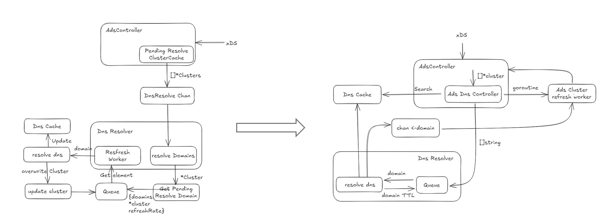
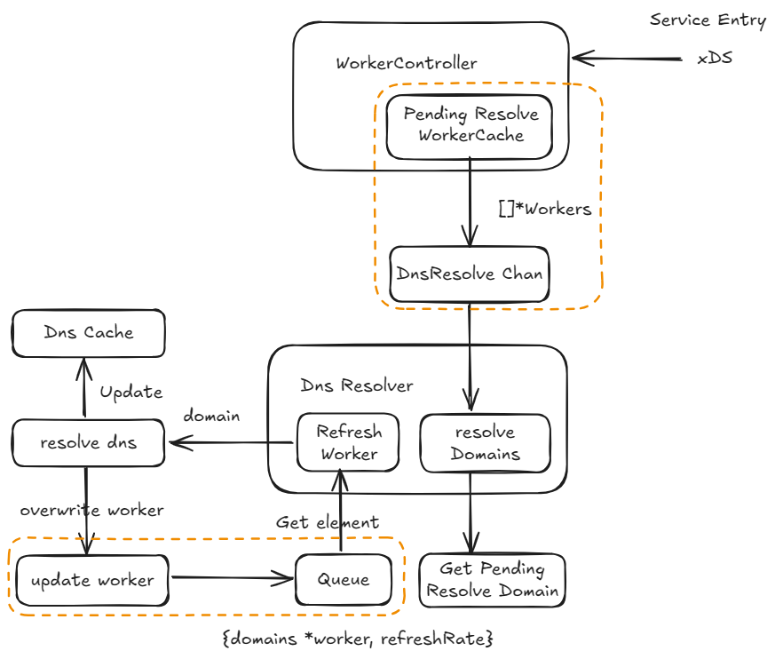

## Support DNS Resolution in Dual Engine Mode

<!--
This is the title of your KEP. Keep it short, simple, and descriptive. A good
title can help communicate what the KEP is and should be considered as part of
any review.
-->

### Summary

<!--
This section is incredibly important for producing high-quality, user-focused
documentation such as release notes or a development roadmap.
A good summary is probably at least a paragraph in length.
-->

### Motivation

<!--
This section is for explicitly listing the motivation, goals, and non-goals of
this KEP.  Describe why the change is important and the benefits to users.
-->

In istio, [External Name service](https://kubernetes.io/docs/concepts/services-networking/service/#externalname) and DNS resolution typed [ServiceEntry](https://istio.io/latest/docs/reference/config/networking/service-entry/#ServiceEntry-Resolution) are widely used. For both kind of configs, istiod will generate associated DNS typed clusters.

So many people have depend on this kind services, Kmesh have to support it to make people migrate to it seamlessly.

Suppose we create a ServiceEntry like below:

```yaml
apiVersion: networking.istio.io/v1
kind: ServiceEntry
metadata:
  name: external-svc-google
  namespace: default
spec:
  hosts:
  - news.google.com
  ports:
  - number: 80
    number: http
    protocol: HTTP
  resolution: DNS
```

In the previous DNS processing, the CDS refresh process was included, resulting in a high degree of coupling between the DNS module and the kernel-native mode, making it impossible to reuse in dual-engine mode. In Release 1.1, Kmesh refactored the DNS module. Now, the data circulating in the DNS refresh queue is the domain name, rather than a structure containing CDS. Therefore, the DNS module no longer concerns itself with the mode of Kmesh and only provides the hostnames that need to be resolved. Specifically, the DNS logic of the Ads controller was extracted into a separate component called the Ads Dns Controller.



We want to leverage this capability to build the DNS logic under Dual-Engine mode.

#### Goals

<!--
List the specific goals of the KEP. What is it trying to achieve? How will we
know that this has succeeded?
-->

- Support dns resolution of domain from workload generated by `ServiceEntry` in Dual-engine mode.
- Improve the existing DNS logic and further abstract a more general paradigm.

#### Non-Goals

<!--
What is out of scope for this KEP? Listing non-goals helps to focus discussion
and make progress.
-->

This KEP does not aim to implement or provide a DNS proxy or DNS server functionality. Specifically, we do not support resolving DNS names on behalf of client workloads. As a result, if a `ServiceEntry` uses a non-resolvable or fake DNS domain, client workloads may fail to resolve and access the intended service. Handling such DNS resolution scenarios is explicitly out of scope for this proposal.

### Proposal

<!--
This is where we get down to the specifics of what the proposal actually is.
This should have enough detail that reviewers can understand exactly what
you're proposing, but should not include things like API designs or
implementation. What is the desired outcome and how do we measure success?.
The "Design Details" section below is for the real
nitty-gritty.
-->

Thanks to the `DNSResolver` in `pkg/dns` which extracted independent DNS resolution logic, we can reuse the DNS capabilities implemented in Dual-engine mode. To be more specific, `dnsController` was implemented (`pkg/controller/ads/dns.go`) and registered as a component of Ads Controller, which receives domains need to be resolved from the Processor (another component of Ads Controller) by a channel `DnsResolverChan`, so the `dnsController` can handle the DNS resolution asynchronously and save the resolved results (address) in a shared cache `AdsCache` to send them back to the Processor, along with flushing them to the BPF map.

### Design Details

<!--
This section should contain enough information that the specifics of your
change are understandable. This may include API specs (though not always
required) or even code snippets. If there's any ambiguity about HOW your
proposal will be implemented, this is the place to discuss them.
-->

Inspired by the AdsDnsController in the Kernel-Native paradigm, we can implement a similar WorkloadDnsController in the Dual-Engine paradigm to handle the DNS resolution for the workloads generated by `ServiceEntry` and without address information. Some key structures and methods are shown below:

```go
type dnsController struct {
  workloadsChan chan []*workloadapi.Workload
  cache         cache.WorkloadCache
  dnsResolver   *dns.DNSResolver
  // store the copy of pendingResolveWorkload.
  // key is the domain name, value is the pendingResolveDomain which contains workloads and refresh rate
  workloadCache map[string]*pendingResolveDomain
  // store all pending hostnames in the workloads
  // key is the workload name, value is the list of related hostnames
  pendingHostnames map[string][]string
  sync.RWMutex
}

// pending resolve domain info of Dual-Engine Mode,
// workload is used for create the apiworkload
type pendingResolveDomain struct {
  Workloads   []*workloadapi.Workload
  RefreshRate time.Duration
}

func (r *dnsController) Run(stopCh <-chan struct{}) {
  go r.dnsResolver.StartDnsResolver(stopCh)
  go r.refreshWorker(stopCh)
  go r.processWorkloads()
  go func() {
    <-stopCh
    close(r.workloadsChan)
  }()
}

func (r *dnsController) refreshWorker(stop <-chan struct{}) {
  for {
    select {
    case <-stop:
      return
    case domain := <-r.dnsResolver.DnsChan:
      // receive domain need to be resolved and handle it
      pendingDomain := r.getWorkloadsByDomain(domain)
      addrs := r.dnsResolver.GetDNSAddresses(domain)
      // update the cache with resolved addresses
      r.updateWorkloads(pendingDomain, domain, addrs)
    }
  }
}

func (r *dnsController) processWorkloads() {
  for workloads := range r.workloadsChan {
    r.processDomains(workloads)
  }
}

// handle the workloads received from the Processor that need 
// DNS resolution, send them to the dnsResolver.
func (r *dnsController) processDomains(workload []*workloadapi.Workload) {
  ...
}
```

And the Processor need to be updated handle the workloads without address information

```go
func (p *Processor) handleServicesAndWorkloads(services []*workloadapi.Service, workloads []*workloadapi.Workload) {
  ...

  for _, workload := range workloads {
    if workload.GetAddresses() == nil {
      uid := workload.GetUid()
      if !strings.Contains(uid, "ServiceEntry") {
        log.Warnf("workload: %s/%s addresses is nil", workload.Namespace, workload.Name)
        continue
      } else {
        // workload from service entry need address resolving
        if p.DnsResolverChan != nil {
          p.DnsResolverChan <- workloads
        }
        // send the workload to dnsController for DNS resolution
        ...
        // get resolved addresses from dnsController
        }()
        // wait for the service entry to be resolved
      }
    }
    if err := p.handleWorkload(workload); err != nil {
      log.Errorf("handle workload %s failed, err: %v", workload.ResourceName(), err)
    }
  }
}
```

Overall, the DNS logic under the Dual-engine mode is roughly illustrated in the block diagram below.



As mentioned earlier, this implementation largely mirrors the DNS logic in AdsController, resulting in significant structural redundancy. Therefore, after the Step-1 we need to further abstract the current DNS logic. As shown in the diagram, both WorkerController and DnsResolver are already cohesive and self-contained; however, the interface layer highlighted in orange differs across modes. Subsequent refactoring will attempt to treat Cluster or Workload as first-class entities—load objects that Controller and DnsController (Resolver) interact with directly—thereby achieving looser coupling.

#### Test Plan

<!--
**Note:** *Not required until targeted at a release.*
Consider the following in developing a test plan for this enhancement:
- Will there be e2e and integration tests, in addition to unit tests?
- How will it be tested in isolation vs with other components?
No need to outline all test cases, just the general strategy. Anything
that would count as tricky in the implementation, and anything particularly
challenging to test, should be called out.
-->

### Alternatives

<!--
What other approaches did you consider, and why did you rule them out? These do
not need to be as detailed as the proposal, but should include enough
information to express the idea and why it was not acceptable.
-->

<!--
Note: This is a simplified version of kubernetes enhancement proposal template.
https://github.com/kubernetes/enhancements/tree/3317d4cb548c396a430d1c1ac6625226018adf6a/keps/NNNN-kep-template
-->