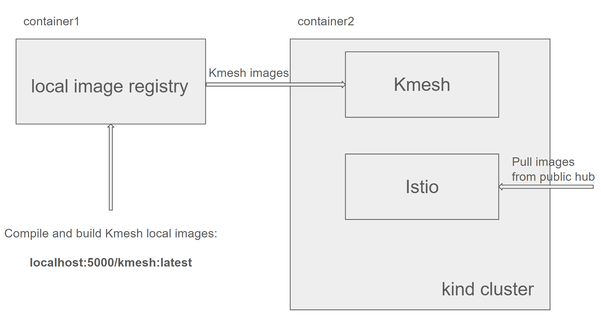

## Kmesh E2E test framework

### Summary

This proposal mainly introduces the motivation for introducing E2E testing in Kmesh, the trade-offs of framework selection, the main workflow of framework and test case analysis.


### Motivation

E2E testing is a software approach that tests an application's workflow from start to finish, simulating real user scenarios. The main purpose of E2E testing is to validate the system as a whole,ensuring that all the individual components and integrations work together seamlessly. It helps to identify any issues or defects that may arise from the interation between different components of the appliction, ensuing the application works as expected under normal operating conditions.

We often encounter such situation during development: although all UTs have passed, when we compile the code to the binary, deploy the component to the test environment, or even worse, to the production envionment, we find some basic functions doesn't work, and the reason for the unavailability is obviously not caused by this modification. Apparently it is unrealistic to manually test all scenarios before merging the code everytime.

Therefore, we introduced E2E testing in Kmesh. Before each PR is merged, the cod modification must be compiled into binary, deployed to the test environment and pass asll basic tests. This ensures that existing functions will not be unavailable due to newly merged code. E2E test, combined with UT, ensures the robustness of the project from multiple dimensions.

### Goals

Ensure that each merge of code will not break existing functions and ensures the stablity and availability of Kmesh.

### Proposal

#### The selection of E2E test framework

Kmesh E2E test framework is heavily inspired by [istio integration framework](https://github.com/istio/istio/tree/master/tests/integration), both in architecture and code. The pros and cons of using it are as follows:

Pros:

1. Avoid reinventing the wheel: istio integration framework has encapsulated a lot of basic functions and has a complete workflow, such as deploying local image registry, k8s cluster and istio. We can easily call it to avoid cumbersome development. And just insert the compilation and deployment of Kmesh in appropriate places of workflow.

2. Comprehensive test cases: istio integration framework already contains a large number of test cases, which could be used directly or modified to meet the comformance of istio.

Cons:

1. Complexity: After years of development, istio integration framework has included a lot of functions, many of which may not be used for the time being. So there will be a steep learning curve and it must be properly tailored before it can be used in Kmesh.

#### Workflow of Kmesh E2E framework



1. Install necessary dependencies. For example, we use kind to deploy istio and Kmesh, so we need to install it.

2. Set up k8s cluster. It is very convenient to deploy a k8s cluster with kind, but it should be noted that some configs need to be modified to allow pull images from the local image registry.

3. Provision a local image registry. Actually it is a docker container, and also we should make some configurations to allow access it from host and kind cluster.

4. Compile and build a new Kmesh image based on the code change of PR and push it to the local registry.

NOTE: all the above steps are implemented by script and located at [here](/test/e2e/run_test.sh)

5. Use built-in functions of istio integration framework to quickly deploy istio. At the same time, istio integration framework also provides good extensibility, which facilitates our deployment of Kmesh and a series of test applications.

NOTE: this step is implemented at [here](/test/e2e/main_test.go), based on istio integration framework.

6. Write various test cases based on a series of deployed test applications. We can write them [here](/test/e2e/baseline_test.go) or create a new file if necessary.

#### Test case analysis

istio integration framework has been well encapsulated and we can use built-in functions to easily create various configured test applications. We can create test cases according to following process:

1. Use [namespace](https://github.com/istio/istio/blob/master/pkg/test/framework/components/namespace/namespace.go) package to create namespace for deploying test applications.

2. Use [deployment](https://github.com/istio/istio/blob/master/pkg/test/framework/components/echo/deployment/builder.go) package to build test applications. `WithClusters()` can be used to specify the clusters where the test applications should be deployed. Each call to `WithConfig()` will generate a test application with corresponding configuration. Actually we create all test applications at the beginning. In each test case, we select some suitable applications for testing. And an application can be used as both a client and a server. If the existing applications doesn't meet your requirement, you can call `WithConfig()` to create a new test application with different configuration, then filter out the application in your test case. We believe the `echo` package can meet most scenarios. If it doesn't, you can also write some custom code to deploy specific applications.

3. Each test cases combines all test applications in pairs and also allow the applications to access itself. Use `CallOptions` of the [echo](https://github.com/istio/istio/blob/master/pkg/test/framework/components/echo/calloptions.go) package to define the options for calling an Endpoint, such as specify the protocol used for access, the number of requests and the `Checker` which also defined in [echo](https://github.com/istio/istio/blob/master/pkg/test/framework/components/echo/checker.go) package could be customized whether the access is successful.

4. Istio integration framework is very convenient to use. We only need to make appropriate configurations and don't event need to worry about how test applications works underlying. Also it provides method to directly apply yamls to create resources such as `VirtualService` and `DestinationRule`.

#### Usage

We can run E2E test by calling script `./test/e2e/run_test.sh`. The complete E2E test includes the following steps:

1. Install dependencies, such as kind, helm, istioctl ...
2. Deploy the local image registry as a docker container, build Kmesh image and push to it
3. Deploy k8s cluster, istio and Kmesh
4. Deploy test applications and actually run the E2E test cases

For Github CI environment, all the above steps shoud be executed in full. But when test locally, we often want to skip some of these steps. We provide the following flags to skip some steps of the test:

- `--skip-install-dep`:      skip installing dependencies
- `--skip-build`:            skip deploying the local image registry and building Kmesh image
- `--skip-setup`:            skip deploying k8s, istio and Kmesh
- `--only-run-tests`:        skip all other steps and only deploying test applications and running E2E tests

For example, if we want to repeatedly run the E2E test locally, then except for the first time, subsequent executions can use the following command, avoid unnecessary download and build:

```bash
./test/e2e/run_test.sh --only-run-tests
```
