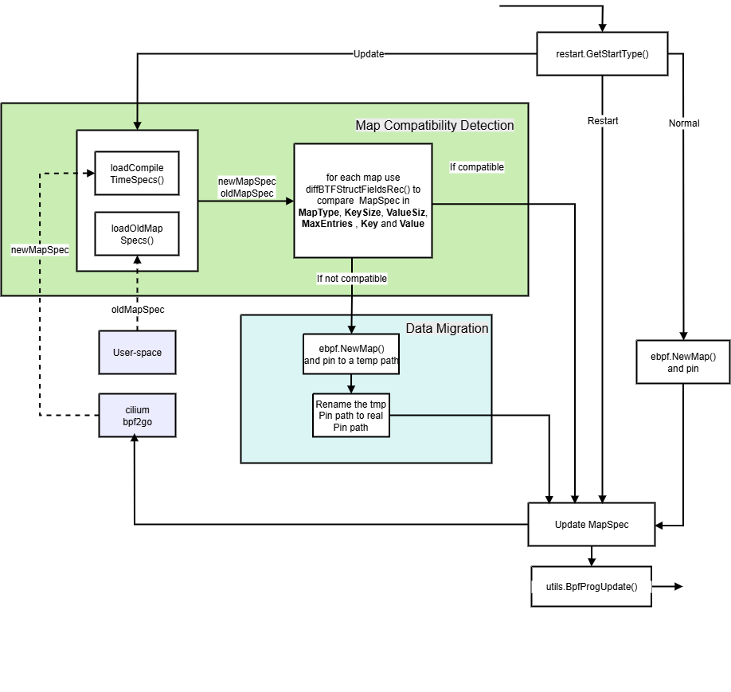

## Kmesh-daemon upgrades traffic without disruption

### Summary

Add traffic-preserving upgrades to Kmesh-daemon.

### Motivation

Currently, Kmesh supports traffic-preserving restarts but does not support traffic-preserving upgrades. During upgrades, existing eBPF map state may be discarded if the map definitions change, leading to connection drops, policy resets, or performance metric loss.

This proposal improves the upgrade experience by:

- Preserving important state (flows, policies, metrics) across versions
- Allowing safe, autonomous rolling upgrades in Kubernetes environments
- Reducing operational risk and improving reliability in production deployments

#### Goals

The purpose of this proposal is to enable seamless traffic continuity during version upgrades by detecting map changes and migrating data safely.

### Design Details

#### Map Compatibility Detection

1.**Runtime Inspection**: The comparison logic begins by loading each map’s runtime `MapSpec` which includes `MapType`, `KeySize`, `ValueSize`, `MaxEntries` , `Key` and `Value`.
Runtime map compatibility inspection is done by calling `loadCompileTimeSpecs`, which loads the compiled-time MapSpec definitions from the embedded ELF section of each BPF object. This function iterates over the enabled BPF engines (e.g., KernelNative, DualEngine, General) based on config.

```go
func loadCompileTimeSpecs(config *options.BpfConfig) (map[string]map[string]*ebpf.MapSpec, error) {
    specs := make(map[string]map[string]*ebpf.MapSpec)

    if config.KernelNativeEnabled() {
        // KernelNative: cgroup_sock
        if coll, err := kernelnative.LoadKmeshCgroupSock(); err != nil {
            return nil, fmt.Errorf("load KernelNative KmeshCgroupSock spec: %w", err)
        } else {
            specs["KmeshCgroupSock"] = coll.Maps
        }
        ... // other KernelNative
    } else if config.DualEngineEnabled() {
        // DualEngine: cgroup_sock workload
        if coll, err := dualengine.LoadKmeshCgroupSockWorkload(); err != nil {
            return nil, fmt.Errorf("load DualEngine KmeshCgroupSockWorkload spec: %w", err)
        } else {
            specs["KmeshCgroupSockWorkload"] = coll.Maps
        }
        ... // other DualEngine
    }

    // General: tc_mark_encrypt
    if coll, err := general.LoadKmeshTcMarkEncrypt(); err != nil {
        return nil, fmt.Errorf("load General KmeshTcMarkEncrypt spec: %w", err)
    } else {
        specs["KmeshTcMarkEncrypt"] = coll.Maps
    }
    ... // other General

    return specs, nil
}
```

And loads each map's key/value types, sizes, and attributes into a nested structure:

```go
map[string]map[string]*ebpf.MapSpec // map[pgkname][mapname]Mapspce
```

2.**Spec Snapshot at Startup**: During Kmesh-daemon startup, each `MapSpec` generated from the compiled BPF object is stored in a user-space registry for future comparison. On Update-type startup, the daemon reads the previous version’s stored `MapSpec` definitions and uses them as the baseline `oldMapSpec` for diff comparison.

3.**Layout Diffing**: A recursive function `diffBTFStructFieldsRec` is implemented to compare old and new btf.Struct definitions field by field. It detects field additions, removals, type changes, offset shifts, and nested structure changes, and uses a visited map to avoid infinite recursion in recursive types. This function provides a fine-grained structural diff to guide compatibility decisions.

```go
type StructDiff struct {
    Removed       bool // fields present in A but missing in B
    Added         bool // fields present in B but missing in A
    TypeChanged   bool // same-name fields whose type changed
    OffsetChanged bool // same-name fields whose offset changed
    NestedChanged bool // same-name fields of struct type whose nested layout changed
}
```

#### Data Migration Logic

1.**New Map Creation**: When a layout change is detected, a new map is created based on the latest `MapSpec`, with its path set to the old map path appended with "_tmp", and temporarily pinned to an alternate location. If no change is detected, the existing map is left intact and no further action is taken.

2.**Atomic Pin Swap**: Once data migration completes, the daemon proceeds to unpin the old map. It then closes the old map’s file descriptor, attempts to remove the old map’s pin file, and finally renames the temporary pinned path of the new map to the original map’s pin path.

```go
if err := oldMap.Unpin(); err != nil && !os.IsNotExist(err) {
   log.Warnf("failed to unpin old map %s: %v (continuing)", pinPath, err)
}
if err := oldMap.Close(); err != nil {
   log.Warnf("failed to close old map FD: %v (continuing)", err)
}
if err := os.Remove(pinPath); err != nil && !os.IsNotExist(err) {
   return nil, fmt.Errorf("remove old pin %s failed: %w", pinPath, err)
}
if err := os.Rename(tmpPinPath, pinPath); err != nil {
   return nil, fmt.Errorf("rename tmp pin %s to old pin %s failed: %w", tmpPinPath, pinPath, err)
}
```

#### Hot Program Replacement

**Atomic Swap***: Once all maps are migrated, new BPF programs are attached. The upgrade process uses `utils.BpfProgUpdate()` to atomically swap the loaded program with a new one. BpfProgUpdate(progPinPath, cgopt) actually does two steps:

1. LoadPinnedLink: Reopens the existing `bpf_link` from the pinned path before reloading, recovering the same link object in the kernel as the kernel has attached.

2. link.Update(newProgFD): Atomically swaps the BPF program FD on that link to `cgopt.Program`, preserving the existing hook and any accumulated state.

This approach ensures there is no packet loss during the transition. Take `BpfSockOps` for example, if the process is detected as a Restart or Update, the existing pinned link is recovered and updated with the new program:

```go
func (sc *BpfSockOps) Attach() error {
   var err error
   cgopt := link.CgroupOptions{
      Path:    sc.Info.Cgroup2Path,
      Attach:  sc.Info.AttachType,
      Program: sc.KmeshSockopsObjects.SockopsProg,
      }
   // pin bpf_link
   progPinPath := filepath.Join(sc.Info.BpfFsPath, constants.Prog_link)
   if restart.GetStartType() == restart.Restart || restart.GetStartType() == restart.Update {
      if sc.Link, err = utils.BpfProgUpdate(progPinPath, cgopt); err != nil {
         return err
         }
      } else {
         sc.Link, err = link.AttachCgroup(cgopt)
         if err != nil {
            return err
         }
         if err = sc.Link.Pin(progPinPath); err != nil {
            return err
         }
      }
   return nil
}
```

#### Workflow



#### Testing Plan

1.**Unit Tests**: Validate `loadCompileTimeSpecs`, `diffBTFStructFieldsRec`, `convertStructValue`, and the dual-write synchronization.

2.**E2E Tests**: Run Kmesh upgrades with live traffic and verify data continuity, no packet loss, and zero connection resets.
