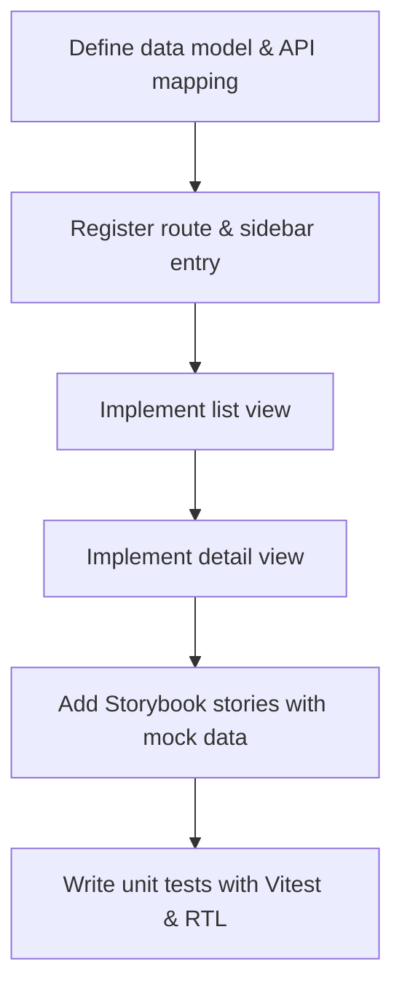

## Integrating Kmesh into Headlamp UI

<!--
This is the title of your KEP. Keep it short, simple, and descriptive. A good
title can help communicate what the KEP is and should be considered as part of
any review.
-->

Upstream issue: <https://github.com/kmesh-net/kmesh/issues/1658>

### Summary

<!--
This section is incredibly important for producing high-quality, user-focused
documentation such as release notes or a development roadmap.

A good summary is probably at least a paragraph in length.
-->

Headlamp is an open-source, extensible Kubernetes web UI that supports
multi-cluster management, RBAC, and a plugin system for adding custom
functionality. Users who work with Kmesh today must switch between Headlamp (for
general Kubernetes resource management) and CLI tools or kubectl (for
Kmesh-specific inspection), which can increase context switching during operations.

This proposal describes building a Headlamp plugin for Kmesh that brings Kmesh
resources directly into the Headlamp UI. The plugin provides lightweight
visibility of Kmesh resources alongside standard Kubernetes resources. It focuses
on reducing context switching and improving day-to-day operator workflows. The
full-featured Kmesh dashboard remains the place for advanced operations.

### Motivation

<!--
This section is for explicitly listing the motivation, goals, and non-goals of
this KEP.  Describe why the change is important and the benefits to users.
-->

Currently, there is no visual interface to inspect Kmesh-specific resources such
as Waypoints, eBPF map states, or per-node daemon health from within an existing
Kubernetes UI. Operators currently use `kmeshctl` and
`kubectl` commands to view their mesh configuration and
status. This plugin aims to address the following areas:

- **Context switching**: operators leave the Headlamp UI mid-workflow to inspect
  Kmesh resources in a terminal.
- **Discoverability**: new users may find it challenging to discover which namespaces or pods are
  enrolled in Kmesh without knowing specific annotation keys.
- **No at-a-glance health view**: there is no easy way to correlate Kmesh daemon
  health with workload events from a single pane.

Since Headlamp already has a rich plugin API and strong adoption in the Kmesh
community, integrating a Kmesh plugin is the lowest-friction path to solving
these problems without duplicating a standalone dashboard.

#### Goals

<!--
List the specific goals of the KEP. What is it trying to achieve? How will we
know that this has succeeded?
-->

- Build a Headlamp plugin (TypeScript/React) that surfaces Kmesh-related Gateway
  API resources (Waypoints) and Kmesh daemon status as first-class views in the
  Headlamp UI.
- Provide list and detail views for Kmesh Waypoints (modelled as
  `gateway.networking.k8s.io/v1` Gateway objects) and the Kmesh daemon DaemonSet.
- Show per-resource readiness and health using the `Programmed` condition, and
  surface recent Kubernetes Events for each Kmesh object.
- Enable cross-resource navigation between Kmesh objects and related Pods,
  Services, and Workloads.
- Provide a built-in YAML viewer for low-level inspection of all resources.
- Ship unit/component tests (Vitest + React Testing Library) and an end-to-end
  smoke test against a kind/minikube cluster running Kmesh.
- Publish the plugin via a Headlamp plugin registry entry or Helm manifest with a
  complete README and install guide.

#### Non-Goals

<!--
What is out of scope for this KEP? Listing non-goals helps to focus discussion
and make progress.
-->

- Replacing or duplicating the standalone Kmesh dashboard for advanced operations
  such as traffic policy management or detailed eBPF map editing.
- Implementing new observability metrics or modifying Kmesh daemon behaviour.
- Supporting Kmesh versions older than the current stable release.
- Implementing multi-cluster federation views beyond what Headlamp itself
  provides.

### Proposal

<!--
This is where we get down to the specifics of what the proposal actually is.
This should have enough detail that reviewers can understand exactly what
you're proposing, but should not include things like API designs or
implementation. What is the desired outcome and how do we measure success?
The "Design Details" section below is for the real nitty-gritty.
-->

The plugin will be scaffolded using the `@kinvolk/headlamp-plugin` CLI and
registered into Headlamp via its standard plugin API. It will surface the
following views under a dedicated **Kmesh** sidebar section:

1. **Waypoint List / Detail** — lists all `gateway.networking.k8s.io/v1` Gateway
   objects that act as Kmesh Waypoints, with `Programmed` condition status and a
   detail view showing spec, conditions, proxy image, and related events.
2. **Daemon Status** — shows the Kmesh daemon DaemonSet health, per-node
   readiness, and a cluster-level summary of enrolled namespaces.
3. **Enrolled Workloads** — lists pods annotated with `kmesh.net/redirection:
   enabled`, linking each back to its owning Deployment/Service.

All views will reuse Headlamp's existing Table, SectionBox, and MainInfoSection
components to guarantee visual consistency with the rest of the UI.

#### User Stories

##### Story 1

As a platform engineer, I want to see all Kmesh Waypoints in my cluster in a
searchable table — with name, namespace, gateway class, proxy image, and
readiness status — so that I can quickly diagnose which Waypoints are degraded
without leaving the Headlamp UI.

##### Story 2

As a developer new to Kmesh, I want to click on any pod and see whether it is
enrolled in Kmesh (via the `kmesh.net/redirection` annotation) alongside the
standard pod metadata, so that I can understand my mesh topology at a glance.

#### Notes/Constraints/Caveats

- The plugin consumes the standard Kubernetes API server via Headlamp's proxy and
  does not require direct access to the Kmesh daemon's HTTP endpoint.
- Waypoints are modelled as `gateway.networking.k8s.io/v1` Gateway objects;
  the plugin identifies them by the `gatewayClassName` field matching a Kmesh
  class name. This approach is tied to the Gateway API version Kmesh exposes and
  may need updating across Kmesh releases.
- Readiness is determined by the `Programmed` condition in `status.conditions`,
  which is the canonical Gateway API signal for whether a Gateway is active.
- eBPF map inspection is limited to data exposed through the Kubernetes API
  (annotations, status fields). Raw BPF map reads are out of scope.

#### Risks and Mitigations

- **Risk**: Kmesh Gateway API version changes across releases break the plugin.
  **Mitigation**: Pin to the current stable `gateway.networking.k8s.io/v1` group
  version and add a CRD availability check that shows a user-friendly error when
  the expected resources are absent.
- **Risk**: Plugin adds UI clutter when Kmesh is not installed.
  **Mitigation**: Detect Gateway CRD and Kmesh daemon presence on startup; hide
  the sidebar section entirely when Kmesh is not found.
- **Risk**: Test coverage is insufficient for early release.
  **Mitigation**: Enforce minimum coverage thresholds in CI; block merges on
  failing unit tests and Storybook smoke tests.

### Design Details

<!--
This section should contain enough information that the specifics of your
change are understandable. This may include API specs (though not always
required) or even code snippets. If there's any ambiguity about HOW your
proposal will be implemented, this is the place to discuss them.
-->

#### Resource Model & API Mapping

Kmesh Waypoints are represented as standard Gateway API `Gateway` objects with
`apiVersion: gateway.networking.k8s.io/v1`. The plugin registers a typed class
using Headlamp's `makeCustomResourceClass` helper:

```typescript
import { K8s } from '@kinvolk/headlamp-plugin/lib';

export const Waypoint = K8s.crd.makeCustomResourceClass({
  apiInfo: [{ group: 'gateway.networking.k8s.io', version: 'v1' }],
  kind: 'Gateway',
  pluralName: 'gateways',
  singularName: 'gateway',
  isNamespaced: true,
});
```

Readiness is determined by finding the `Programmed` entry in
`status.conditions` and reading its `status` field (`True` / `False` /
`Unknown`). This is the canonical Gateway API signal for whether a Gateway is
active and will be used consistently across all list and detail views.

#### Resource List View

The list view renders all Kmesh Waypoints via Headlamp's `ResourceListView`
component, which provides sorting, filtering, and pagination out of the box.
Columns displayed: `name`, `namespace`, `age`, `gatewayClassName`, `proxyImage`
(from the `sidecar.istio.io/proxyImage` annotation), and `Programmed` readiness
status derived from `status.conditions`.

#### Resource Detail View

The detail view fetches a single Waypoint by namespace and name and renders it
via Headlamp's `MainInfoSection`. It additionally renders:

- Full `status.conditions` table (type, status, reason, message).
- A live Kubernetes Events section scoped to the Waypoint object.
- Links to Pods whose traffic is routed through this Waypoint.

#### Sidebar & Route Registration

A top-level **Kmesh** sidebar entry is registered using `registerSidebarEntry`.
Two routes are registered:

- `/kmesh/waypoints` → `WaypointList` component (list view).
- `/kmesh/waypoints/:namespace/:name` → `WaypointDetail` component (detail view).

The sidebar entry is shown only after a startup check confirms that the
`gateway.networking.k8s.io` CRD group is reachable in the current cluster.

#### Development Lifecycle

Each resource view follows a standardised pipeline before it is considered done:



#### Implementation Timeline (12 Weeks)

Dates follow the LFX mentorship program schedule starting 8 June.

| Phase | Weeks | Dates | Deliverables |
| --- | --- | --- | --- |
| **1 — Environment & Foundation** | 1–2 | 8 Jun – 21 Jun | Local Kind/Minikube cluster with Kmesh deployed; plugin scaffolded via `@kinvolk/headlamp-plugin` CLI; TypeScript interfaces defined using `makeCustomResourceClass`; reusable `useList`/`useGet` hooks implemented; API connectivity validated. |
| **2 — Core Resource Views** | 3–5 | 22 Jun – 12 Jul | Kmesh sidebar section registered; list and detail view routes defined with namespace/name parameters; Table-based list views with sorting, filtering, and pagination; detail pages showing metadata, spec, and status; UI consistent with Headlamp patterns. |
| **3 — Visualization & Inspection** | 6–8 | 13 Jul – 21 Jul | Health and readiness indicators using `Programmed` condition; live Kubernetes event stream per resource; cross-resource links between Kmesh objects and related Pods/Services/Workloads; built-in YAML viewer for raw inspection. |
| **4 — Testing & QA** | 9–10 | 22 Jul – 10 Aug | Unit and component tests with Vitest + React Testing Library; mocked API responses covering loading, error, and empty states; Playwright e2e smoke tests with automated Kind + Kmesh cluster setup; CRD rendering and navigation flow validation. |
| **5 — Documentation & Delivery** | 11–12 | 11 Aug – 31 Aug | README with setup, usage, and architecture overview; screenshots and demo visuals; plugin packaged for Headlamp plugin registry or Helm manifest; final mentor review, feedback incorporated, and delivery finalized. |

#### Test Plan

<!--
**Note:** *Not required until targeted at a release.*

Consider the following in developing a test plan for this enhancement:
- Will there be e2e and integration tests, in addition to unit tests?
- How will it be tested in isolation vs with other components?

No need to outline all test cases, just the general strategy. Anything
that would count as tricky in the implementation, and anything particularly
challenging to test, should be called out.

-->

**Unit tests** — each component (WaypointList, WaypointDetail, DaemonStatus) is
tested in isolation using Vitest and React Testing Library. The `Waypoint` class
import is mocked at the module level so that `useList` and `useGet` hooks return
controlled fixture data. Tests cover the loading, error, empty, and
data-populated states.

**Storybook stories** — each view ships a Storybook story using
`headlampStoryArgs` to inject mock items without a live cluster. This allows
visual review of all states (loading, empty, error, with data) in isolation.

**End-to-end smoke test** — a Playwright test spins up a kind cluster, deploys
Kmesh, installs the plugin into a local Headlamp instance, and asserts that:

1. The Kmesh sidebar entry is visible.
2. The Waypoints list page renders at least one row.
3. Clicking a row navigates to the correct detail page and shows the
   `Programmed` status condition.

### Alternatives

<!--
What other approaches did you consider, and why did you rule them out? These do
not need to be as detailed as the proposal, but should include enough
information to express the idea and why it was not acceptable.
-->

**Standalone Kmesh dashboard (separate web app)**
A dedicated web application would provide maximum flexibility but requires users
to deploy and maintain an additional component, increasing operational overhead
and duplicating effort. The Headlamp plugin model achieves the same observability
goals with zero additional infrastructure.

**Extending `kmeshctl` with a TUI**
A terminal UI improves the CLI experience but does not remove the need to leave
the Kubernetes web UI. It also targets a different user persona (advanced CLI
users) rather than the broader operator audience Headlamp serves.

**Generic Kubernetes resource viewer (Lens / Headlamp without a plugin)**
Generic tools can already display raw CRD objects, but they lack Kmesh-specific
field rendering (e.g., proxy image, redirection annotation, Programmed status).
A dedicated plugin surfaces exactly the fields operators care about and provides
contextual navigation that a generic viewer cannot.

<!--
Note: This is a simplified version of kubernetes enhancement proposal template.
https://github.com/kubernetes/enhancements/tree/3317d4cb548c396a430d1c1ac6625226018adf6a/keps/NNNN-kep-template
-->
