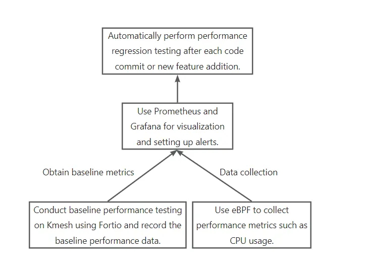
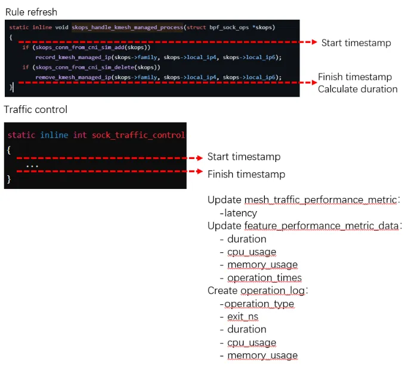
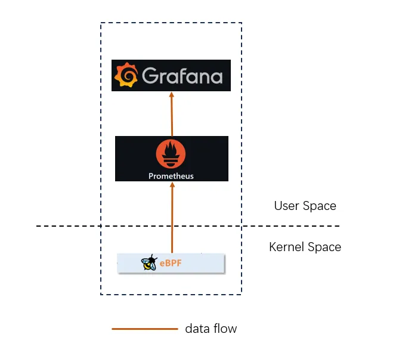

## Kmesh performance monitoring

### Summary

This proposal mainly introduces the main implementation steps and workflow of neutral energy monitoring in Kmesh.

### Motivation

The main functions of the current Kmesh include interfacing with the control plane (implemented in Go) and data plane governance and forwarding (implemented in eBPF/Ko). Introducing new features can easily lead to performance degradation. Additionally, it is challenging to maintain performance baselines due to the involvement of multiple languages and the crossing of user space and kernel space processes.

### Goals

- Performance visualization and monitoring of key performance indicators for Kmesh in scenarios such as rule refresh and data governance forwarding.
- Ensure that each code merge does not excessively increase performance overhead.

### Proposal

#### Steps to Implement Performance Monitoring



1. **Identify Key Performance Indicators (KPIs)** : Determine the performance metrics that Kmesh needs to monitor, such as latency, QPS, throughput, CPU usage, and memory usage.
2. **Testing and Baseline Establishment** : Use Fortio to conduct baseline performance testing for Kmesh and record the baseline performance data.
3. **Data Collection** : Use eBPF programs to collect key performance metrics such as the time from sending a rule refresh request to completion, packet transmission time within the mesh, data processed per unit time, CPU usage of the Kmesh process, and memory usage of the Kmesh process.
4. **Performance Monitoring and Alerts** : Use Prometheus and Grafana to monitor performance metrics and set alert rules. Trigger alert notifications when performance metrics exceed threshold values.
5. **Performance Protection** : Implement automated performance testing and monitoring using GitHub Actions, integrating performance protection into the PR review and release processes.


#### operation_log

when a operation is finished, the following information about the operation execution need reported: pid, type of operation. duration, cpu_usage_user_time, cpu_usage_system_time, memory_usage,  whether the operation is executed successfully, and finish timestamp.

#### metrics

contains mesh thoughtout,latency and metrics related to per operation.

#### Design Details

Storage the resource usage of operation by ebpf map. the definition of ebpf map is as follows:

operation_data :

```c
struct usage_data {
    __u64 start_time;
    __u64 end_time;
    __u32 pid;
    __u64 start_mem;
    __u64 end_mem;
};
```

```c
struct performance_data {
    __u64 timestamp;     
    __u64 duration;      
    __u8  operation_type;      
};
```

operation_log :

```c
struct access_log {
    __u8  operation_type; //1-rule refresh 2-traffic control
    __u64 duration; // ns
    __u64 exit_ns; 
    __u64 cpu_usage; //ns
    __u32 memory_usage; //Byte
    
};
```

metrics :

- kmesh-deamon

```c
struct kmesh_deamon_performance_metrics {
    __u64 cpu_usage; //ns
    __u32 memory_usage; //Byte
    __u64 throughput; // Byte
    __u64 latency; //ns 
    
};

// ringbuf
struct {
    __uint(type, BPF_MAP_TYPE_RINGBUF);
    __uint(max_entries, RINGBUF_SIZE);
} map_of_performance_metrics SEC(".maps");
```


- feature

```c

// value:
struct feature_performance_metric_data {
    // average
    __u64 duration; // ns
    __u64 cpu_usage; //ns
    __u32 memory_usage; //Byte
    __u32 operation_times;
    
};


#define MAP_SIZE_OF_METRICS 100000
struct {
    __uint(type, BPF_MAP_TYPE_HASH);
    __type(key, __u8); //operation_type
    __type(value, struct feature_performance_metric_data);
    __uint(max_entries, MAP_SIZE_OF_METRICS);
    __uint(map_flags, BPF_F_NO_PREALLOC);
} map_of_metrics SEC(".maps");
```


#### Workflow of Kmesh performance monitoring




