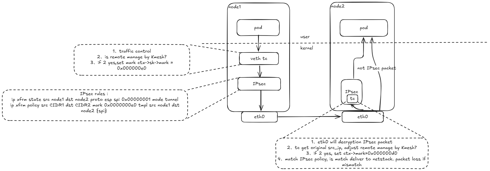

--- 
title: Kmesh支持节点之间进行数据加密
authors:
- "@bitcoffeeiux"
reviews:
-
approves:
-

create-date: 2024-10-10

---

## 1.背景

随着网络安全威胁的增加，未经加密的数据在传输过程中容易被黑客或第三方监听、截取甚至篡改，导致敏感信息泄露。为了解决上述安全风险，Kmesh计划引入节点数据加密模式，为节点之间的通信流量进行加密，消除通讯过程中的安全风险。

## 2.使用场景

由Kmesh进行代理的节点，在数据从应用发出时，路由到指定的网络接口设备进行加密处理后再经过网络发送给对端。对端由特定的网络接口设备接收到数据后进行解密，上送给对应的服务应用。

## 3.IPsec简介

IPsec是一个保护IP层通信的安全保密架构，是一个协议簇，通过对IP协议的分组进行加密和认证来保护IP协议的网络传输协议簇。运行在OSI模型的第三层（Internet Protocol，IP层），在VPN（virtual private networks）应用很广泛。
有关IPsec的更多描述请参阅[什么是IPsec](https://info.support.huawei.com/info-finder/encyclopedia/zh/IPsec.html)

## 4.Kmesh集成IPSec作为节点之间的加密工具

Kmesh仅使用IPSec的加密功能，IPSec的预共享密钥由用户设置在K8s后，传递至Kmesh进行管理并设置到IPSec中，保证IPSec的正常通信。整体架构图如下：

### 4.1 用户设置IPSec密钥

用户通过kmeshctl向K8s中设置名称为Kmesh-ipsec-keys的secret类型资源，格式如下：

    kmeshctl secret create --key=<aead key>

当前仅支持rfc4106 gcm aes (aead)算法，该资源中包含有ipsec使用的aead key，以及ipsec的icv长度

### 4.2 CRD设计

Kmesh使能ipsec时，需要精细化控制ipsec数据加密行为，这其中要求Kmesh具有节点之间的信息同步机制。当前主要场景基于云原生业务场景，信息同步机制基于K8s集群api-server构建，依赖Kmesh自定义结构体来完成数据存储。

CRD数据结构定义如下：

 apiVersion: apiextensions.k8s.io/v1
 kind: CustomResourceDefinition
 metadata:
 annotations:
  controller-gen.kubebuilder.io/version: v0.16.4
 name: kmeshnodeinfos.kmesh.net
 spec:
 group: kmesh.net
 names:
  kind: KmeshNodeInfo
  listKind: KmeshNodeInfoList
  plural: kmeshnodeinfos
  singular: kmeshnodeinfo
 scope: Namespaced
 versions:

- name: v1alpha1
  schema:
  openAPIV3Schema:
   description: KmeshNode is the Schema for the kmeshnodes API
   properties:
   apiVersion:
    description: |-
    APIVersion defines the versioned schema of this representation of an object.
    Servers should convert recognized schemas to the latest internal value, and
    may reject unrecognized values.
    More info: <https://git.k8s.io/community/contributors/devel/sig-architecture/api-conventions.md#resources>
    type: string
   kind:
    description: |-
    Kind is a string value representing the REST resource this object represents.
    Servers may infer this from the endpoint the client submits requests to.
    Cannot be updated.
    In CamelCase.
    More info: <https://git.k8s.io/community/contributors/devel/sig-architecture/api-conventions.md#types-kinds>
    type: string
   metadata:
    type: object
   spec:
    properties:
    addresses:
     description: |-
     Addresses is used to store the internal ip address informatioon on the
     host. The IP address information is used to generate the IPsec state
     informatioon. IPsec uses this information to determine which network
     adapter is used to encrypt and send data.
     items:
     type: string
     type: array
    bootID:
     description: |-
     bootid is used to generate the ipsec key. After the node is restarted,
     the key needs to be updated.
     type: string
    podCIDRS:
     description: |-
     PodCIDRs used in IPsec checks the destination of the data to
     determine which IPsec state is used for encryption.
     items:
     type: string
     type: array
    spi:
     description: |-
     The SPI is used to identify the version number of the current key.
     The communication can be normal only when both communication parties
     have spis and the spi keys are the same.
     type: integer
    required:
  - addresses
  - bootID
  - podCIDRS
  - spi
    type: object
   status:
    type: object
   type: object
  served: true
  storage: true

### 4.3 Kmesh IPsec通信路径

流量数据路径上需要新增一张map以及两个tc程序

- 加密路径新增map：
 | 类型 | lpm前缀树map(4.11版本引入内核) |
 |:-------:|:-------|
 | 作用 | 在流量编排时，判断发送的对端pod所在的节点是否被Kmesh接管了，只有当两边的pod都被Kmesh接管，才会被ipsec加密 |
 | key | bpf_lpm_trie_key {u32 prefixlen; u8 data[0]}; |
 | value | uint32 |

- 新增2个tc：
在每个pod的容器出口网卡上新增一个tc程序，该tc程序用于将从pod中发出的流量打上mark，标记为走ipsec加密发出

在node网卡上新增tc程序，ipsec将数据包解密完成后进入tc程序，tc将数据包打上mark，转给对应的ipsec策略分发处理。如果没有这个tc程序，不在收包时打上mark，会导致非ipsec的数据包接收时出现丢包问题

### 4.4 Kmesh IPSec操作

**规格限制**

- 由于ipsec规则匹配时使用了mark标记，所以请保证当前环境中mark不会出现冲突

  - 加密时使用的mark如下：0x000000e0，mask :0xffffffff
  - 解密时使用的mark如下：0x000000d0，mask :0xffffffff
  - 请勿与该mark使用相同的bit，导致数据包识别错误

- 数据从客户端发送时不能在iptables中为需要加密的流量开启地址伪装（masq）选项。地址伪装会使用snat技术，在服务端收到的ipsec数据包中，将流量src_ip伪装成nodeid，导致服务端ipsec无法正确匹配，数据包被丢弃

**Kmesh-daemon启动时，完成以下动作：**

- 从Kmesh-daemon读取secret信息并解析存储以下关键信息：
 | 名称 | 作用 |
 |:-------:|:-------|
 | spi | 加密密钥的序列号，由kmeshctl secret自动生成spi |
 | aead-algo | 密钥算法，当前仅支持rfc4106(gcm(aes)) |
 | aead-key | 预共享密钥，所有的节点间的ipsec密钥从此密钥通过特定算法进行派生 |
 | icv-len | 密钥长度 |

- 获取本端的如下信息：
 | 名称 | 作用 |
 |:-------:|:-------|
 | 本端的PodCIDR | 用于生成ipsec规则 |
 | 本端的集群内部ip地址 | 用于生成nodeid,ipsec规则 |
 | bootid | 启动id |

- 从api-server中读取出所有kmeshNodeInfo节点信息，节点信息包含各node当前name，使用的spi版本号、ipsec设备的ip地址、bootID信息并开始生成ipsec规则，每个对端node需要生成2条state（一进一出），3条policy（out、in、fwd）。密钥从预共享密钥中进行派生，规则如下：

出口密钥： 预共享密钥+本机IP+对端IP+本机bootid+对端bootID，hash后截取aead密钥长度

入口密钥： 预共享密钥+对端IP+本机IP+对端bootid+本机bootID，hash后截取aead密钥长度

 ipsec示例：本机ip地址为7.6.122.84，获取到对端的node ip 地址信息为7.6.122.220，设置ipsec配置预览如下

## 数据加密、解密流程

### 5.1 加密过程

当数据包从Pod发出并到达Pod peer veth设备时，数据包的加密处理流程如下：

1. **目标检查**：TC程序根据数据包的目的IP地址在LPM前缀树map中进行查询
2. **加密标记**：如果查询到对应的CIDR记录，说明目标节点启用了IPsec加密，TC程序会为数据包打上特定的mark标记（mark值为0x000000e0），将其标识为需要通过IPsec加密发送的数据包
3. **IPsec处理**：带有加密标记的数据包会被内核的IPsec子系统拦截，根据配置的xfrm policy和state规则进行加密处理
4. **隧道封装**：由于使用IPsec隧道模式，加密后的数据包会被重新封装，新的外层IP头部中的源地址和目的地址会被替换为发送节点和接收节点的网卡IP地址，原始的Pod IP地址被封装在内层

### 5.2 解密过程

数据包到达目标节点网卡时，解密处理流程相对复杂，需要区分不同类型的数据包：

#### 5.2.1 ESP协议数据包处理

如果接收到的数据包协议为ESP（Encapsulating Security Payload），说明这是一个IPsec加密的数据包：

1. **Xfrm解码**：数据包会被送入内核的`Xfrm decode`阶段
2. **状态查找**：系统查找匹配的xfrm state规则
3. **解密处理**：如果找到匹配的规则，进行解密处理，解密后的数据包会携带output-mark（mark值为0x00d0）并第二次进入ingress阶段
4. **丢弃处理**：如果未找到匹配的规则，数据包将被丢弃

#### 5.2.2 非ESP协议数据包处理

如果数据包协议不是ESP，则存在两种可能情况，需要通过mark值进行区分：

1. **未加密的普通数据包**：
   - 这是第一次进入ingress阶段的普通数据包
   - TC程序将其mark值设置为0x0，避免后续错误匹配到xfrm policy导致数据包被意外丢弃

2. **解密后的数据包**：
   - 这是经过`Xfrm decode`解密处理后的数据包，携带output-mark（mark值为0x00d0）
   - TC程序保持其mark值不变，以便后续能够正确匹配到相应的xfrm policy进行进一步处理
   - 数据包经过验证后转发给目标Pod

### 5.3 Mark值说明

系统使用不同的mark值来标识数据包的状态和处理阶段：

| Mark值 | 用途 | 说明 |
|--------|------|------|
| 0x000000e0 | 加密标记 | 标识需要IPsec加密的出站数据包 |
| 0x000000d0 | 解密标记 | 标识已完成IPsec解密的入站数据包 |
| 0x0 | 普通标记 | 标识普通未加密数据包，避免错误匹配 |

### 5.4 流程图

**下面是加密数据包的解密过程流程图**

**下面是未加密数据包的加密过程流程图**

关于流程图中的细节可以进一步参考：[Nftables - Netfilter and VPN/IPsec packet flow](https://thermalcircle.de/doku.php?id=blog:linux:nftables_ipsec_packet_flow#context)以及[RFC 4301](https://www.rfc-editor.org/rfc/rfc4301).

# state配置

 ip xfrm state add src 7.6.122.84 dst 7.6.122.220 proto esp spi 0x1 mode tunnel reqid 1 {\$aead-algo} {\$aead-出口密钥} {\$icv-len}
 ip xfrm state add src 7.6.122.220 dst 7.6.122.84 proto esp spi 0x1 mode tunnel reqid 1 {\$aead-algo} {\$aead-入口密钥} {\$icv-len} output-mark 0x000000d0 mask 0xffffffff

# policy配置

 ip xfrm policy add src 0.0.0.0/0 dst {\$对端CIDR} dir out tmpl src 7.6.122.84 dst 7.6.122.220 proto esp spi 0x1 reqid 1 mode tunnel mark 0x000000e0 mask 0xffff
 ip xfrm policy add src 0.0.0.0/0 dst {\$本端CIDR} dir in  tmpl src 7.6.122.220 dst 7.6.122.84 proto esp reqid 1 mode tunnel mark 0x000000d0 mask 0xfffffff
 ip xfrm policy add src 0.0.0.0/0 dst {\$本端CIDR} dir fwd tmpl src 7.6.122.220 dst 7.6.122.84 proto esp reqid 1 mode tunnel mark 0x000000d0 mask 0xfffffff

- 更新lpm前缀树map，key为对端CIDR地址，value当前全部设置为1，tc根据目标pod ip在前缀树找到记录，确定对端pod为Kmesh纳管，为流量打上对应的加密标签
- Kmesh-daemon将本端的spi、IPsec设备ip、podCIDRs更新到api-server中，触发其他节点更新机器上的IPsec配置

**Kmesh-daemon检测到node节点新增时：**

新增节点：可参考上一章节[Kmesh-daemon启动时，完成以下动作：]

其他节点：

- 新增节点将自己的kmeshNodeInfo信息上传api-server后，说明新增节点上IPsec规则已准备好
- 本端需要创建ipsec in/fwd/out方向的state、policy规则
- 本端更新map表，将对应的CIDR更新到lpm map中

**Kmesh-daemon退出时，完成以下动作：**

退出节点：

- 清理api-server中的本node的kmeshNodeInfo信息
- 清理当前node上ipsec的state、policy信息
- 卸载tc程序
- 清理lpm数据

其他节点：

- 本端删除退出节点的IPsec state、policy信息
- 本端清理退出节点的lpm CIDR数据

**secret更新时，完成以下动作：**

更新节点：

- Kmesh检测到当前secret更新后，需要对IPsec规则进行全量扫描更新
- 遍历kmeshNodeInfo信息，执行以下动作：
  - 如果对端的secret spi版本在本端记录的当前、历史spi中没有查询到，则什么也不做（无spi则缺失预共享密钥，无法生成密钥），可能是对端的spi比本端高，则等待下次secret更新时再触发更新
  - 使用新的spi创建所有到对端的in、fwd方向state，in/fwd方向policy支持多版本密钥解析，无需更新。
  - 如果对端的secret spi版本小于等于本端的secret spi，则创建out方向新的state，更新out方向的policy中spi到最新的spi版本
  - 如果对端的secret spi版本大于本端的secret spi，说明本端spi版本落后，等待secret版本更新时再生成out方向的state以及policy
- 更新自己的kmeshNodeInfo到api-server中

其他节点：

- 本端从api-server中读取到kmeshNodeInfo更新后，执行以下动作：
  - 如果对端的secret spi版本在本端记录的当前、历史spi中没有查询到，则什么也不做（无spi则缺失预共享密钥，无法生成密钥），可能是对端的spi比本端高，则等待下次secret更新时再触发更新。也可能是对端的版本过低，低于本端Kmesh启动时的spi版本号，等待对端spi版本更新后再出发本端更新
  - 使用新的spi创建所有到对端的in、fwd方向state，in/fwd方向policy支持多版本密钥解析，无需更新
  - 如果对端的secret spi版本小于等于本端的secret spi，则创建out方向新的state，更新out方向的policy中spi到最新的spi版本
  - 如果对端的secret spi版本大于本端的secret spi，说明本端spi版本落后，等待secret版本更新时再生成out方向的state以及policy
