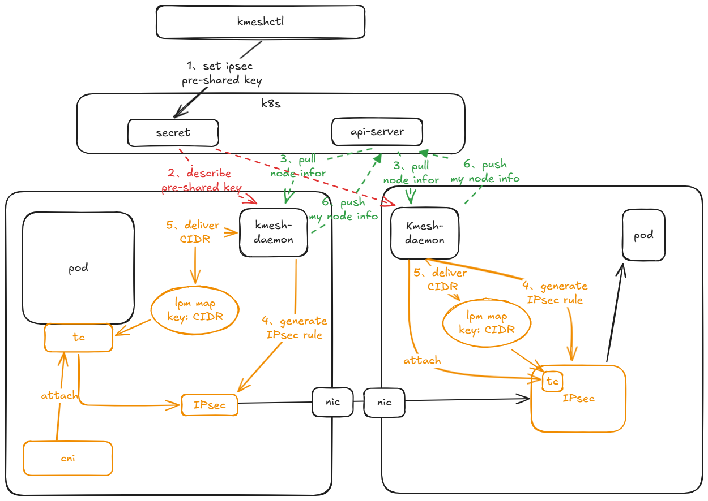

## 1. Background

With the increase in network security threats, unencrypted data is easily eavesdropped, intercepted, or even tampered with by hackers or third parties during transmission, leading to the leakage of sensitive information. To address the above security risks, Kmesh plans to introduce a node data encryption mode to encrypt communication traffic between nodes, eliminating security risks during communication.

## 2. Usage Scenarios

Nodes proxied by Kmesh, when data is sent from the application, are routed to a specified network interface device for encryption processing and then sent to the peer over the network. The peer receives the data through a specific network interface device, decrypts it, and sends it to the corresponding service application.

## 3. IPsec Introduction

IPsec is a security architecture that protects IP layer communication. It is a protocol suite that protects network transmission protocols of the IP protocol by encrypting and authenticating IP protocol packets. It operates at the third layer of the OSI model (Internet Protocol, IP layer) and is widely used in VPN (virtual private networks) applications.
For more information about IPsec, please refer to [What is IPsec](https://info.support.huawei.com/info-finder/encyclopedia/zh/IPsec.html)

## 4. Kmesh Integrates IPSec as an Encryption Tool Between Nodes

Kmesh only uses the encryption function of IPSec. The pre-shared key of IPSec is set by the user in K8s, passed to Kmesh for management, and set in IPSec to ensure normal communication of IPSec. The overall architecture diagram is as follows:

### 4.1 User Sets IPSec Key

Users set a secret type resource named Kmesh-ipsec-keys in K8s through kmeshctl, in the following format:

    kmeshctl secret --key=<aead key>

Currently, only the rfc4106 gcm aes (aead) algorithm is supported. This resource contains the aead key used by ipsec and the icv length of ipsec.

### 4.2 CRD Design

When Kmesh enables ipsec, it needs to finely control the ipsec data encryption behavior, which requires Kmesh to have an information synchronization mechanism between nodes. The current main scenario is based on the cloud-native business scenario, and the information synchronization mechanism is based on the K8s cluster api-server, relying on the Kmesh custom structure to complete data storage.

CRD data structure definition is as follows:

 apiVersion: apiextensions.k8s.io/v1
 kind: CustomResourceDefinition
 metadata:
 annotations:
  controller-gen.kubebuilder.io/version: v0.16.4
 name: kmeshnodeinfos.kmesh.net
 spec:
 group: kmesh.net
 names:
  kind: KmeshNodeInfo
  listKind: KmeshNodeInfoList
  plural: kmeshnodeinfos
  singular: kmeshnodeinfo
 scope: Namespaced
 versions:

- name: v1alpha1
  schema:
  openAPIV3Schema:
   description: KmeshNode is the Schema for the kmeshnodes API
   properties:
   apiVersion:
    description: |-
    APIVersion defines the versioned schema of this representation of an object.
    Servers should convert recognized schemas to the latest internal value, and
    may reject unrecognized values.
    More info: <https://git.k8s.io/community/contributors/devel/sig-architecture/api-conventions.md#resources>
    type: string
   kind:
    description: |-
    Kind is a string value representing the REST resource this object represents.
    Servers may infer this from the endpoint the client submits requests to.
    Cannot be updated.
    In CamelCase.
    More info: <https://git.k8s.io/community/contributors/devel/sig-architecture/api-conventions.md#types-kinds>
    type: string
   metadata:
    type: object
   spec:
    properties:
    addresses:
     description: |-
     Addresses is used to store the internal ip address informatioon on the
     host. The IP address information is used to generate the IPsec state
     informatioon. IPsec uses this information to determine which network
     adapter is used to encrypt and send data.
     items:
     type: string
     type: array
    bootID:
     description: |-
     bootid is used to generate the ipsec key. After the node is restarted,
     the key needs to be updated.
     type: string
    podCIDRS:
     description: |-
     PodCIDRs used in IPsec checks the destination of the data to
     determine which IPsec state is used for encryption.
     items:
     type: string
     type: array
    spi:
     description: |-
     The SPI is used to identify the version number of the current key.
     The communication can be normal only when both communication parties
     have spis and the spi keys are the same.
     type: integer
    required:
  - addresses
  - bootID
  - podCIDRS
  - spi
    type: object
   status:
    type: object
   type: object
  served: true
  storage: true

### 4.3 Kmesh IPsec Communication Path

A map and two tc programs need to be added to the traffic data path

- New map for encryption path:
	| Type | lpm prefix tree map (introduced in kernel version 4.11) |
	|:-------:|:-------|
	| Function | When traffic is orchestrated, it determines whether the node where the sending peer pod is located is managed by Kmesh. Only when both pods are managed by Kmesh will it be encrypted by ipsec |
	| key | bpf_lpm_trie_key {u32 prefixlen; u8 data[0]}; |
	| value | uint32 |
- Add 2 tc:
Add a tc program to the container egress network card of each pod. This tc program is used to mark the traffic sent from the pod and mark it as going through ipsec encryption.

Add a tc program to the node network card. After ipsec decrypts the data packet, it enters the tc program. The tc marks the data packet and forwards it to the corresponding ipsec policy for distribution. If this tc program is not used to mark the data packet when receiving it, it will cause packet loss when receiving non-ipsec data packets.

### 4.4 Kmesh IPSec Operation

**Specification Restrictions**

- Since the mark is used when matching ipsec rules, please ensure that there are no conflicts in the current environment

	- The mark used for encryption is: 0x000000e0, mask :0xffffffff
	- The mark used for decryption is: 0x000000d0, mask :0xffffffff
	- Do not use the same bit as this mark, which will cause data packet identification errors

- When data is sent from the client, do not enable the address masquerade (masq) option for the traffic that needs to be encrypted in iptables. Address masquerade will use snat technology to masquerade the traffic src_ip into nodeid in the ipsec data packet received by the server, causing the server ipsec to fail to match correctly and the data packet to be discarded

**When Kmesh-daemon starts, it completes the following actions:**

- Read secret information from Kmesh-daemon and parse and store the following key information:
	| Name | Function |
	|:-------:|:-------|
	| spi | The serial number of the encryption key, automatically generated by kmeshctl secret |
	| aead-algo | Key algorithm, currently only supports rfc4106(gcm(aes)) |
	| aead-key | Pre-shared key, all ipsec keys between nodes are derived from this key through a specific algorithm |
	| icv-len | Key length |

- Obtain the following information from the local end:
	| Name | Function |
	|:-------:|:-------|
	| Local PodCIDR | Used to generate ipsec rules |
	| Local cluster internal ip address | Used to generate nodeid, ipsec rules |
	| bootid | Startup id |

- Read all kmeshNodeInfo node information from the api-server. The node information includes the current name of each node, the spi version number used, the ip address of the ipsec device, and bootID information, and start generating ipsec rules. Each peer node needs to generate 2 states (one in and one out), 3 policies (out, in, fwd). The key is derived from the pre-shared key, and the rules are as follows:

Egress key: Pre-shared key + local IP + peer IP + local bootid + peer bootID, hash and then intercept the aead key length

Ingress key: Pre-shared key + peer IP + local IP + peer bootid + local bootID, hash and then intercept the aead key length

ipsec example: The local ip address is 7.6.122.84, and the peer node ip address information obtained is 7.6.122.220. The ipsec configuration preview is set as follows

# state configuration

 ip xfrm state add src 7.6.122.84 dst 7.6.122.220 proto esp spi 0x1 mode tunnel reqid 1 {\$aead-algo} {\$aead-出口密钥} {\$icv-len}
 ip xfrm state add src 7.6.122.220 dst 7.6.122.84 proto esp spi 0x1 mode tunnel reqid 1 {\$aead-algo} {\$aead-入口密钥} {\$icv-len}

# policy configuration

 ip xfrm policy add src 0.0.0.0/0 dst {\$对端CIDR} dir out tmpl src 7.6.122.84 dst 7.6.122.220 proto esp spi 0x1 reqid 1 mode tunnel mark 0x000000e0 mask 0xffff
 ip xfrm policy add src 0.0.0.0/0 dst {\$本端CIDR} dir in  tmpl src 7.6.122.220 dst 7.6.122.84 proto esp reqid 1 mode tunnel mark 0x000000d0 mask 0xfffffff
 ip xfrm policy add src 0.0.0.0/0 dst {\$本端CIDR} dir fwd tmpl src 7.6.122.220 dst 7.6.122.84 proto esp reqid 1 mode tunnel mark 0x000000d0 mask 0xfffffff

- Update the lpm prefix tree map, the key is the peer CIDR address, the value is currently set to 1, tc finds the record in the prefix tree according to the target pod ip, determines that the peer pod is managed by Kmesh, and marks the traffic with the corresponding encryption and decryption labels
- Kmesh-daemon updates the local spi, IPsec device ip, and podCIDRs to the api-server, triggering other nodes to update the IPsec configuration on the machine

**When Kmesh-daemon detects a new node node:**

New node: Refer to the previous chapter [When Kmesh-daemon starts, it completes the following actions:]

Other nodes:

- After the new node uploads its kmeshNodeInfo information to the api-server, it indicates that the IPsec rules on the new node are ready
- The local end needs to create state and policy rules for ipsec in/fwd/out directions
- The local end updates the map table and updates the corresponding CIDR to the lpm map

**When Kmesh-daemon exits, it completes the following actions:**

Exit node:
- Clear the kmeshNodeInfo information of this node in the api-server
- Clear the ipsec state and policy information on the current node
- Uninstall the tc program
- Clear lpm data

Other nodes:
- The local end deletes the IPsec state and policy information of the exit node
- The local end clears the lpm CIDR data of the exit node

**When the secret is updated, the following actions are completed:**

Update node:
- After Kmesh detects that the current secret is updated, it needs to perform a full scan update of the IPsec rules
- Traverse the kmeshNodeInfo information and perform the following actions:
  - If the peer's secret spi version is not found in the current and historical spi recorded locally, then do nothing (no spi means the pre-shared key is missing, and the key cannot be generated). It may be that the peer's spi is higher than the local end, so wait for the next secret update to trigger the update
  - Use the new spi to create all in and fwd direction states to the peer, and in/fwd direction policies support multi-version key parsing without updating.
  - If the peer's secret spi version is less than or equal to the local secret spi, create a new state in the out direction and update the spi in the out direction policy to the latest spi version
  - If the peer's secret spi version is greater than the local secret spi, it means that the local spi version is behind, and wait for the secret version update to generate the state and policy in the out direction
- Update your own kmeshNodeInfo to the api-server

Other nodes:
- After the local end reads the kmeshNodeInfo update from the api-server, perform the following actions:
  - If the peer's secret spi version is not found in the current and historical spi recorded locally, then do nothing (no spi means the pre-shared key is missing, and the key cannot be generated). It may be that the peer's spi is higher than the local end, so wait for the next secret update to trigger the update. It may also be that the peer's version is too low, lower than the spi version number when the local Kmesh started, and wait for the peer's spi version to be updated before triggering the local update
  - Use the new spi to create all in and fwd direction states to the peer, and in/fwd direction policies support multi-version key parsing without updating
  - If the peer's secret spi version is less than or equal to the local secret spi, create a new state in the out direction and update the spi in the out direction policy to the latest spi version
  - If the peer's secret spi version is greater than the local secret spi, it means that the local spi version is behind, and wait for the secret version update to generate the state and policy in the out direction
