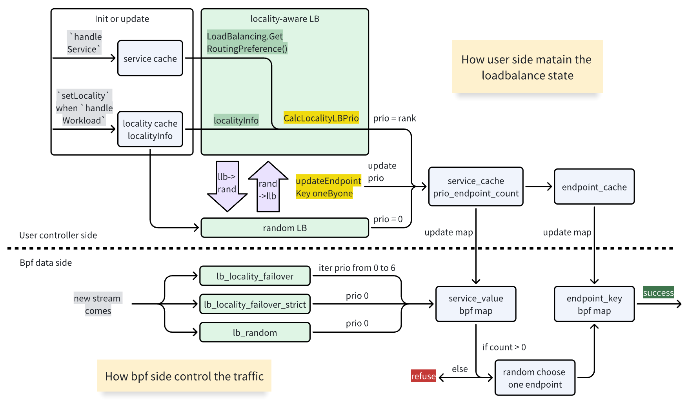

## Locality Load Balancing for Kmesh

### Summary

Add Locality Load Balancing to Kmesh workload mode.

### Motivation

Currently, Kmesh does not support locality aware load balancing. Locality Load Balancing optimizes performance and reliability in distributed systems by directing traffic to the nearest service instances. This approach reduces latency, enhances availability, and lowers costs associated with cross-region data transfers. It also ensures compliance with data sovereignty regulations and improves the overall user experience by providing faster and more reliable service responses.

### Goals

The purpose of this proposal is to add locality aware load balancing capabilities to kmesh workload mode, corresponding to locality load balancing in Ztunnel.

### Proposal

Locality load balancing mode: locality failover, locality strict.

What is locality failover mode? When a request accesses the service, the control plane will perform a tiered match between the locality information of the originating pod of the flow and the localities of all healthy backends behind the service. Pods with a higher degree of match indicate that they are geographically closer, and traffic will be preferentially routed to pods with a higher matching pair.

What is locality strict mode? In locality strict mode, the LB (load balancing) algorithm will only select backends that exactly match the routingPreference. This means that in such a mode, the load balancer enforces a strict policy where it only routes traffic to backends based on a perfect match with the specified locality preferences, ensuring that requests are handled by servers that meet specific criteria related to their location or other attributes.

### Design Details

Introduce a priority (rank) between the existing service and endpoint to achieve finer-grained traffic control and service management. The newly designed endPointKey will consist of the service ID, priority level, and backend index, with its corresponding value being the backendKey. Development will be carried out in both user space and kernel space to implement the functionality.



#### Control plane（user-space）
1. The user-space kmesh process needs to maintain locality, clusterId, and network information, which is updated when the xDS receives information about the workload currently on that node.
2. The user-space kmesh process also needs to maintain routingPreference, which is updated when the xDS receives information about the service currently on that node.
3. Once the above information has been successfully obtained by the user-space, for each incoming workload, its locality information is compared with the kmesh process's locality to calculate a priority.
   Calculation Process: Match according to the routing rules defined in the service load balancing scope. For example, if a service is configured with a region, the kmesh process's region is compared with the target backend's region. If they are the same, the priority value is incremented. After calculating the rank, the corresponding endpointKey is generated using the service ID, backend ID, and rank, thereby associating the service with the backend.

#### Data plane（kernel-space）
When a request is made to a service, the BPF program traverses the endpoint map to query the backend ID based on the requested service ID and count, following the priority rank. 
- In strict mode, only backends that match all scopes are considered.
- In failover mode, the BPF program will iterate through the ranks starting from the highest and moving downward. If there are backends stored at a particular priority level, one of the queried backends is selected at random to serve the request.

#### data struct
1. workload.h
```
typedef struct {
    __u32 service_id;    // service id
    __u32 prio;          // prio means rank, 0 means lowest priority(match nothing at routePerference), and 6 means heightest priority
    __u32 backend_index; // if endpoint_count = 3, then backend_index = 0/1/2
} endpoint_key;
```

2. service

workload.h
```
#define PRIO_COUNT            7

typedef struct {
    __u32 prio_endpoint_count[PRIO_COUNT];// endpoint count of current service with prio, prio from 0->6,
    __u32 lb_policy;                    // load balancing algorithm, currently supports random algorithm, locality loadbalance Failover/strict mode
    __u32 lb_strict_index;              // for failover strict mode
    ...
} service_value;
```

3. locality LB mode

workload_common.h
```
// loadbalance type
typedef enum {
    LB_POLICY_RANDOM = 0,
    LB_POLICY_STRICT = 1,
    LB_POLICY_FAILOVER = 2,
} lb_policy_t;
```

4. locality_cache.go
```
const (
	PrioCount = 7
)

type localityInfo struct {
	region    string // init from workload.GetLocality().GetRegion()
	zone      string // init from workload.GetLocality().GetZone()
	subZone   string // init from workload.GetLocality().GetSubZone()
	nodeName  string // init from os.Getenv("NODE_NAME"), workload.GetNode()
	clusterId string // init from workload.GetClusterId()
	network   string // workload.GetNetwork()
	mask      uint32 // mask
}

type LocalityCache struct {
	LbPolicy               uint32
	localityInfo           localityInfo
	LbStrictIndex          uint32 // for failover strict mode
	isLocalityInfoSet      bool
	RoutingPreference      []workloadapi.LoadBalancing_Scope
	isRoutingPreferenceSet bool
	workloadWaitQueue      map[*workloadapi.Workload]struct{}
}
```

5. endpoint.go
```
type EndpointKey struct {
	ServiceId    uint32 // service id
	Prio         uint32
	BackendIndex uint32 // if endpoint_count = 3, then backend_index = 1/2/3
}
```