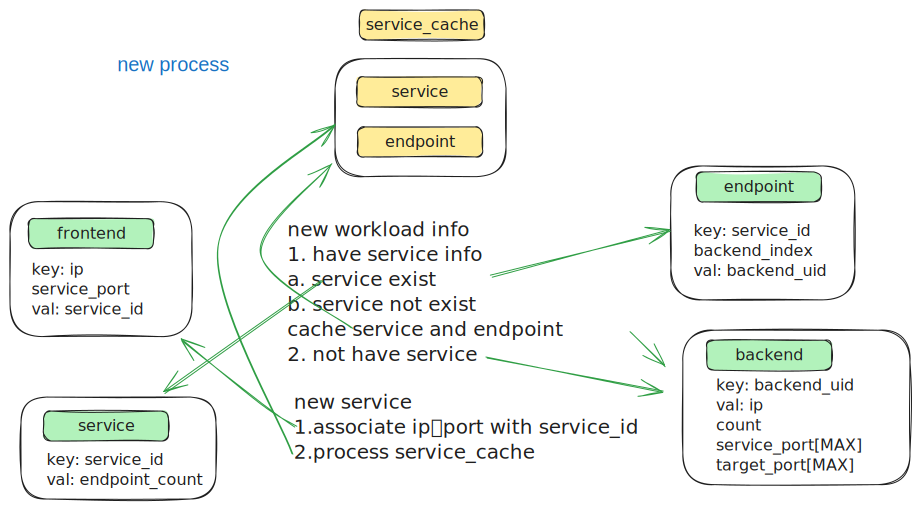
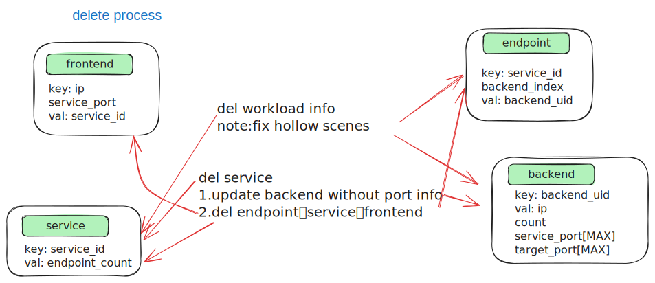
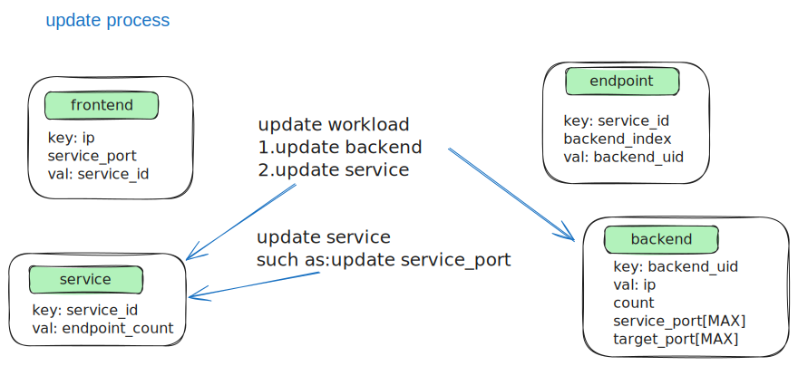

## Background

Currently, kmesh has implemented traffic governance functions for L4 and L7 through XDS protocol. However, in some scenarios, microservice applications focus more on L4 traffic governance, and L7 governance can be deployed as needed. The Istio community has launched a Workload model to provide lightweight L4 traffic governance functions, which Kmesh needs to consider supporting.

Complete Workload Model reference link：https://pkg.go.dev/istio.io/istio/pkg/workloadapi

## Workload fields related to L4 traffic governance

### Address

```go//
type Address struct {
  // Types that are assignable to Type:
  // *Address_Workload
  // *Address_Service
  Type isAddress_Type `protobuf_oneof:"type"`
}
```

### Service

```go//
type Service struct {
  // The service name for Kubernetes, such as: "fortio-server", "Kubernetes", "istiod", "kube-dns" etc.
  Name string `protobuf:"bytes,1,opt,name=name,proto3" json:"name,omitempty"`
  // The namespace the service belongs to，such as: "default", "kube-system", "istio-system" etc.
  Namespace string `protobuf:"bytes,2,opt,name=namespace,proto3" json:"namespace,omitempty"`
  // Hostname represents the FQDN of the service.
  // For Kubernetes，this would be <name>.<namespace>.svc.<cluster domain>, such as: "fortio-server.default.svc.cluster.local", "istiod.istio-system.svc.cluster.local" etc.
  Hostname string `protobuf:"bytes,3,opt,name=hostname,proto3" json:"hostname,omitempty"`
  // Address represents the addresses the service can be reached at.
  // There may be multiple addresses for a single service if it resides in multiple networks,
  // multiple clusters, and/or if it's dual stack (TODO: support dual stack).
  // For a headless kubernetes service, this list will be empty.
  Addresses []*NetworkAddress `protobuf:"bytes,4,rep,name=addresses,proto3" json:"addresses,omitempty"`
  // Ports for the service.
  // The target_port may be overridden on a per-workload basis.
  Ports []*Port `protobuf:"bytes,5,rep,name=ports,proto3" json:"ports,omitempty"`
}
```

### Workload

```go
type Workload struct {
  // UID represents a globally unique opaque identifier for this workload, such as: "Kubernetes//Pod/default/fortio-server-deployment-59f95d774d-85nr4"
  Uid string `protobuf:"bytes,20,opt,name=uid,proto3" json:"uid,omitempty"`
  // Name represents the name for the workload, For Kubernetes, this is the pod name, such as: "fortio-server-deployment-59f95d774d-ljmd5"
  Name string `protobuf:"bytes,1,opt,name=name,proto3" json:"name,omitempty"`
  // Namespace represents the namespace for the workload. 
  Namespace string `protobuf:"bytes,2,opt,name=namespace,proto3" json:"namespace,omitempty"`
  // Address represents the IPv4/IPv6 address for the workload, this should be globally unique.
  Addresses [][]byte `protobuf:"bytes,3,rep,name=addresses,proto3" json:"addresses,omitempty"`
  // The services for which this workload is an endpoint. the key is the NamespacedHostname string of the format namespace/hostname.
  Services map[string]*PortList `protobuf:"bytes,22,rep,name=services,proto3" json:"services,omitempty" protobuf_key:"bytes,1,opt,name=key,proto3" protobuf_val:"bytes,2,opt,name=value,proto3"`
  // Health status of the workload，such as: "Healthy"，"Unhealthy"
  Status WorkloadStatus `protobuf:"varint,17,opt,name=status,proto3,enum=istio.workload.WorkloadStatus" json:"status,omitempty"`
}
```

Note: The above configuration about workload model is related to the basic network function and does not involve TLS or encryption related configurations. This part of the content will be added in the process of supplementing the complete functionality of the workload.

## How kmesh subscribe and use the workload model info

1. kmesh's xds client subscribes to the workload model from Istiod through Delta manner, and the type_url is: "type.googleapis.com/istio.workload.Address";
2. The workload data of Address type is divided into two sub resources: Service and Workload, which are responsed to kmesh and then parsed and converted into internal structures, stored in the bpf map;


In the subsequent traffic management of kmesh, based on the IP and Port accessed by the client, find the corresponding service and its endpoints from the BPF map, and then randomly select an endpoint to forward the request to that endpoint;

## Kmesh BPF map data structure definition

```C
// frontend map
typedef struct
{
    __be32 ipv4; // service ip
    __be16 service_port;
} __attribute__((packed)) frontend_key;

typedef struct
{
    __u32 service_id; // service id, through <namespace>/<hostname> string convert to uint32 variable
} __attribute__((packed)) frontend_value;

// service map
typedef struct
{
    __u32 service_id; // service id, through <namespace>/<hostname> string convert to uint32 variable
} __attribute__((packed)) service_key;

typedef struct
{
	__u32 endpoint_count; // the endpoint count of the service
	__u32 lb_policy;	  // current only support random lb policy
} __attribute__((packed)) service_value;

// endpoint map
typedef struct
{
    __u32 service_id;	 // service id, through <namespace>/<hostname> string convert to uint32 variable
    __u32 backend_index; // backend index，The relationship of backend_index and endpoint_count：if endpoint_count is 3，then backend_index can be 1/2/3;
} __attribute__((packed)) endpoint_key;

typedef struct
{
    __u32 backend_uid; // backend uid, through workload_uid string convert to uint32 variable
} __attribute__((packed)) endpoint_value;

// backend map
typedef struct
{
    __u32 backend_uid; // backend uid, through workload_uid string convert to uint32 variable
} __attribute__((packed)) backend_key;

typedef struct
{
    __be32 ipv4; 				   // backend ip
    __u32 port_count;
    __u32 service_port[MAX_COUNT]; // MAX_ COUNT fixed at 10, currently
    __u32 target_port[MAX_COUNT];
} __attribute__((packed)) backend_value;

```

## Subscription data processing flow






## Traffic governance process


* Client Access Service: Search the serviceinfo map based on the IP and Port accessed by the client, find the corresponding service_id, and then search the service map based on the service_id to find the endpoint_count of the backend Pod in the service. Then, search the endpoint map based on the service_id and the random backend_index generated based on the count to find the corresponding backend_uid. Finally, use the backenduid to find the IP and Port of the backend.
* Client access Pod: Access directly through Pod's IP and Port.


