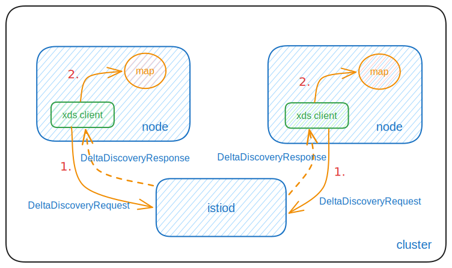
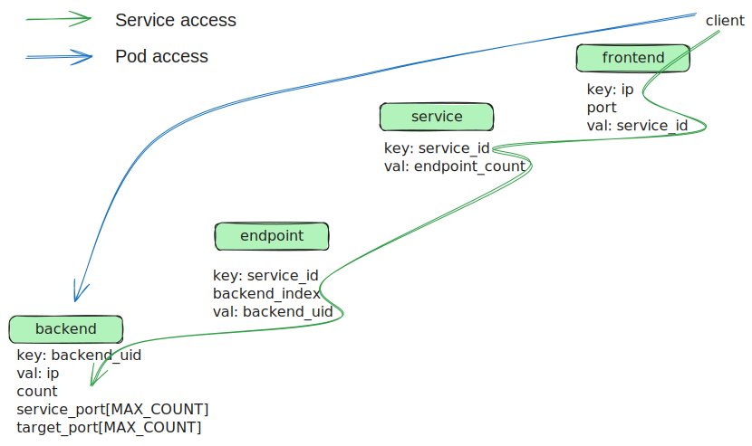

## 背景

目前，kmesh 已经通过 XDS 协议实现了 L4 和 L7 的流量治理功能。然而，在某些场景下，微服务应用更关注 L4 流量治理，而 L7 治理可以根据需要进行部署。Istio 社区已经推出了 Workload 模型，以提供轻量级的 L4 流量治理功能，这是 Kmesh 需要考虑支持的。

完整的 Workload 模型参考链接：https://pkg.go.dev/istio.io/istio/pkg/workloadapi

## 与 L4 流量治理相关的 Workload 字段

### Address

```go//
type Address struct {
  // Types that are assignable to Type:
  // *Address_Workload
  // *Address_Service
  Type isAddress_Type `protobuf_oneof:"type"`
}
```

### Service

```go//
type Service struct {
  // The service name for Kubernetes, such as: "fortio-server", "Kubernetes", "istiod", "kube-dns" etc.
  Name string `protobuf:"bytes,1,opt,name=name,proto3" json:"name,omitempty"`
  // The namespace the service belongs to，such as: "default", "kube-system", "istio-system" etc.
  Namespace string `protobuf:"bytes,2,opt,name=namespace,proto3" json:"namespace,omitempty"`
  // Hostname represents the FQDN of the service.
  // For Kubernetes，this would be <name>.<namespace>.svc.<cluster domain>, such as: "fortio-server.default.svc.cluster.local", "istiod.istio-system.svc.cluster.local" etc.
  Hostname string `protobuf:"bytes,3,opt,name=hostname,proto3" json:"hostname,omitempty"`
  // Address represents the addresses the service can be reached at.
  // There may be multiple addresses for a single service if it resides in multiple networks,
  // multiple clusters, and/or if it's dual stack (TODO: support dual stack).
  // For a headless kubernetes service, this list will be empty.
  Addresses []*NetworkAddress `protobuf:"bytes,4,rep,name=addresses,proto3" json:"addresses,omitempty"`
  // Ports for the service.
  // The target_port may be overridden on a per-workload basis.
  Ports []*Port `protobuf:"bytes,5,rep,name=ports,proto3" json:"ports,omitempty"`
}
```

### Workload

```go
type Workload struct {
  // UID represents a globally unique opaque identifier for this workload, such as: "Kubernetes//Pod/default/fortio-server-deployment-59f95d774d-85nr4"
  Uid string `protobuf:"bytes,20,opt,name=uid,proto3" json:"uid,omitempty"`
  // Name represents the name for the workload, For Kubernetes, this is the pod name, such as: "fortio-server-deployment-59f95d774d-ljmd5"
  Name string `protobuf:"bytes,1,opt,name=name,proto3" json:"name,omitempty"`
  // Namespace represents the namespace for the workload. 
  Namespace string `protobuf:"bytes,2,opt,name=namespace,proto3" json:"namespace,omitempty"`
  // Address represents the IPv4/IPv6 address for the workload, this should be globally unique.
  Addresses [][]byte `protobuf:"bytes,3,rep,name=addresses,proto3" json:"addresses,omitempty"`
  // The services for which this workload is an endpoint. the key is the NamespacedHostname string of the format namespace/hostname.
  Services map[string]*PortList `protobuf:"bytes,22,rep,name=services,proto3" json:"services,omitempty" protobuf_key:"bytes,1,opt,name=key,proto3" protobuf_val:"bytes,2,opt,name=value,proto3"`
  // Health status of the workload，such as: "Healthy"，"Unhealthy"
  Status WorkloadStatus `protobuf:"varint,17,opt,name=status,proto3,enum=istio.workload.WorkloadStatus" json:"status,omitempty"`
}
```

注意：以上关于 workload 模型的配置与基本网络功能相关，不涉及 TLS 或加密相关的配置。这部分内容将在补充 workload 的完整功能的过程中添加。

## Kmesh 如何订阅和使用 workload 模型信息

1. kmesh 的 xds 客户端通过 Delta 方式从 Istiod 订阅 workload 模型，type_url 为："type.googleapis.com/istio.workload.Address"；
2. Address 类型的 workload 数据分为两个子资源：Service 和 Workload，它们被响应给 kmesh，然后被解析并转换为内部结构，存储在 bpf map 中；



在 kmesh 的后续流量管理中，基于客户端访问的 IP 和 Port，从 BPF map 中找到相应的服务及其端点，然后随机选择一个端点将请求转发到该端点；

## Kmesh BPF map 数据结构定义

```C
// frontend map
typedef struct
{
    __be32 ipv4; // service ip
} frontend_key;

typedef struct
{
    __u32 upstream_id; // service id for Service access or backend uid for Pod access.
} frontend_value;

// service map
typedef struct
{
    __u32 service_id; // service id, through <namespace>/<hostname> string convert to uint32 variable
} service_key;

typedef struct
{
    __u32 endpoint_count;               // endpoint count of current service
    __u32 lb_policy;                    // load balancing algorithm
    __u32 service_port[MAX_PORT_COUNT]; // service_port[i] and target_port[i] are a pair, i starts from 0 and max value
                                        // is MAX_PORT_COUNT-1
    __u32 target_port[MAX_PORT_COUNT];
    __u32 waypoint_addr;
    __u32 waypoint_port;
} service_value;

// endpoint map
typedef struct
{
    __u32 service_id;	 // service id, through <namespace>/<hostname> string convert to uint32 variable
    __u32 backend_index; // backend index，The relationship of backend_index and endpoint_count：if endpoint_count is 3，then backend_index can be 1/2/3;
} endpoint_key;

typedef struct
{
    __u32 backend_uid; // backend uid, through workload_uid string convert to uint32 variable
} endpoint_value;

// backend map
typedef struct
{
    __u32 backend_uid; // backend uid, through workload_uid string convert to uint32 variable
} backend_key;

typedef struct
{
    __be32 ipv4; // backend ip
    __u32 service[MAX_SERVICE_COUNT];
    __u32 waypoint_addr;
    __u32 waypoint_port;
} backend_value;

```

## 流量治理过程

<p align="center">
  
</p>

**流量治理过程**

- 基于客户端访问的 IP 搜索 frontend map，找到对应的 upstream_id，然后使用该 upstream_id 搜索 service map 和 backend map：
  - 如果在 service map 中找到对应的服务，并获取服务中后端 Pod 的 endpoint_count。然后，基于 service_id 和基于计数生成的随机 backend_index 搜索 endpoint map，以找到对应的 backend_uid。最后，使用 backenduid 找到后端的 IP 和 Port。
  - 如果在 backend map 中找到对应的后端，则为直接 pod 访问。
- 此外，如果服务或后端包含 waypoint，它将重定向到 waypoint。
