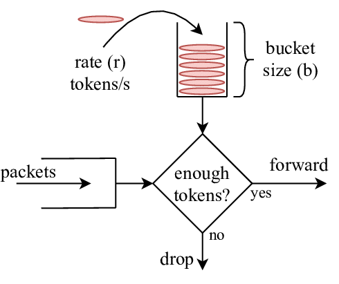

## Support Local Rate Limit

### Summary
Envoy supports local rate limiting, but Kmesh currently does not. This proposal aims to add local rate limiting to Kmesh, focusing on per-connection rate limiting.

### Motivation
When many downstream clients send requests to an upstream server, configuring appropriate circuit-breaking strategies for each client is challenging. Circuit-breaking does not effectively handle burst connections. In Istio, EnvoyFilters apply rate limiting to connections before processing them in the filter chain, providing better control.


Envoy supports the following rate-limiting mechanisms:
* **Network Rate Limiting**: Envoy checks a rate limit service for each new connection, using configured domains to restrict the number of connections per second. 
* **HTTP Rate Limiting**: Envoy checks a rate limit service for each HTTP request based on route settings, limiting requests to upstream and inter-cluster.
* **Quota-Based Rate Limiting**: Enforces quotas on resource usage over time.


Envoy supports two rate limiting deployment modes:
* **Global Rate Limiting**: when a client initiates a new connection request, Envoy triggers the rate limit filter in the listener. The filter then communicates with an external global rate limit service to determine whether to allow the connection.
* **Local Rate Limiting**: Envoy processes the rate-limiting logic directly within the data plane, eliminating the need for external rate limit services.

Since Kmesh is an eBPF-based data plane and does not support external services, implementing global rate limiting is not feasible. Therefore, this proposal focuses on adding local rate limiting, specifically per-connection rate limiting, to handle burst connections and manage load effectively.

**Goals**:
* Add local rate limiting to Kmesh to support per-connection rate limiting.

**None-Goals**:
* Add global rate limiting to Kmesh.
* Implement HTTP rate limiting or quota-based rate limiting.

### Design Details
#### Configuration in Istio
To enable local rate limiting in Envoy, use an EnvoyFilter to insert the `local_ratelimit` filter into the listener's filter chain. Below is an example YAML configuration:
```yaml
apiVersion: networking.istio.io/v1alpha3
kind: EnvoyFilter
metadata:
  name: filter-local-ratelimit-svc
  namespace: istio-system
spec:
  configPatches:
    - applyTo: NETWORK_FILTER
      match:
        listener:
          filterChain:
            filter:
              name: envoy.filters.network.tcp_proxy
      patch:
        operation: INSERT_BEFORE
        value:
          name: envoy.filters.network.local_ratelimit
          typed_config:
            "@type": type.googleapis.com/envoy.extensions.filters.network.local_ratelimit.v3.LocalRateLimit
            stat_prefix: local_rate_limit
            token_bucket:
              max_tokens: 4
              tokens_per_fill: 4
              fill_interval: 60s
```

The configuration above inserts the local_ratelimit filter before the tcp_proxy filter in the listener's filter chain.

In xds, local_ratelimit filter is defined as below:
```json
{
  "stat_prefix": "local_rate_limit",
  "token_bucket": {
    "max_tokens": 4,
    "tokens_per_fill": 4,
    "fill_interval": "60s"
  }
}
```
The token_bucket settings define how rate limiting is enforced. `max_tokens` specifies the maximum number of tokens the bucket can hold, setting the burst capacity. `tokens_per_fill` determines the number of tokens added to the bucket at each fill interval, and `fill_interval` defines the time interval for replenishing tokens. In the example above, the bucket can hold up to 4 tokens, with 4 tokens added every 60 seconds. This configuration allows up to 4 new connections per minute.


#### Local Rate Limiting Logic
As shown in below, the per connection rate limiting process in Kmesh operates as follows:
1. **Connection Initiation**: A client initiates a new connection request.
2. **Listener Invocation**: The connection request reaches the listener's hook point. Before executing the filter chain, the rate limiting logic is applied.
3. **Rate Limit Decision**: The rate limiter records the number of historical connections (stores in a ebpf hash map)and compares it against the `token_bucket` configuration. Based on this comparison, it determines whether to allow or reject the new connection.


In the filter_chain_manager, we integrate the rate limiting logic by invoking a function that checks and updates the token bucket based on the connection attempt:
1. **Filter Matching**: The function first verifies if the local_ratelimit filter is present in the filter chain. If not, the connection is allowed to proceed without rate limiting.
2. **Configuration Retrieval**: It retrieves the rate_limit and token_bucket configurations from the matched filter.
3. **Rate Limiting Decision**: The rate limiter uses the client's address as a key to access the corresponding token bucket. Based on the elapsed time since the last token refill, tokens are added to the bucket up to the maximum capacity. If tokens are available, one token is consumed to allow the connection; otherwise, the connection is rejected.

The rate limiting logic follows the Token Bucket algorithm to manage connection rates:
1. **Initialization**: When a new client address is encountered, a token bucket is initialized with the maximum number of tokens (max_tokens).
2. **Token Replenishment**: Tokens are periodically added to the bucket at intervals defined by fill_interval, ensuring the bucket does not exceed max_tokens.
3. **Connection Handling**: If tokens are available, a token is consumed, and the connection is allowed. If no tokens are available, the connection is rejected.


