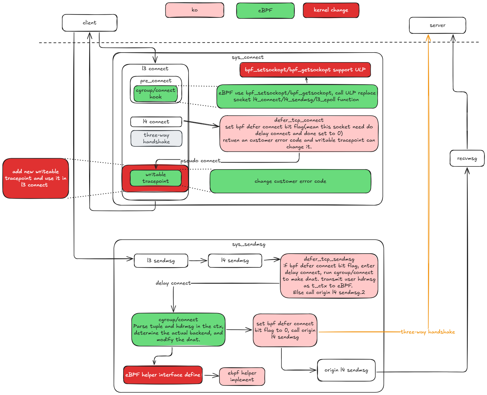

## The kernel-native mode supports traffic control based on the layer7 HTTP protocol and improves the process.

### Background

The kernel-native mode requires a large number of intrusive kernel reconstructions to implement HTTP-based traffic control. Some of these modifications may have a significant impact on the kernel, which makes the kernel-native mode difficult to deploy and use in a real production environment.

To resolve this problem, we have modified the kernel in kernel-native mode and the involved ko and eBPF synchronously.

In kernel 5.10, the kernel modification is limited to four, and in kernel 6.6, the kernel modification is reduced to only one.
This last one will be eliminated as much as possible, with the goal of eventually running kernel-native mode on native version 6.6 and above.

### Overview



### Changes in kernel
#### kernel enhanced 1

A flag is added to the socket to indicate whether the current socket needs to delay link establishment.

Solution on kernel 5.10:
Add a flag bit called bpf_defer_connect, which occupies the same u8 variable with defer_connect, bind_address_no_port, and recverr_rfc4884.

    ```c
    include/net/inet_sock.h

    struct inet_sock {
        ...
        __u8    bind_address_no_port:1,
                recverr_rfc4884:1,
    -           defer_connect:1;
    +           defer_connect:1,
    +           bpf_defer_connect:1;
        __u8    rcv_tos;
        ...
    }
    ```

Solution on kernel 6.6:
The 6.6 kernel does not need to be modified. The variable `inet_flags`(unsigned long)type is added to the 6.6 kernel. On the 64-bit platform, 64 flags can be set. Currently, 30 flags are used by the kernel. This variable can be directly used to store the flags.

    ```c
    include/net/inet_sock.h

    struct inet_sock {
        ...
    #define inet_num        sk.__sk_common.skc_num

        unsigned long   inet_flags;
        __be32          inet_saddr; 
        ...
    }
    ...
    enum {
        INET_FLAGS_PKTINFO  = 0,
        INET_FLAGS_TTL      = 1,
        INET_FLAGS_TOS      = 2,
        ...
        INET_FLAGS_RECVERR_RFC4884 = 10,
        ...
        INET_FLAGS_BIND_ADDRESS_NO_PORT = 18,
        INET_FLAGS_DEFER_CONNECT = 19,
        ...
        INET_FLAGS_RTALERT  = 30,
    }
    ...
    ```

#### kernel enhanced 2
bpf_setsockopt and bpf_getsockopt support setting and reading of the Upper Layer Protocol(ULP). ULP is a key technology to implement the kernel-native mode. Through ULP, we can customize the behavior details of the socket managed by Kmesh to implement the goal of offloading traffic control logic to the kernel for execution.

Solution on kernel 5.10:
This function is integrated in 5.10 based on the implementation details of the upstream community.

Solution on kernel 6.6:
The solution does not need to be modified and is supported by the upstream community.

#### kernel enhance 3:
Inject writable_tracepoint to inet_stream_connect to change the specified error code returned by kmesh_defer_connect to normal value. The error code is used to indicate whether the Kmesh pseudo connect establishment process is used. The error code must be returned to the user mode. Use the defer_connect label to avoid this problem.

Use the defer_connect label to avoid this problem. In the connect and sendmsg phases, set the default_connect flag to the socket and analyze the impact on the socket. If the impact is not affected, delete the tracepoint.

Solution on kernel 5.10:
Introduce a new writable_tracepoint hook

Solution on kernel 6.6:
Introduce a new writable_tracepoint hook

#### kernel enhance 4:
In kernel-native mode, user information is parsed in eBPF using the helper function of kfunc. The parameter is passed to ctx, which contains an iovec copy of the data sent by the user for parsing.

Solution on kernel 5.10:
Use the helper function to inject related interfaces into the kernel.

Solution on kernel 6.6:
No reconstruction is required. The kfunc interface is used.

### Changes in ko

The ko performs the following functions:

- The connect function kmesh_defer_connect is customized by the ULP framework. Provides the pseudo connect establishment capability and sets the related status. After detecting that the fastopen capability is enabled for the socket, roll back the sendmsg and epoll
- The sendmsg function kmesh_defer_sendmsg is customized by the ULP framework. Provides the delay sending capability and determines whether the socket needs to delay link establishment based on the socket status. In the link establishment delay phase, the eBPF program is invoked to complete the DNAT. Delay link setup.
- The epoll function customized by the ULP framework is used to solve the problem that the epoll cannot be triggered when the socket is in the connected state.
- The helper function and kfunc are implemented to parse, save, and match layer-7 user information for the eBPF to support grayscale functions.

### Changes in eBPF

Adapt to the preceding modification.