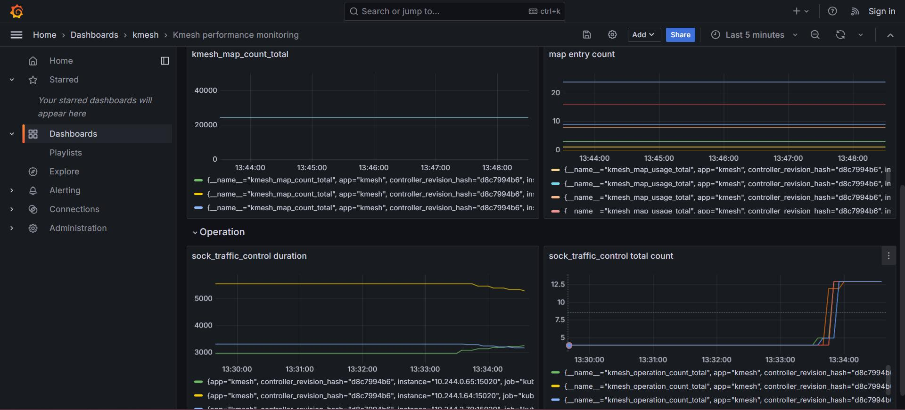
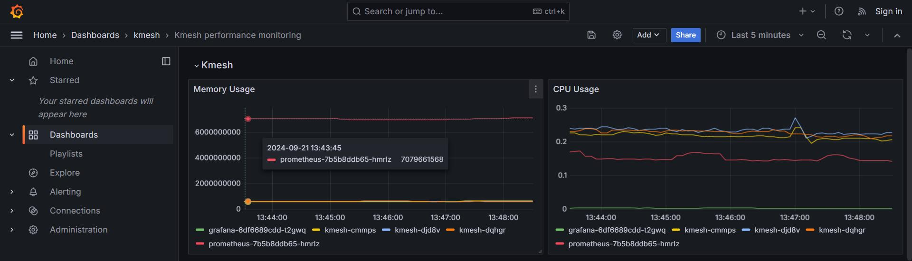
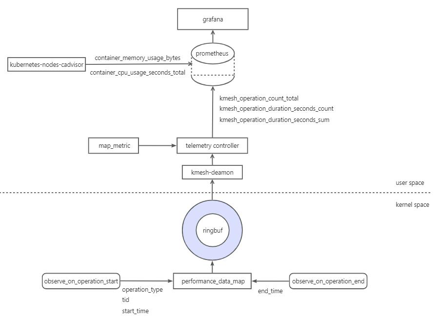

## proposal of Kmesh observability

<!--
This is the title of your KEP. Keep it short, simple, and descriptive. A good
title can help communicate what the KEP is and should be considered as part of
any review.
-->
### Summary

<!--
This section is incredibly important for producing high-quality, user-focused
documentation such as release notes or a development roadmap.

A good summary is probably at least a paragraph in length.
-->

The significance of performance monitoring in Kmesh as the foundation for efficient, scalable, and robust mesh systems is paramount. In Kmesh, monitoring key metrics such as Kmesh daemon activity, the number of eBPF maps, the number of entries in each map, and the duration of eBPF method execution is crucial to ensure optimal system performance.

In this proposal, I will analyze the performance monitoring metrics of Kmesh. I will also suggest the implementation of enhanced observability features within Kmesh to capture these critical performance indicators. This will allow users to seamlessly monitor Kmesh's performance and ensure system efficiency.

### Proposal

Kmesh needs to collect metrics through the kernel and pass them on to the user mode. In the user mode, the data related to eBPF maps and operation duration can ultimately be queried through Prometheus and visualized using Grafana.

#### Design Details

##### metrics related operation duration

This is because Kmesh needs to get metrics from the kernel and sent them to the user mode. We need a bpf map to record the metrics, as a vehicle for transferring.

So we need to define a bpf map that contains all the required metrics:

```
struct operation_usage_data {
    __u64 start_time;
    __u64 end_time;
    __u32 operation_type;
};

struct operation_usage_key {
    __u32 tid;
    __u32 operation_type;
};

struct {
    __uint(type, BPF_MAP_TYPE_HASH);
    __type(key, struct operation_usage_key);
    __type(value, struct operation_usage_data);
    __uint(max_entries, 1024);
} kmehs_perf_map SEC(".maps");

struct {
    __uint(type, BPF_MAP_TYPE_RINGBUF);
    __uint(max_entries, RINGBUF_SIZE);
} kmesh_perf_info SEC(".maps");
```

collect the timestamps at the beginning and end of the function, and at the end of the function, write the data from the map into the ring buffer.

##### metrics related ebpf map

In user space, retrieve relevant information from the eBPF maps, including the total number of maps, the number of entries in each map, the maximum number of entries in the maps, and the memory space locked by the maps.



##### metrics related Kmesh resource usage

Provided by cAdvisor, use the `container_memory_usage_bytes` and `container_cpu_usage_seconds_total` metrics to visualize the memory usage and CPU consumption of Kmesh itself.




