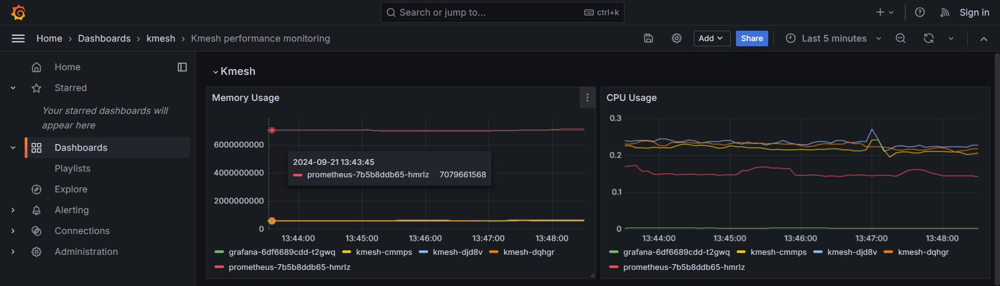

## Kmesh 可观测性提案

<!--
This is the title of your KEP. Keep it short, simple, and descriptive. A good
title can help communicate what the KEP is and should be considered as part of
any review.
-->
### 摘要

<!--
This section is incredibly important for producing high-quality, user-focused
documentation such as release notes or a development roadmap.

A good summary is probably at least a paragraph in length.
-->

在 Kmesh 中，性能监控作为高效、可扩展和健壮的网格系统的基础，其重要性是至关重要的。在 Kmesh 中，监控关键指标，例如 Kmesh 守护进程活动、eBPF map 的数量、每个 map 中的条目数量以及 eBPF 方法的执行时长，对于确保最佳系统性能至关重要。

在本提案中，我将分析 Kmesh 的性能监控指标。我还将建议在 Kmesh 中实施增强的可观测性功能，以捕获这些关键的性能指标。这将允许用户无缝地监控 Kmesh 的性能并确保系统效率。

### 提案

Kmesh 需要通过内核收集指标，并将其传递到用户模式。在用户模式下，与 eBPF map 和操作持续时间相关的数据最终可以通过 Prometheus 查询并使用 Grafana 可视化。

#### 设计细节

##### 与操作持续时间相关的指标

这是因为 Kmesh 需要从内核获取指标并将其发送到用户模式。我们需要一个 bpf map 来记录指标，作为传输的媒介。

因此，我们需要定义一个包含所有必需指标的 bpf map：

```
struct operation_usage_data {
    __u64 start_time;
    __u64 end_time;
    __u32 operation_type;
};

struct operation_usage_key {
    __u32 tid;
    __u32 operation_type;
};

struct {
    __uint(type, BPF_MAP_TYPE_HASH);
    __type(key, struct operation_usage_key);
    __type(value, struct operation_usage_data);
    __uint(max_entries, 1024);
} kmehs_perf_map SEC(".maps");

struct {
    __uint(type, BPF_MAP_TYPE_RINGBUF);
    __uint(max_entries, RINGBUF_SIZE);
} kmesh_perf_info SEC(".maps");
```

收集函数开始和结束时的时间戳，并在函数结束时，将 map 中的数据写入环形缓冲区。

##### 与 ebpf map 相关的指标

在用户空间中，从 eBPF map 中检索相关信息，包括 map 的总数、每个 map 中的条目数、map 中的最大条目数以及 map 锁定的内存空间。


##### 与 Kmesh 资源使用相关的指标

由 cAdvisor 提供，使用 `container_memory_usage_bytes` 和 `container_cpu_usage_seconds_total` 指标来可视化 Kmesh 本身的内存使用情况和 CPU 消耗。



