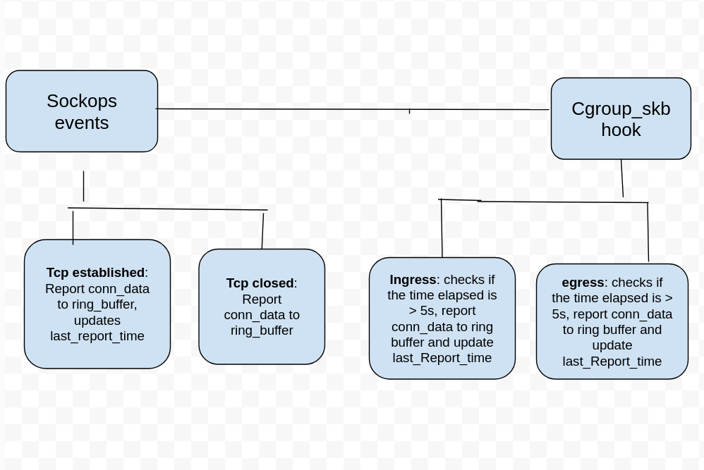

## Proposal for generating metrics for TCP long connections

<!--
This is the title of your KEP. Keep it short, simple, and descriptive. A good
title can help communicate what the KEP is and should be considered as part of
any review.
-->

Upstream issue: https://github.com/kmesh-net/kmesh/issues/1211

### Summary

<!--
This section is incredibly important for producing high-quality, user-focused
documentation such as release notes or a development roadmap.

A good summary is probably at least a paragraph in length.
-->

Currently kmesh provides access logs during termination and establisment of a TCP connection with more detailed information about the connection, such as bytes sent, received, packet lost, rtt and retransmits.

Kmesh also provides workload and service specific metrics such as bytes sent and received, lost packets, minimum rtt, total connection opened and closed by a pod, These metrics are only updated after a connection is closed. In this proposal we are aiming to update these metrics periodically.

We are also aiming to implement access logs and metrics for TCP long connections, developing a continuous monitoring and reporting mechanisms that captures detailed, real-time data throughout the lifetime of long-lived TCP connections. Access logs are reported periodically with information such as reporting time, connection establishment time, bytes sent, received, packet losts, rtt, retransmits and state. Metrics such as bytes sent and received, packet losts, retransmits is also reported periodically for long connections.

### Motivation

<!--
This section is for explicitly listing the motivation, goals, and non-goals of
this KEP.  Describe why the change is important and the benefits to users.
-->

Performance and heath of the long connections can be known early, currently we get all the information of the connection by the metrics and access logs provided at the end after the connection termination.

#### Goals

<!--
List the specific goals of the KEP. What is it trying to achieve? How will we
know that this has succeeded?
-->
- Reporting workload and service based metrics periodically(5 sec).

- Collect detailed traffic metrics (e.g. bytes send/received, round-trip time, packet loss, tcp retransmission) continuously during the lifetime of long TCP connections using ebpf.

- Reporting of metrics and access logs, at periodic time of 5 seconds. We are choosing 5 seconds as a threshold time because, it allows enough time to accumulate meaningful changes in metrics. If the reporting interval is too short, it might cause excessive overhead by processing too many updates.

- Generation Access logs containing information about connection continuously during the lifetime of long TCP connections from the metrics data.

- Metrics and logs supporting open-telemetry format.

- Exposing these metrics by kmesh daemon so that prometheus can scrape it.

- Unit and E2E tests.

#### Non-Goals

<!--
What is out of scope for this KEP? Listing non-goals helps to focus discussion
and make progress.
-->

- Collecting information about packet contents.

- Controlling or modifying TCP connection

- Collecting L7 metrics

### Proposal

<!--
This is where we get down to the specifics of what the proposal actually is.
This should have enough detail that reviewers can understand exactly what
you're proposing, but should not include things like API designs or
implementation. What is the desired outcome and how do we measure success?.
The "Design Details" section below is for the real
nitty-gritty.
-->

TCP connection information will be collected using eBPF sockops, sk_msg and kprobes hooks, and stored in ebpf hash maps using socket cookie as a unique key for hashmap. RingBuffer map is used for sending connection info periodically to userspace.


### Design Details

<!--
This section should contain enough information that the specifics of your
change are understandable. This may include API specs (though not always
required) or even code snippets. If there's any ambiguity about HOW your
proposal will be implemented, this is the place to discuss them.
-->

#### Collecting Metrics

Decelearing ebpf hash map in probe.h to store realtime information about tcp_connections.

```
// Ebpf map to store active tcp connections
struct {
    __uint(type, BPF_MAP_TYPE_HASH);
    __type(key, __u64); // use sock_cookie as key
    __type(value, struct tcp_probe_info);
    __uint(max_entries, MAP_SIZE_OF_TCP_CONNS);
    __uint(map_flags, BPF_F_NO_PREALLOC);
} map_of_tcp_conns SEC(".maps");

```
Sockpos ebpf hook is triggered at various socket events, we will use this hook to store connection information at the time of connection established and refresh the information connection state change, retransmits (also trigger in packet losss), and remove the connection from map and report the conn into to ringbuffer when the state change to TCP_CLOSED.

Updating workload/sockops.c

```
SEC("sockops")
int sockops_prog(struct bpf_sock_ops *skops)
{
    __u64 sock_cookie = bpf_get_socket_cookie(skops);

    if (skops->family != AF_INET && skops->family != AF_INET6)
        return 0;

    switch (skops->op) {
    case BPF_SOCK_OPS_TCP_CONNECT_CB:
        skops_handle_kmesh_managed_process(skops);
        break;

    case BPF_SOCK_OPS_ACTIVE_ESTABLISHED_CB:
        if (!is_managed_by_kmesh(skops))
            break;
        observe_on_connect_established(skops->sk, sock_cookie, OUTBOUND);
        if (bpf_sock_ops_cb_flags_set(skops, BPF_SOCK_OPS_STATE_CB_FLAG) != 0
            || bpf_sock_ops_cb_flags_set(skops, BPF_SOCK_OPS_RETRANS_CB_FLAG) != 0
            || bpf_sock_ops_cb_flags_set(skops, BPF_SOCK_OPS_RTT_CB_FLAG) != 0) {
            BPF_LOG(ERR, SOCKOPS, "set sockops cb failed!\n");
        }
        __u64 *current_sk = (__u64 *)skops->sk;
        struct bpf_sock_tuple *dst = bpf_map_lookup_elem(&map_of_orig_dst, &current_sk);
        if (dst != NULL)
            enable_encoding_metadata(skops);
        break;

    case BPF_SOCK_OPS_PASSIVE_ESTABLISHED_CB:
        if (!is_managed_by_kmesh(skops) || skip_specific_probe(skops))
            break;
        observe_on_connect_established(skops->sk, sock_cookie, INBOUND);
        if (bpf_sock_ops_cb_flags_set(skops, BPF_SOCK_OPS_STATE_CB_FLAG) != 0
            || bpf_sock_ops_cb_flags_set(skops, BPF_SOCK_OPS_RETRANS_CB_FLAG) != 0
            || bpf_sock_ops_cb_flags_set(skops, BPF_SOCK_OPS_RTT_CB_FLAG) != 0) {
            BPF_LOG(ERR, SOCKOPS, "set sockops cb failed!\n");
        }
        auth_ip_tuple(skops);
        break;

    case BPF_SOCK_OPS_STATE_CB:
        if (skops->args[1] == BPF_TCP_CLOSE) {
            clean_auth_map(skops);
            clean_dstinfo_map(skops);
        }
        if (!is_managed_by_kmesh(skops))
            break;
        observe_on_status_change(skops->sk, skops->args[0]);
        break;

    case BPF_SOCK_OPS_RETRANS_CB:
        if (!is_managed_by_kmesh(skops))
            break;
        observe_on_retransmit(skops->sk);
        break;

    case BPF_SOCK_OPS_RTT_CB:
        if (!is_managed_by_kmesh(skops))
            break;
        observe_on_rtt(skops->sk);
        break;

    default:
        break;
    }
    return 0;
}

```

Sk_msg hook is triggered when the packet leaves the socket, we will be using sk_msg ebpf hook for refreshing sent bytes data, also we are triggering flush_conn function here to send the connection info to userspace using ringbuffer map.
Updating sendmsg_prog func in send_msg.c

```
SEC("sk_msg")
int sendmsg_prog(struct sk_msg_md *msg)
{
    __u32 off = 0;
    if (msg->family != AF_INET && msg->family != AF_INET6)
        return SK_PASS;

    // encode org dst addr
    encode_metadata_org_dst_addr(msg, &off, (msg->family == AF_INET));

    struct bpf_sock *sk = msg->sk;

    if (sk) {
        if (is_managed_by_kmesh_skmsg(msg)) {
            observe_on_data(sk);
        }
    } else {
        BPF_LOG(ERR, KMESH, "sk_lookup success\n");
    }
    int key = 0;
    __u64 *last_time = bpf_map_lookup_elem(&tcp_conn_last_flush, &key);
    __u64 now = bpf_ktime_get_ns();

    if (!last_time) {
        __u64 init_time = now;
        // Initialize last flush time if not set
        bpf_map_update_elem(&tcp_conn_last_flush, &key, &init_time, BPF_ANY);
    } else if ((now - *last_time) >= TIMER_INTERVAL_NS) {
        flush_tcp_conns();
        // Update last flush time
        bpf_map_update_elem(&tcp_conn_last_flush, &key, &now, BPF_ANY);
    }
    return SK_PASS;
}

```

For refreshing the received bytes by a connection, we will attach a kprobe on tcp_rcv_established.
Creating workload/kprobe.c
```
SEC("kprobe/tcp_rcv_established")
int bpf_tcp_rcv_established(struct pt_regs *ctx) {
   
    struct sk_buff *skb = (struct sk_buff *)PT_REGS_PARM2(ctx);
     struct bpf_sock *sk = skb->sk;
    if (sk) {
        if (is_managed_by_kmesh_skb(skb)) {
            observe_on_data(sk);
        }
    } else {
        BPF_LOG(ERR, KMESH, "sk_lookup success\n");
    }
    return 0;
}
```

We will update functions of tcp_probe.h to store and refresh the connection information on the hash map.

We will update the functions of metric.go for periodic updating the workload and service metrics, also we will create a new metric for long tcp connections.



#### User Stories (Optional)

<!--
Detail the things that people will be able to do if this KEP is implemented.
Include as much detail as possible so that people can understand the "how" of
the system. The goal here is to make this feel real for users without getting
bogged down.
-->

##### Story 1
Workload and service prometheus metrics are updated periodically and when the connection is closed.

##### Story 2
A new prometheus metric for long tcp connection which updates periodically.

#### Notes/Constraints/Caveats (Optional)

<!--
What are the caveats to the proposal?
What are some important details that didn't come across above?
Go in to as much detail as necessary here.
This might be a good place to talk about core concepts and how they relate.
-->

#### Risks and Mitigations

<!--
What are the risks of this proposal, and how do we mitigate?

How will security be reviewed, and by whom?

How will UX be reviewed, and by whom?

Consider including folks who also work outside the SIG or subproject.
-->


#### Test Plan

<!--
**Note:** *Not required until targeted at a release.*

Consider the following in developing a test plan for this enhancement:
- Will there be e2e and integration tests, in addition to unit tests?
- How will it be tested in isolation vs with other components?

No need to outline all test cases, just the general strategy. Anything
that would count as tricky in the implementation, and anything particularly
challenging to test, should be called out.

-->

Updating bpf_test.go for testing the ebpf code written.
Also updating metric_test.go for testing the metrics
### Alternatives

<!--
What other approaches did you consider, and why did you rule them out? These do
not need to be as detailed as the proposal, but should include enough
information to express the idea and why it was not acceptable.
-->

<!--
Note: This is a simplified version of kubernetes enhancement proposal template.
https://github.com/kubernetes/enhancements/tree/3317d4cb548c396a430d1c1ac6625226018adf6a/keps/NNNN-kep-template
-->

Creating a userspace proxy component instead of ebpf for collecting metrics.