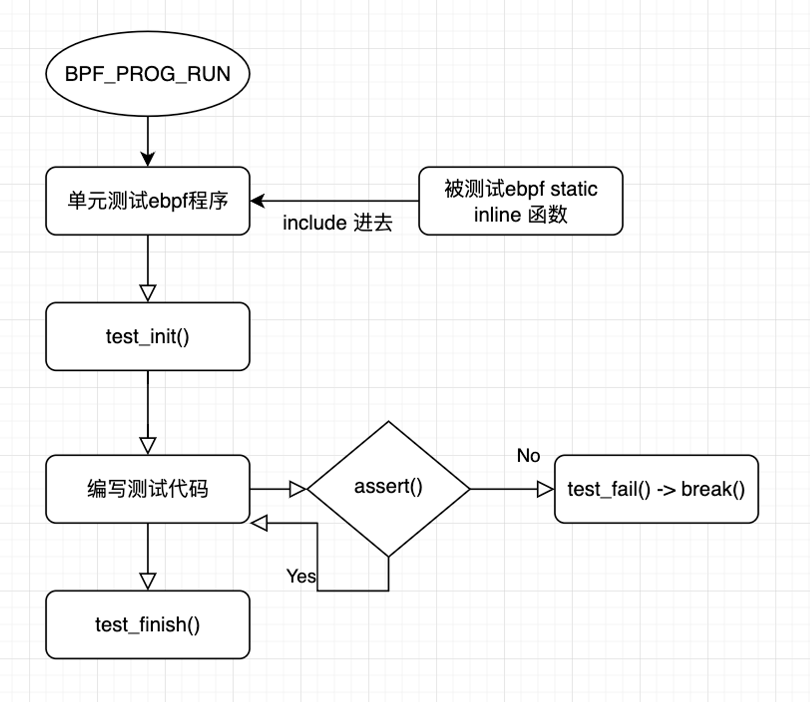

## **1 背景**

当前，Kmesh目前的测试只有端到端的测试，缺乏对ebpf程序的单元测试框架，我们想要提供不加载整个Kmesh就能对某个ebpf程序进行单元测试的能力，由此能更方便的进行功能测试和覆盖率测试。

## **2 功能设计**

- check()
- test_init()
- test_finish()
- 断言assert()
- skip机制，根据配置对一些功能的test进行跳过

**设计原则**：对于功能不怎么变化的，在.h里inline实现的，可以采取mock的形式对这些inline函数进行单元测试；对于功能会经常发生变更的，采取端到端的测试。

该框架使用该`BPF_PROG_RUN`功能在内核中运行 eBPF 程序，而无需将它们附加到实际钩子上。

BPF_PROG_RUN用法：

- 一个 eBPF 程序可以定义全局变量，在用户空间测试运行程序之前和之后都可以对其进行修改。
- 可以使用`BPF_PROG_RUN`命令在用户空间中运行 eBPF 程序，该命令由 libbpf 中的 `bpf_prog_test_run_opts()`函数包装。
- 一旦将 eBPF 程序编译为对象文件，可以使用 bpftool 生成一个skeleton加载器，该加载器将 eBPF 程序加载到内核，并为用户空间程序提供访问上述全局变量的权限。
- 最后，可以编写用户态单元测试，在测试之前设置加载的 eBPF 程序的全局变量，并在测试之后读取它们，从而确定 eBPF 程序是否执行了预期的操作。

具体可查看使用示例，链接：https://www.cnxct.com/unit-testing-ebpf/



### 2.0 check()

```c
#define CHECK(progtype, name) __section(progtype "/test/" name "/check")
```

通过宏定义 `CHECK`，我们可以方便地生成特定格式的 section 名称,可以用这种方式为测试用例定义特定的 section 名称

### **2.1 test_init()**

`test_init`宏用于初始化eBPF测试框架中的一些全局变量和状态。这些变量和状态用于管理测试结果、日志记录和错误处理。它通过设置这些变量，为后续的测试用例提供支持。

关键变量语义：

- `suite_result`：整个测试的结果，初始值为TEST_PASS
- `test_result_status`：指向当前测试结果状态的指针，初始值设为 0，并使用 `__maybe_unused` 标记以防止编译器警告未使用变量。
- `suite_result_map` : 存储测试结果以及测试程序相关信息的ebpf map
- `suite_result_cursor`：指向测试结果存储位置的指针，在`suite_result_map` 查找出对应的项返回赋值给此指针。
- `test_result_cursor`：指向当前测试结果存储位置的指针，初始值设为 0。
- `test_result_size`：用于存储测试结果大小的变量。

```c
#define test_init()               \
  char suite_result = TEST_PASS;            \
  __maybe_unused char *test_result_status = 0;        \
  char *suite_result_cursor;            \
  {                 \
    __u32 __key = 0;              \
    suite_result_cursor =           \
      test_bpf_map_lookup_elem(&suite_result_map, &__key);\
    if (!suite_result_cursor) {         \
      return TEST_ERROR;          \
    }               \
  }                 \
  __maybe_unused char *test_result_cursor = 0;        \
  __maybe_unused __u16 test_result_size;          \
  do {
```

**详细解析**

**1. 定义变量**

```c
char suite_result = TEST_PASS;
```

- `suite_result`：表示整个测试套件的结果，初始值设为`TEST_PASS`（测试通过）。

```c
__maybe_unused char *test_result_status = 0;
```

- `test_result_status`：指向当前测试结果状态的指针，初始值设为`0`，并使用`__maybe_unused`标记以防止编译器警告未使用变量。

**2. 定义`cursor`变量**

```c
char *suite_result_cursor;
```

- `suite_result_cursor`：指向测试结果存储位置的指针。

**3. 查找并初始化`suite_result_cursor`**

```
{
  __u32 __key = 0;
  suite_result_cursor = test_bpf_map_lookup_elem(&suite_result_map, &__key);
  if (!suite_result_cursor) {
    return TEST_ERROR;
  }
}
```

- 使用`__key`作为键，从`suite_result_map`中查找值，并将指针赋值给`suite_result_cursor`。
- 如果找不到值，则返回`TEST_ERROR`，表示测试初始化失败。

**4. 定义测试结果指针和大小变量**

```
__maybe_unused char *test_result_cursor = 0;
__maybe_unused __u16 test_result_size;
```

- `test_result_cursor`：指向当前测试结果存储位置的指针，初始值设为`0`。
- `test_result_size`：用于存储测试结果大小的变量。

**5. 进入`do-while`循环**

```
do {
```

- 进入`do-while`循环，表示开始执行测试用例。

**总结**

`test_init`宏通过初始化一系列全局变量和状态，为后续的测试用例提供支持。这些变量和状态用于管理测试结果、日志记录和错误处理。具体步骤如下：

1. 初始化表示测试套件结果的变量。
2. 定义并初始化指向当前测试结果状态和存储位置的指针。
3. 查找并初始化`suite_result_cursor`，用于指向测试结果存储位置。
4. 定义用于存储当前测试结果位置和大小的变量。
5. 进入`do-while`循环，表示开始执行测试用例。

这个宏为测试用例的执行和结果管理提供了必要的支持和初始化

### **2.2 test_finish()**

`test_finish`宏用于结束eBPF测试程序，并返回测试结果。它的作用是标志测试的结束，并返回最终的测试结果状态。

finish的时候返回init里定义的suite_result，如果执行顺利这里返回的就是TEST_PASS

```c
#define test_finish()   \
  } while (0);    \
  return suite_result
```

### **2.3 TEST() 宏**

`TEST`宏用于定义一个单独的测试用例，它会记录测试用例的名称、状态和日志信息。通过使用这个宏，可以方便地在eBPF程序中编写和管理测试用例。

TEST宏设计在test_init和test_finish之间使用，作为子测试，整体设计思路为在一个 `do-while` 循环中封装测试用例的定义和执行过程body。通过预留空间记录测试结果类型、测试用例名称和状态，确保所有测试信息能够被正确存储和处理。TEST宏还计算并记录测试结果的长度，提供了一种结构化的方法来管理和分析 eBPF 测试用例的执行和结果。

```c
#define TEST(name, body)               \
do {                     \
  *(suite_result_cursor++) = MKR_TEST_RESULT;        \
  /* test_result_cursor will stay at test result length varint */    \
  test_result_cursor = suite_result_cursor;        \
  /* Reserve 2 bytes for the varint indicating test result length */ \
  suite_result_cursor += 2;            \
                     \
  static const char ____name[] = name;           \
  *(suite_result_cursor++) = MKR_TEST_NAME;        \
  *(suite_result_cursor++) = sizeof(____name);         \
  memcpy(suite_result_cursor, ____name, sizeof(____name));     \
  suite_result_cursor += sizeof(____name);         \
                     \
  *(suite_result_cursor++) = MKR_TEST_STATUS;        \
  test_result_status = suite_result_cursor;        \
                     \
  *test_result_status = TEST_PASS;           \
  suite_result_cursor++;               \
                     \
  body                   \
} while (0);                   \
/* Write the total size of the test result in bytes as varint */     \
test_result_size = (__u16)((long)suite_result_cursor -         \
  (long)test_result_cursor) - 2;             \
if (test_result_size > 127) {              \
  *(test_result_cursor) = (__u8)(test_result_size & 0b01111111) |    \
    0b10000000;              \
  test_result_size >>= 7;              \
  *(test_result_cursor + 1) = (__u8)test_result_size;      \
} else {                   \
  *test_result_cursor = (__u8)(test_result_size) | 0b10000000;     \
}                    \
test_result_cursor = 0;
```

**详细解析**

**1. `do-while`循环**

```c
do {
```

- 启动一个`do-while`循环，这样可以使用`break`语句来提前退出测试。

**2. 记录测试结果类型**

```c
*(suite_result_cursor++) = MKR_TEST_RESULT;
```

- 在`suite_result_cursor`位置写入`MKR_TEST_RESULT`，表示这是一个测试结果。

**3. 设置测试结果长度指针**

```c
test_result_cursor = suite_result_cursor;
```

- `test_result_cursor`指向当前的`suite_result_cursor`位置，用于稍后记录测试结果的总长度。

**4. 预留长度字段**

```c
suite_result_cursor += 2;
```

- 预留2个字节用于存储测试结果长度的变长整数（varint）。

**5. 记录测试用例名称**

```c
static const char ____name[] = name;
*(suite_result_cursor++) = MKR_TEST_NAME;
*(suite_result_cursor++) = sizeof(____name);
memcpy(suite_result_cursor, ____name, sizeof(____name));
suite_result_cursor += sizeof(____name);
```

- 将测试用例的名称记录到`suite_result_cursor`位置。

**6. 设置测试状态指针**

```c
*(suite_result_cursor++) = MKR_TEST_STATUS;
test_result_status = suite_result_cursor;
```

- 在`suite_result_cursor`位置写入`MKR_TEST_STATUS`，表示这是测试的状态字段。
- `test_result_status`指向当前的`suite_result_cursor`位置，用于稍后更新测试状态。

**7. 设置默认测试状态为通过**

```c
*test_result_status = TEST_PASS;
suite_result_cursor++;
```

- 将测试状态初始化为`TEST_PASS`（测试通过），并移动`suite_result_cursor`指针。

**8. 执行测试用例主体**

```c
body
```

- 执行由`body`定义的测试用例主体内容。

**9. 结束`do-while`循环**

```c
} while (0);
```

- 关闭`do-while`循环。

**10. 计算并记录测试结果长度**

```c
test_result_size = (__u16)((long)suite_result_cursor - (long)test_result_cursor) - 2;
if (test_result_size > 127) {
  *(test_result_cursor) = (__u8)(test_result_size & 0b01111111) | 0b10000000;
  test_result_size >>= 7;
  *(test_result_cursor + 1) = (__u8)test_result_size;
} else {
  *test_result_cursor = (__u8)(test_result_size) | 0b10000000;
}
test_result_cursor = 0;
```

- 计算测试结果的总长度，并将其写入之前预留的长度字段中。如果长度大于127字节，则使用两字节的变长整数格式。

### **总结**

`TEST`宏通过一个`do-while`循环封装了测试用例的定义和执行过程。它记录了测试用例的名称、状态和结果，并提供了一个灵活的结构，使得测试用例可以通过`break`语句提前退出。宏的结构确保了所有测试用例的信息都被正确记录，以便后续处理和分析。

### 2.3 assert断言

```c
/* Assert that `cond` is true, fail the rest otherwise */
#define assert(cond)							\
	if (!(cond)) {							\
		test_log("assert failed at " __FILE__ ":" LINE_STRING);	\
		test_fail_now();					\
	}
```

如果条件失败，会进入test_fail()，直接break

### 2.4 skip机制

可能的几种方案：

**1. 使用条件编译**

条件编译可以根据某些条件（例如宏定义、环境变量等）来有选择地编译或跳过某些测试代码。

**2. 通过环境变量控制**

使用环境变量来控制是否跳过某些测试，可以在运行测试脚本时动态决定。

```c
if (getenv("SKIP_TEST1")) {
        return xxx;
    }
```

**4.参考gtest**

这个机制主要通过以下方法实现：

1. **`GTEST_SKIP()` 宏**：用于在运行时条件满足时跳过测试。
2. **命令行参数**：用于在运行测试时通过命令行参数选择性地运行或跳过测试。

```c
#include <gtest/gtest.h>

TEST(SampleTest, Test1) {
    if (std::getenv("SKIP_TEST1")) {
        GTEST_SKIP() << "Skipping Test1 due to environment variable";
    }
    // 测试逻辑
    EXPECT_EQ(1, 1);
}

TEST(SampleTest, Test2) {
    if (std::getenv("SKIP_TEST2")) {
        GTEST_SKIP() << "Skipping Test2 due to environment variable";
    }
    // 测试逻辑
    EXPECT_EQ(2, 2);
}

int main(int argc, char **argv) {
    ::testing::InitGoogleTest(&argc, argv);
    return RUN_ALL_TESTS();
}

```

**使用命令行参数**

Google Test 提供了一些命令行参数，允许你选择性地运行或排除特定的测试。

```cpp
#include <gtest/gtest.h>TEST(SampleTest, Test1) {
    // 测试逻辑
    EXPECT_EQ(1, 1);
}

TEST(SampleTest, Test2) {
    // 测试逻辑
    EXPECT_EQ(2, 2);
}

int main(int argc, char **argv) {
    ::testing::InitGoogleTest(&argc, argv);
    return RUN_ALL_TESTS();
}

```

**运行测试**

可以使用命令行参数 `--gtest_filter` 来选择运行哪些测试或排除哪些测试。例如：

```
# 只运行 Test1
./your_test_binary --gtest_filter=SampleTest.Test1

# 排除 Test1
./your_test_binary --gtest_filter=-SampleTest.Test1

# 运行所有 SampleTest 下的测试，但排除 Test2
./your_test_binary --gtest_filter=SampleTest.*:-SampleTest.Test2

```

## 3 使用方式

**使用样例**

```c
#include "common.h"

CHECK("xdp", "nodeport-lb4")
int nodeportLB4(struct __ctx_buff *ctx)
{
        test_init();

    /* ensure preconditions are met */
    /* call the functions you would like to test */
    /* check that everything works as expected */

    test_finish();
}

```

带有TEST子测试：

```c
#include "common.h"

#include <bpf/ctx/xdp.h>
#include <lib/jhash.h>
#include "bpf/section.h"

CHECK("xdp", "jhash")
int bpf_test(__maybe_unused struct xdp_md *ctx)
{
    test_init();

    TEST("Non-zero", {
        unsigned int hash = jhash_3words(123, 234, 345, 456);

        if (hash != 2698615579)
            test_fatal("expected '2698615579' got '%lu'", hash);
    });

    TEST("Zero", {
        unsigned int hash = jhash_3words(0, 0, 0, 0);

        if (hash != 459859287)
            test_fatal("expected '459859287' got '%lu'", hash);
    });

    test_finish();
}
```

**bpf_test.go**

通过一个go测试程序用于加载和运行我们编写的ebpf单元测试程序，并同时收集覆盖率

 `bpf_test.go` 测试程序主要是用来加载和运行 eBPF 程序，并收集测试覆盖率。下面是其主要流程：

### 1. 初始化和设置

首先，程序定义了一些全局变量，用于从命令行读取参数：

```go
var (
    testPath = flag.String("bpf-test-path", "", "Path to the eBPF tests")
    ...
    testFilePrefix = flag.String("test", "", "Single test file to run (without file extension)")
    dumpCtx = flag.Bool("dump-ctx", false, "If set, the program context will be dumped after a CHECK and SETUP run.")
)

```

这些参数用于指定测试路径、覆盖率报告路径、单个测试文件前缀等。

### 2. 主测试函数

```go
func TestBPF(t *testing.T) {
    if testPath == nil || *testPath == "" {
        t.Skip("Set -bpf-test-path to run BPF tests")
    }

    if err := rlimit.RemoveMemlock(); err != nil {
        t.Log(err)
    }

    entries, err := os.ReadDir(*testPath)
    if err != nil {
        t.Fatal("os readdir: ", err)
    }
    ...
}

```

`TestBPF` 函数是主测试入口。它首先检查 `testPath` 参数，如果没有设置则跳过测试。然后它移除内存锁定限制，并读取指定路径下的所有文件。

### 3. 加载和运行 eBPF 程序

`TestBPF` 函数中，逐个处理读取到的文件：

```go
for _, entry := range entries {
    if entry.IsDir() || !strings.HasSuffix(entry.Name(), ".o") {
        continue
    }

    t.Run(entry.Name(), func(t *testing.T) {
        profiles := loadAndRunSpec(t, entry, instrLog)
        ...
    })
}

```

只处理以 `.o` 结尾的文件。每个文件通过 `t.Run` 启动一个子测试。

### 4. 加载 eBPF Collection

`loadAndRunSpec` 函数用于加载和运行 eBPF 程序：

```go
func loadAndRunSpec(t *testing.T, entry fs.DirEntry, instrLog io.Writer) []*cover.Profile {
    elfPath := path.Join(*testPath, entry.Name())

    spec := loadAndPrepSpec(t, elfPath)
    ...
}

```

`loadAndPrepSpec` 函数加载 eBPF 程序，并准备 `ebpf.CollectionSpec`：

```go
func loadAndPrepSpec(t *testing.T, elfPath string) *ebpf.CollectionSpec {
    spec, err = bpf.LoadCollectionSpec(elfPath)
    ...
}

```

`bpf.LoadCollectionSpec` 加载 eBPF 程序的 ELF 文件，并生成 `CollectionSpec` 对象。

### 5. 加载 eBPF Collection 和运行测试

根据是否收集覆盖率，选择不同的加载方式：

```go
if !collectCoverage {
    coll, _, err = bpf.LoadCollection(spec, nil)
} else {
    coll, cfg, err = coverbee.InstrumentAndLoadCollection(spec, ebpf.CollectionOptions{}, instrLog)
}

```

### 6. 运行测试程序

加载完 eBPF 程序后，程序会根据 section 名称将其分配到不同的测试集中：

```go
testNameToPrograms := make(map[string]programSet)
for progName, spec := range spec.Programs {
    match := checkProgRegex.FindStringSubmatch(spec.SectionName)
    ...
}

```

然后，通过 `subTest` 函数运行每个测试：

```go
for _, name := range testNames {
    t.Run(name, subTest(testNameToPrograms[name], coll.Maps[suiteResultMap], skbMdMap))
}

```

`subTest` 函数负责实际运行 eBPF 程序，并检查返回结果：

```go
func subTest(progSet programSet, resultMap *ebpf.Map, skbMdMap *ebpf.Map) func(t *testing.T) {
    return func(t *testing.T) {
        ...
        if statusCode, data, ctx, err = runBpfProgram(progSet.checkProg, data, ctx); err != nil {
            t.Fatal("error while running check program:", err)
        }
        ...
    }
}

```

### 7. 运行 eBPF 程序

`runBpfProgram` 函数负责运行具体的 eBPF 程序：

```go
func runBpfProgram(prog *ebpf.Program, data, ctx []byte) (statusCode uint32, dataOut, ctxOut []byte, err error) {
    ...
    ret, err := prog.Run(opts)
    return ret, opts.DataOut, ctxOut, err
}

```

### 总结

这个测试程序通过以下步骤加载和运行 eBPF 程序：

1. 读取指定目录下的所有 `.o` 文件。
2. 加载每个 `.o` 文件生成 `CollectionSpec` 对象。
3. 根据是否需要收集覆盖率，选择不同的加载方式。
4. 运行 eBPF 程序，并根据 section 名称进行分类。
5. 执行具体的测试逻辑，并检查返回结果。

这个流程确保了 eBPF 程序能够正确加载、运行，并在测试中生成覆盖率报告。

**如何运行**

采用go test的方式，将ebpf单元测试程序所在路径传递给bpf_test.go