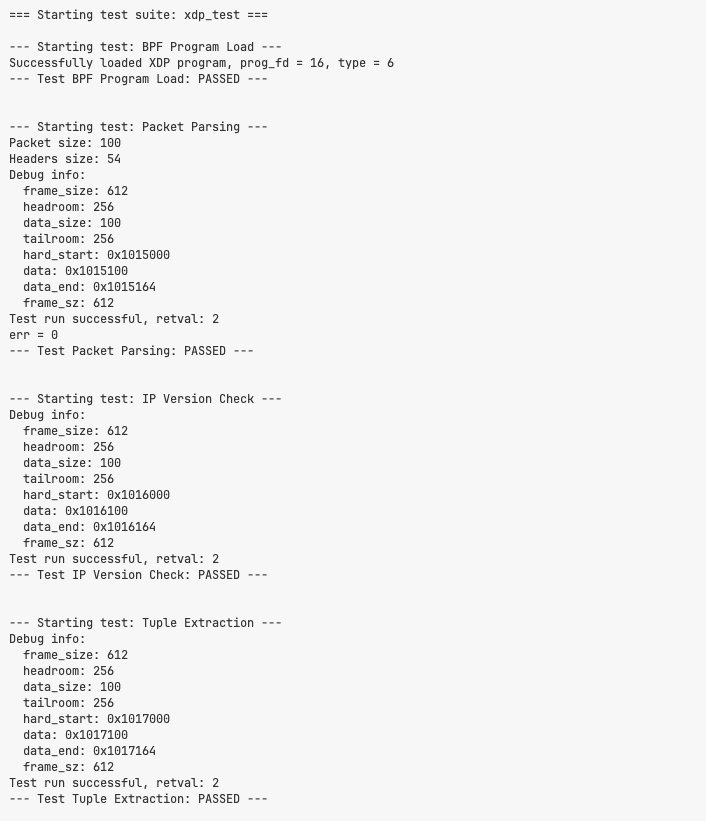
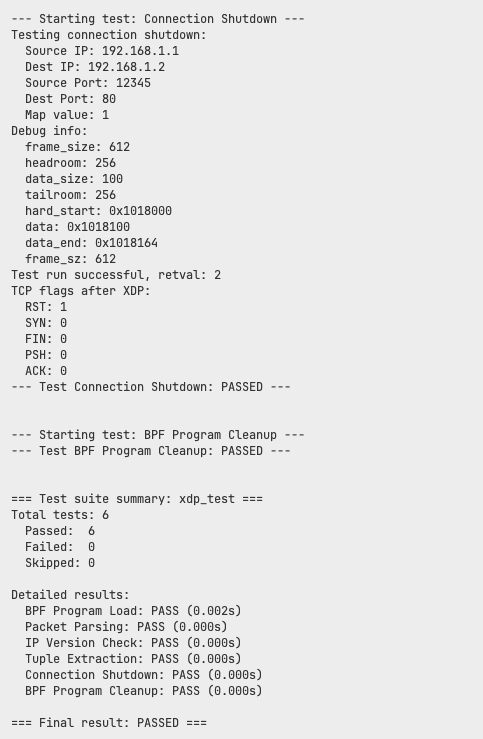

4. - ## **1 Background**

     Currently, Kmesh needs a lightweight unit testing framework to test eBPF programs. This framework should be able to run tests for individual eBPF programs independently without loading the entire Kmesh system, thereby improving test efficiency and coverage.

     ## **2 Test Framework Design**

     ### 2.1 Core Components

     The test framework consists of three core components:

     1. Test Management (common.h)
        - Test suite management
        - Test case execution
        - Result collection and reporting

     2. XDP Test Runtime (xdp_test.c)
        - eBPF program loading
        - Packet construction and injection
        - Test result verification

     3. Build System (Makefile)
        - Compile eBPF programs
        - Generate test framework
        - Link required dependencies

     ### 2.2 Test Structure

     #### 2.2.1 Test Suite

     Test suites use the following structure to manage test state:

     ```c
     typedef struct {
         const char *suite_name;
         test_context_t subtests[MAX_SUBTESTS];
         int subtest_count;
         int passed_count;
         int failed_count;
         int skipped_count;
     } test_suite_t;
     ```

     #### 2.2.2 Test Case

     Each test case contains the following information:

     ```c
     typedef struct {
         const char *name;
         test_status_t status;
         int result;
         const char *message;
         double duration;
     } test_context_t;
     ```

     ### 2.3 Key Functions

     #### 2.3.1 Test Initialization and Cleanup

     ```c
     // Initialize test suite
     test_init("test_suite_name");
     
     test_init function initializes the test suite, sets up the test environment and counters:
     
     ```c
     static inline void test_init(const char *test_name) {
         printf("\n=== Starting test suite: %s ===\n", test_name);
         current_suite.suite_name = test_name;
         current_suite.subtest_count = 0;
         current_suite.passed_count = 0;
         current_suite.failed_count = 0;
         current_suite.skipped_count = 0;
     }
     ```

     Main functions:
     - Initialize test suite name
     - Reset all counters (total, passed, failed, skipped)
     - Print test suite start information

    **test_finish();**

    ```c
    static inline void test_finish(void) {
        printf("\n=== Test suite summary: %s ===\n", current_suite.suite_name);
        printf("Total tests: %d\n", current_suite.subtest_count);
        printf("  Passed:  %d\n", current_suite.passed_count);
        printf("  Failed:  %d\n", current_suite.failed_count);
        printf("  Skipped: %d\n", current_suite.skipped_count);
        
        // Print detailed results
        if (current_suite.subtest_count > 0) {
            printf("\nDetailed results:\n");
            for (int i = 0; i < current_suite.subtest_count; i++) {
                test_context_t *test = &current_suite.subtests[i];
                // ... Print results for each test case ...
            }
        }
    }
    ```

 Main functions:

- Print test suite summary
- Display test statistics
- Output detailed results for each test case, including:
  - Test name
  - Execution status (PASS/FAIL/SKIP)
  - Execution time
  - Error message (if any)

#### 2.3.2 Test Case Definition

 Use TEST macro to define test cases:

TEST macro provides framework for defining and executing individual test cases:

 ```c
 #define TEST(test_name, fn) \
     do { \
         // 1. Initialize test context
         test_context_t *_test_ctx = &current_suite.subtests[current_suite.subtest_count++]; \
         _test_ctx->name = test_name; \
         _test_ctx->status = TEST_STATUS_RUNNING; \
         _test_ctx->result = TEST_PASS; \
         
         // 2. Record start time
         struct timespec _start_time, _end_time; \
         clock_gettime(CLOCK_MONOTONIC, &_start_time); \
         
         // 3. Execute test
         test_log("\n--- Starting test: %s ---", test_name); \
         fn(); \
         
         // 4. Calculate execution time
         clock_gettime(CLOCK_MONOTONIC, &_end_time); \
         _test_ctx->duration = (_end_time.tv_sec - _start_time.tv_sec) + \
                              (_end_time.tv_nsec - _start_time.tv_nsec) / 1e9; \
         
         // 5. Update test status
         _test_ctx->status = TEST_STATUS_COMPLETED; \
         switch (_test_ctx->result) { \
             case TEST_PASS: current_suite.passed_count++; break; \
             case TEST_FAIL: current_suite.failed_count++; break; \
             case TEST_SKIP: current_suite.skipped_count++; break; \
         } \
     } while(0)
 ```

 Main functions:

- Test context management:
  - Create new test context
  - Set initial state and result
- Time tracking:
  - Record start and end times
  - Calculate test execution time
- Status management:
  - Update test status
  - Maintain test counters
- Logging:
  - Record test start and end
  - Output test results

#### 2.3.3 Test Skip Mechanism (SKIP_SUB_TEST)

 SKIP_SUB_TEST macro allows dynamically skipping tests at runtime:

 ```c
 #define SKIP_SUB_TEST(msg) \
     do { \
         test_log("Skipping test: %s", msg); \
         current_test_ctx->result = TEST_SKIP; \
         current_test_ctx->message = msg; \
         break; \
     } while(0)
 ```

 Main functions:

- Mark test as skipped
- Record skip reason
- Early test termination

#### 2.3.4 Assertion Mechanism

 ```c
 test_assert(condition, "error message");
 ```

 test_assert macro provides test verification functionality:

 ```c
 #define test_assert(cond, msg) \
     do { \
         if (!(cond)) { \
             test_log("Assert failed: %s", msg); \
             test_log("At %s:%d", __FILE__, __LINE__); \
             if (current_test_ctx) { \
                 current_test_ctx->result = TEST_FAIL; \
                 current_test_ctx->message = msg; \
             } \
             return; \
         } \
     } while(0)
 ```

 Main functions:

- Condition verification:
  - Check if specified condition is true
  - Record detailed information on failure
- Error handling:
  - Update test status to failed
  - Record failure message and location
  - Terminate test execution

## **3 XDP Test Implementation**

### 3.1 Test Environment Setup

 ```c
 int main() {
     test_init("xdp_test");
     
     TEST("BPF Program Load", bpf_load);
     TEST("Packet Parsing", test_packet_parsing);
     TEST("IP Version Check", test_ip_version_check);
     TEST("Tuple Extraction", test_tuple_extraction);
     TEST("Connection Shutdown", test_connection_shutdown);
     TEST("BPF Program Cleanup", bpf_offload);
 
     test_finish();
     return current_suite.failed_count > 0 ? 1 : 0;
 }
 ```

### 3.2 Test Case Examples

#### 3.2.1 Basic Packet Parsing Test

 ```c
 void test_packet_parsing() {
     unsigned char packet[PACKET_SIZE] = {0};
     struct ethhdr *eth = (struct ethhdr *)packet;
     struct iphdr *ip = (struct iphdr *)(packet + sizeof(struct ethhdr));
     
     // Set test data
     eth->h_proto = htons(ETH_P_IP);
     ip->version = 4;
     // ... More configuration ...
     
     // Run test
     int err = run_xdp_test(packet, PACKET_SIZE);
     test_assert(err == 0, "run_xdp_test failed");
 }
 ```

#### 3.2.2 Connection Shutdown Test

 ```c
 void test_connection_shutdown() {
     // Prepare test packet
     unsigned char packet[PACKET_SIZE] = {0};
     // ... Configure headers ...
     
     // Configure test conditions
     struct bpf_sock_tuple tuple = { /* ... */ };
     __u32 value = AUTH_FORBID;
     
     // Verify results
     test_assert(modified_tcp->rst == 1, "RST flag not set");
     test_assert(modified_tcp->syn == 0, "SYN flag not cleared");
 }
 ```

## **4 Usage**

### 4.1 Writing Tests

 1. Create test file (e.g.: xdp_test.c)
 2. Include required headers:

 ```c
 #include "common.h"
 #include "xdp_test.skel.h"
 ```

 3. Implement test cases:

 ```c
 int main() {
     test_init("xdp_test");
     
     TEST("BPF Program Load", bpf_load);
     TEST("Packet Parsing", test_packet_parsing);
     // ... More tests ...
     
     test_finish();
     return current_suite.failed_count > 0 ? 1 : 0;
 }
 ```

### 4.2 Running Tests

 1. Compile test program:

 ```bash
 make xdp_test
 ```

 2. Execute tests:

 ```bash
 ./xdp_test
 ```

3. Results：




