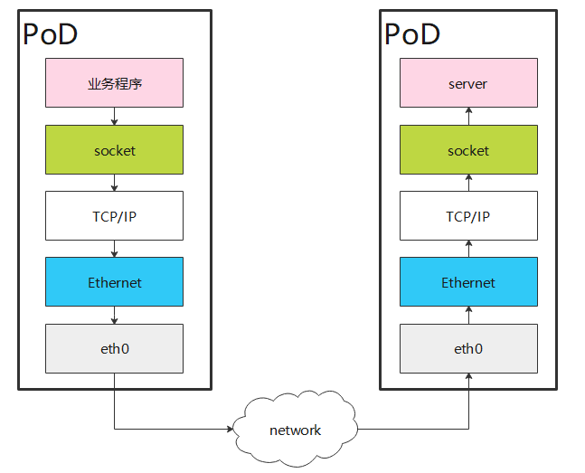
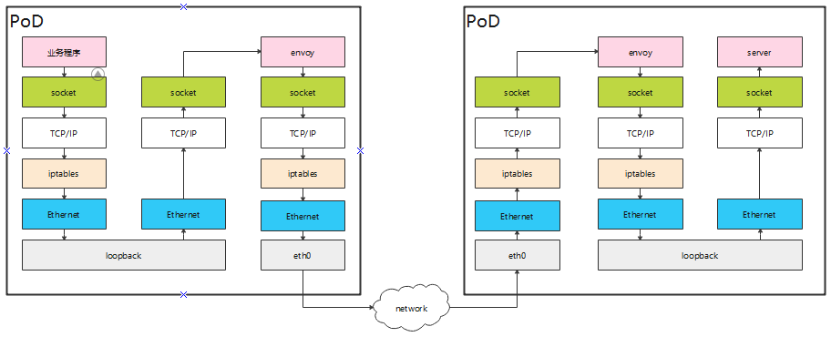
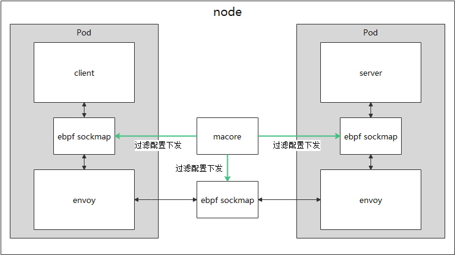
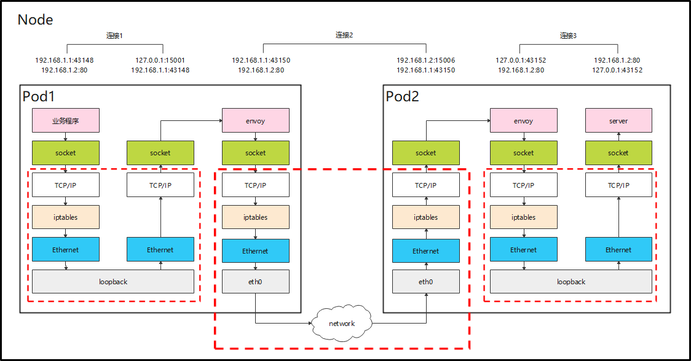
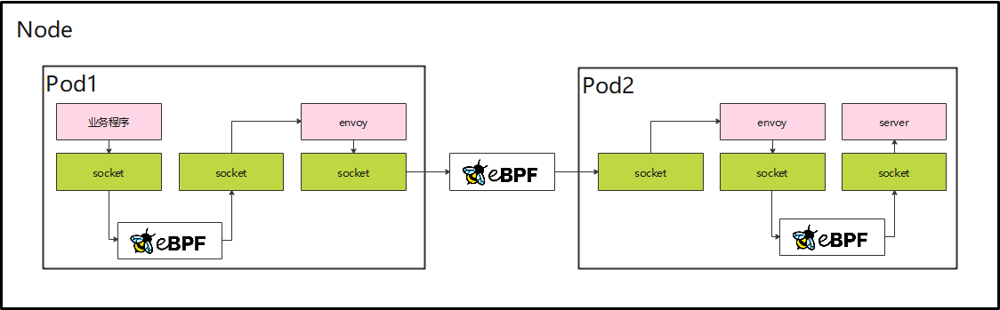
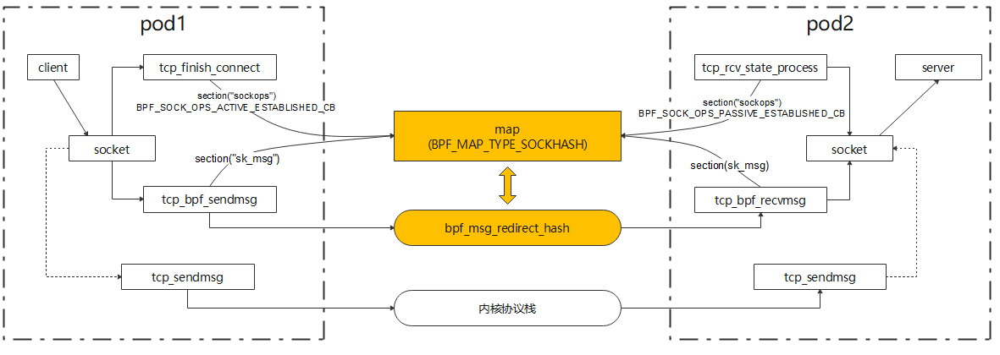

## 特性介绍

### 特性价值概述

云原生主流技术serviceMesh的数据面存在性能瓶颈，客户接受度意愿差；通过serviceMesh加速技术旨在消除serviceMesh引入后导致的性能劣化问题，提供相应的运维工具提供加速能力控制，加速段控制，数据包抓取工具等能力方便用户使用。

### 特性场景分析

应用使用serviceMesh网络后，服务间通信路径由原来的直通变成了业务容器 -> sidecar -> 对端sidecar -> 对端业务，数据路径变长。

- 传统不使用serviceMesh的场景：



- serviceMesh典型使用场景，在istio环境中，采用sidecar部署方式，即每个应用容器旁都会部署一个伴生容器，代理进出应用容器的所有流量。其流量劫持方案一般使用iptables通过NAT表的redirect动作执行流量重定向，报文到来时查找连接转换目的地址与端口。

envoy与业务在同一个pod中的场景：



## 特性原理

### 总体方案



### 特性场景

同一节点上，业务容器与sidecar容器在同一个pod中





设置需要加速或禁止加速的ip、port、uid、gid规则，建链时进行过滤，需要加速的socket会被记录，在转发时通过ebpf中的sockmap能力对红框中的部分进行bypass短接。如果加速规则被禁止加速的规则与需要加速的规则冲突时，以禁止规则为准。

#### ebpf sockmap原理说明

sockmap是BPF程序的一种map类型；这种map类型中存储的是对sock的引用。利用sockmap我们可以提供一种加速本机内部TCP socket之间数据转发的机制。



加速的总体执行逻辑：

1. 系统中有socket操作时（BPF_SOCK_OPS_ACTIVE_ESTABLISHED_CB/BPF_SOCK_OPS_PASSIVE_ESTABLISHED_CB），触发sockops hook提取socket信息，并以key、val形式存储到sockmap中；
2. 拦截sendmsg，从sockmap中提取key，通过bpf_socket_redirect_hash将数据包重定向到对端sock的收包队列；

## 特性功能设计

### ebpf sockmap能力设计

1. 可以通过用户态输入的ip/port/uid/gid来进行加速能力控制，将正确socket的数据包进行加速转发。
2. 可以在转发数据包阶段将数据dump到用户态程序并输出。

### ebpf map设计

map是ebpf程序的主要数据结构，可以用于存放数据并用来与用户态程序进行交互。

1. sock_ops_map：BPF_MAP_TYPE_SOCKHASH，存放连接四元组和socket的对应关系
 key：socket
 value：连接四元组，(local_ip，local_port，remote_ip，remote_port)

2. sock_proxy_map：BPF_MAP_TYPE_HASH，在主动连接过程中存放本地四元组和对端四元组的对应关系，用于转发时查找对端的四元组进而查找socket
 key：本端的连接四元组
 value：对端的连接四元组

3. sock_param_map：BPF_MAP_TYPE_ARRAY，存放过滤参数
 key：int（只有一个元素）
 value：结构体，存放需要加速过滤的所有ip/port/uid/gid参数

4. sock_helper_map：BPF_MAP_TYPE_HASH，用于存放uid、gid和四元组的关系，主动连接时存入helper函数，被动连接将其取出后判断是否需要进行加速。
 key：连接四元组
 value：结构体，记录了uid和gid

### ebpf程序设计

- 正反向连接时都有一个连接四元组：local_ip、local_port、remote_ip、remote_port正向连接时，在sockops阶段将正向连接的key（四元组），value（socket）存放在sock_ops_map中

- 反向连接时，使用helper函数获取正向连接的remote_ip以及remote_port，获取失败且错误码为-ENOENT时说明正向连接不在本node上，不进行sockmap加速，直接返回。成功则将正反向连接的四元组进行条件过滤（详见下一节），通过条件过滤后将反向连接的key（四元组）和value存放到sock_ops_map中，反之清理sock_ops_map。同时将正向连接-反向连接的对应关系存放到sock_proxy_map中。

- 正反向连接建立后，则可进行数据转发。数据转发时，socket通过自身四元组信息，从sock_proxy_map中获取对端的四元组信息，再通过四元组信息与sock_ops_map关联，直接将数据转发到对应的socket上。如果在sock_proxy_map中没有获取到对端四元组信息，则正常退出ebpf程序，走内核协议栈发送数据包

### ebpf过滤能力设计

用户态程序在使能sockmap加速功能时，读取配置文件并解析成相应数据放到sock_param_map中，在sock_ops BFP程序中对socket信息进行查map匹配，若对应的ip，port，uid，gid不在map中，则socket信息将不会加入到sock_ops_map中，即不会进行加速处理。若配置文件中没有设置规则，则默认所有socket都进行加速。

### 配置文件设计

#### 配置格式

配置文件中配置以chain关键字开始:

- --ip 地址范围，例如192.168.122.0/24

- --port，端口范围，例如80

- --uid-owner，用户所属uid组，例如1337

- --gid-owner，用户所属gid组

- -j，接受或返回，可选值ACCEPT，RETURN

#### 配置示例

```text
# 仅加速192.168.1.0/24网段连接中的包含1337 uid的进程流量（包括正向建链与反向建链），对于连接双端包含有15006端口的流量禁止加速
chain --ip 192.168.1.0/24 --uid-owner 1337 --j ACCEPT
chain --port 15006 -j RETURN
```
