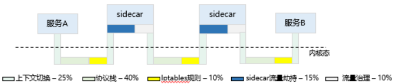
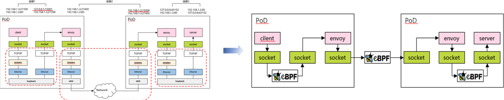
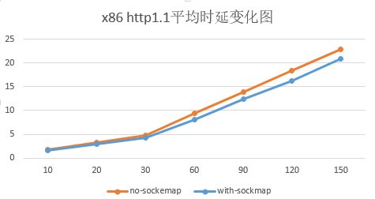
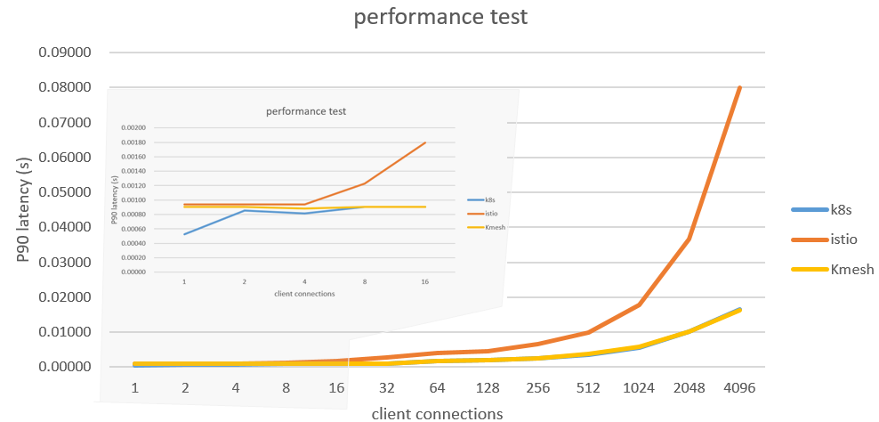

## What is a Service Mesh

The concept of a service mesh was introduced by Buoyant, the company behind the development of Linkerd software, in 2016. Willian Morgan, the CEO of Linkerd, provided the initial definition of a service mesh:

> A service mesh is a dedicated layer for handling service-to-service communication. It’s responsible for the reliable delivery of requests through the complex topology of services that comprise a modern, cloud-native application. In practice, the service mesh is typically implemented as an array of lightweight network proxies that are deployed alongside application code, without the application needing to be aware.

In simple terms, a service mesh is an layer that handles communication between services. It ensures transparent and reliable network communication for modern cloud-native applications through an array of lightweight network proxies.

The essence of a service mesh is to address the challenge of how microservices can communicate effectively. By implementing governance rules such as load balancing, canary routing, and circuit breaking, the service mesh orchestrates traffic flow to maximize the capabilities of the service cluster. It is a product of the evolution of service governance.

<!-- truncate -->

We can divide the evolution of service governance into three generations and compare them. From this evolution, we can observe that service governance capabilities gradually decouple from business logic and move down to the level.

As an layer for handling service-to-service communication, a service mesh effectively fills the gaps in microservice governance in Kubernetes (k8s). As the next-generation technology for cloud-native environments, it has become a critical component of cloud.

In recent years, service mesh has gained significant attention, leading to the emergence of various service mesh software solutions such as Linkerd, Istio, Consul Connect, and Kuma. While they may have slight differences in their software architecture, let's take Istio as an example (one of the most popular service mesh projects) to illustrate the basic architecture of a service mesh:

Taking a Kubernetes cluster as an example, when a Pod instance is created, the service mesh software transparently deploys a proxy container (also known as a sidecar, with Envoy being the default sidecar software in Istio) alongside the application code. The basic flow of communication between Pods is as follows:

- Traffic is transparently intercepted by iptables rules and directed to the proxy component within the Pod.
- The proxy component applies traffic governance logic (e.g., circuit breaking, routing, load balancing) to determine the destination service instance and forwards the message.
- The proxy component within the destination Pod intercepts the incoming traffic, applies basic traffic governance logic (e.g., rate limiting), and then forwards the traffic to the Pod.
- After processing, the response is returned to the requesting Pod following the original path.

## Challenges of the Service Mesh Data Plane

As mentioned earlier, a service mesh introduces a proxy layer in the data plane to achieve transparent service governance. However, this comes at a cost: the introduction of the proxy layer inevitably increases latency and decreases performance in service communication.

Using data provided by the Istio official website as an example, in a cluster environment, the average per-hop latency between microservices increases by 2.65ms. Considering that in a microservice cluster, an external request often involves multiple invocations between microservices, the latency overhead introduced by the service mesh is significant. As service mesh adoption continues to grow, the additional latency introduced by the proxy architecture has become a critical challenge.

To address this issue, we conducted performance testing on L7 load balancing for HTTP services to analyze the communication performance of the service mesh. The breakdown of time consumption is as follows:

From the detailed analysis of mesh traffic, we can see that inter-service communication transitions from one connection establishment to three, and from two protocol stack traversals to six. The time consumption mainly focuses on data copying, connection establishment, context switching, etc. The actual overhead of traffic governance is relatively small.

This raises the question: Can we reduce the latency overhead of the service mesh while maintaining transparent governance for applications?

## High-Performance Service Mesh Data Plane: Kmesh

Based on the performance analysis mentioned above, we have conducted a two-stage optimization for the service mesh data plane.

### Sockmap: Accelerating the Service Mesh Data Plane with Sockmap

Sockmap is an eBPF feature introduced in Linux 4.14, which enables the redirection of data flows between sockets within a node without going through the complex kernel protocol stack. It optimizes the performance of data forwarding between sockets on the network path.

In the context of a service mesh, the default communication between the business container within a Pod and the local proxy component goes through the complete kernel protocol stack, incurring unnecessary overhead. This overhead can be optimized using Sockmap. The following diagram illustrates the concept:

The basic steps for accelerating the service mesh data plane with Sockmap are as follows:

- During the connection establishment process, an eBPF program (of type BPF_PROG_TYPE_SOCK_OPS) is attached to intercept all TCP connection establishment actions.
  - In the BPF_SOCK_OPS_ACTIVE_ESTABLISHED_CB state, a client-side Sockmap record is added.
  - In the BPF_SOCK_OPS_PASSIVE_ESTABLISHED_CB state, a server-side Sockmap record is added.
  - The socket information of both communication parties is stored in the Sockmap table.
- During the sendmsg process, an eBPF program (of type BPF_PROG_TYPE_SK_MSG) is attached to intercept message sending actions.
  - The program looks up the Sockmap table based on the current socket information and associates it with the socket information of the destination party. It then directly redirects the traffic to the receiving queue of the destination socket.

By leveraging Sockmap to accelerate the service mesh data plane, we observed a 10% to 15% reduction in average latency for service access in a scenario with 60 long-lived connections.

While Sockmap is a commonly used solution for optimizing the service mesh data plane, it does not fully address the performance challenges associated with service mesh latency.

### Offload: Offloading Traffic Governance to the Operating System with Programmable Kernel

Based on the performance analysis mentioned earlier, it is evident that a significant portion of the additional overhead introduced by the service mesh is spent on redirecting traffic to the proxy component. The actual overhead of performing traffic governance is relatively small. This raises the question: Can we bypass the proxy component and perform traffic governance directly within the kernel, which is naturally involved in network communication?

Kmesh is our proposed high-performance service mesh data plane solution that leverages a programmable kernel to offload traffic governance to the operating system. With Kmesh, the data plane no longer goes through the proxy component, and service-to-service communication is reduced from three hops to one hop, enabling traffic governance to be performed along the path of traffic transmission. The flow of traffic between microservices in Kmesh is illustrated below:

The software architecture of Kmesh consists of the following components:

- kmesh-controller: The management program responsible for Kmesh lifecycle management, XDS protocol integration, observability, and other functions.
- kmesh-api: The API interface layer provided by Kmesh, including the orchestrated API transformed from XDS and observability channels.
- kmesh-runtime: The runtime implemented in the kernel that supports L3-L7 traffic orchestration.
- kmesh-orchestration: The L3-L7 traffic orchestration implemented based on eBPF, including routing, canary deployments, load balancing, and more.
- kmesh-probe: The observability probe that provides end-to-end observability capabilities.

We deployed an Istio mesh environment and conducted comparative testing on the performance of different data plane solutions (Envoy/Kmesh) for L7 load balancing of HTTP services using the Fortio testing tool. The results showed that Kmesh achieved a 5x performance improvement in service-to-service communication compared to the native data plane of Istio (Envoy).

It is worth noting that we also tested the performance of service-to-service communication in a non-mesh environment based on Kubernetes, and the performance was comparable to Kmesh. This further validates the latency performance of Kmesh. (The testing scenario involved L7 load balancing in a laboratory environment, and the actual performance in real-world governance scenarios may not be as ideal. Preliminary evaluations suggest a 2-3x improvement over Istio.)

## Conclusion

As the next-generation technology for cloud-native environments, a service mesh provides transparent service governance for applications. However, the proxy architecture introduces additional latency overhead, which has become a critical challenge for widespread adoption of service meshes. Kmesh proposes a new approach by offloading traffic governance to the operating system using a programmable kernel. By doing so, Kmesh significantly improves the performance of the service mesh data plane. It offers a fresh perspective for the development of the service mesh data plane.

## reference

[https://linkerd.io/2017/04/25/whats-a-service-mesh-and-why-do-i-need-one](https://linkerd.io/2017/04/25/whats-a-service-mesh-and-why-do-i-need-one)

[https://istio.io/latest/docs/ops/deployment/architecture](https://istio.io/latest/docs/ops/deployment/architecture)

[https://istio.io/v1.16/docs/ops/deployment/performance-and-scalability/#performance-summary-for-istio-hahahugoshortcode-s0-hbhb](https://istio.io/v1.16/docs/ops/deployment/performance-and-scalability/#performance-summary-for-istio-hahahugoshortcode-s0-hbhb)
