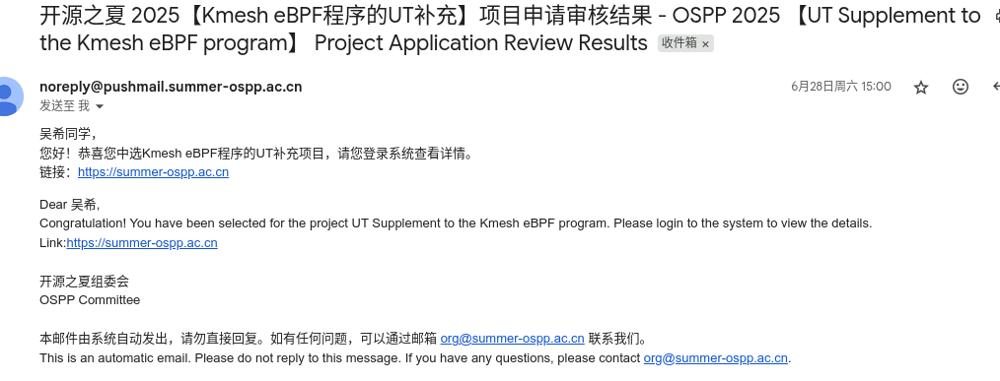
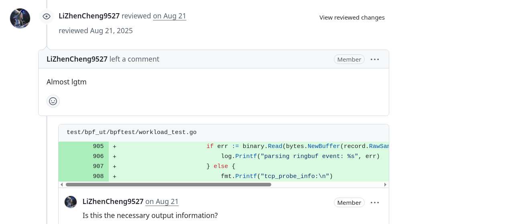
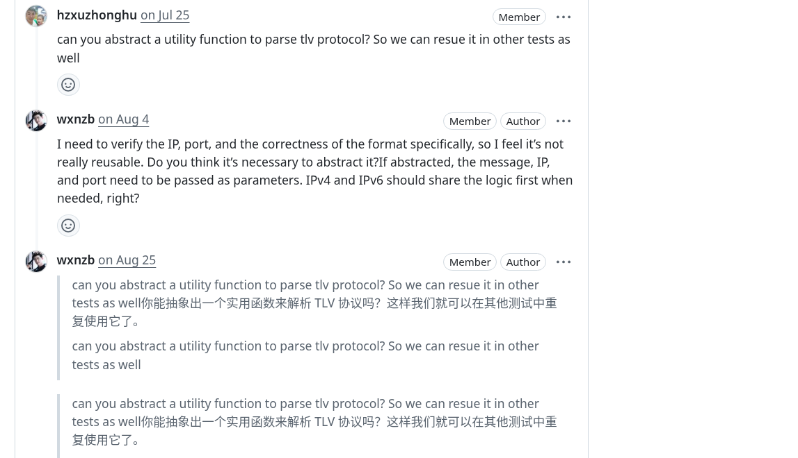
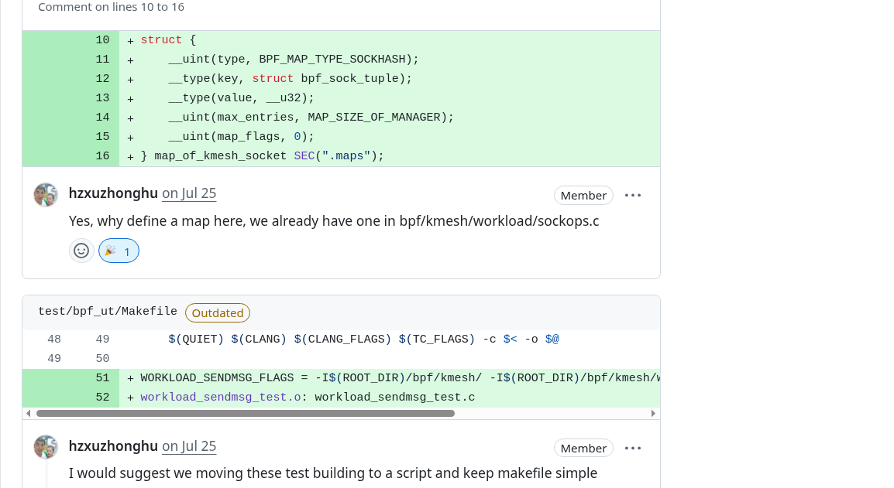
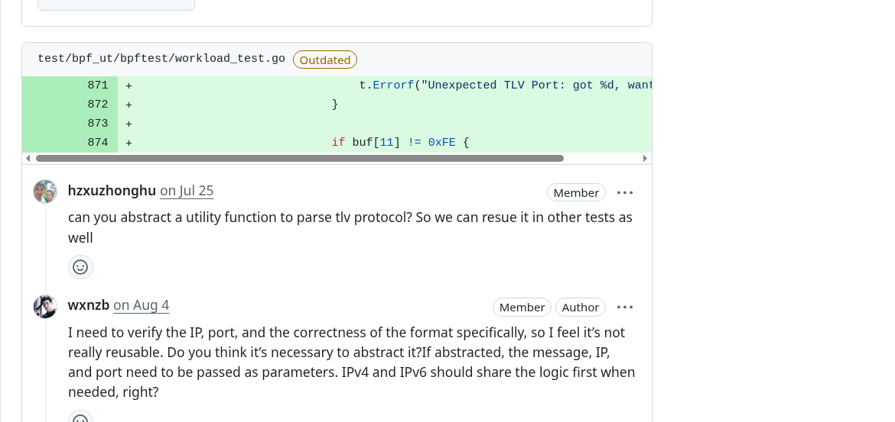

# OSPP 2025 | Completing eBPF Unit Tests for Kmesh

## Introduction

Hello everyone! I'm **Wu Xi**, an open source enthusiast with deep interests in kernel networking, eBPF, and test engineering.

This summer, I had the privilege to participate in **Open Source Promotion Plan (OSPP) 2025** and collaborate with the [Kmesh](https://github.com/kmesh-net/kmesh) community, focusing on eBPF program UT enhancement. Over three months, I primarily completed unit testing work for Kmesh eBPF programs. I wrote and successfully ran UT test code for sendMsg and cgroup programs, and supplemented testing documentation based on this work. Kmesh community developers can now verify eBPF program logic without depending on real kernel mounting and traffic simulation, significantly improving development efficiency.
In this blog, I'll share my complete experience—from acceptance to project execution, technical choices, and lessons learned along the way.

<!-- truncate -->

## OSPP Project Overview

**Open Source Promotion Plan (OSPP)** is organized by the **Institute of Software, Chinese Academy of Sciences (ISCAS)**, providing students and early-career developers with opportunities to collaborate on real open source projects under the guidance of experienced mentors.

Each session lasts approximately **three months** (my session was July 1st – September 30th). Participants not only deliver functional features but also experience firsthand how large open source communities operate.

---

## My Acceptance Experience

I've always enjoyed contributing to open source, and my interests happen to focus on network kernels and cloud-native tools. When I saw the "eBPF" and "unit testing" related topics offered by **Kmesh** in OSPP 2025, I was immediately attracted.

The pain points this project aimed to solve were very clear: eBPF program verification has long relied on black-box testing, which is not only inefficient but also has coverage that depends on testers' experience. By introducing a unit testing framework and supplementing key use cases, functional verification can be completed without requiring real kernel mounting, which is both valuable and challenging.

I received my acceptance email on **June 28, 2025**, with the official project cycle running from **July 1st to September 30th**.

Interestingly, I completed the main work of the project **before the mid-term evaluation**, so that stage was skipped. This gave me more time to refine the workflow and write usage documentation.

---

## Project Work Content

### 1. eBPF Unit Testing Framework Construction

- **Core Technology:** eBPF kernel function simulation based on #define mock macro replacement
- **Test Coverage:** Covers sendmsg TLV encoding, cgroup sock connection management, cgroup skb traffic processing
- **Innovation:** Embedding test infrastructure in production code through conditional compilation #ifdef KMESH_UNIT_TEST

### 2. sendmsg TLV Encoding Verification

- **Test Objective:** Verify correctness of TLV metadata encoding in waypoint scenarios
- **Test Data:** IPv4 (8.8.8.8:53) and IPv6 (fc00:dead:beef:1234::abcd:53) simulation data
- **Verification Mechanism:** Real-time parsing of TLV message format, verifying integrity of type, length, IP, and port

### 3. cgroup Lifecycle Management Testing

- **Hook Coverage:** cgroup/connect4, cgroup/connect6, cgroup/sendmsg4, cgroup/recvmsg4
- **Test Scenarios:** kmesh management process registration/deregistration, backend connections without waypoint, tail call mechanism
- **Verification Method:** Verify netns cookie management correctness through km_manage map state changes

---

## Project Results

| Metric                     | Before (Manual)            | After (Automated)          | Improvement               |
| -------------------------- | -------------------------- | -------------------------- | ------------------------- |
| TLV Encoding Verification Time | 30-60 minutes/scenario    | < 5 seconds/scenario       | **>99% Faster** 🚀        |
| cgroup hook Regression Testing | Half-day manual deployment verification | Automated parallel execution | **95% Time Saved** ⏱️     |
| Test Environment Dependencies | Requires complete Kubernetes cluster | Pure eBPF program unit testing | **Zero Dependencies** 🎯  |

These testing frameworks effectively **eliminated blind spots in eBPF program testing**, ensuring the stability and correctness of Kmesh's data plane.

Currently, the testing framework has been integrated into the CI/CD pipeline, allowing execution of the complete eBPF unit test suite through the make run command, covering core components like workload, XDP, sockops, sendmsg, cgroup_skb, and cgroup_sock.

---

## Key Technical Decisions

- Used **define mock** for function replacement, replacing eBPF kernel functions at compile time through macro definitions like #define bpf_sk_storage_get mock_bpf_sk_storage_get, achieving dependency isolation in unit tests
- Adopted **conditional compilation** test infrastructure, embedding test-specific map definitions and data structures in production code through #ifdef KMESH_UNIT_TEST macros, ensuring consistency between test and production code
- Used **Go + eBPF** hybrid testing framework, combining C language eBPF program compilation with Go language test execution, implementing automated testing workflow through go test -v ./...

---

## Mentor Guidance Experience

My mentors **Li Zhencheng** and **Xu Zhonghu**, along with other Kmesh maintainers, provided tremendous support throughout the UT testing framework development process.

They not only patiently pointed out improvements in test design during GitHub reviews but also quickly answered my questions about bpf helper mocking and map validation on Slack.

Although I completed the core UT for `sendMsg` and `cgroup` programs relatively early, mentor feedback helped me notice more edge cases and pushed me to further improve test coverage and documentation.

Finally, the Kmesh community invited me to become an **organization member** as recognition of my contributions and active participation. This not only made me feel humble but also strengthened my determination to continue participating in and supporting Kmesh's development.

---

## Lessons Learned

1. **Unit testing is a tool to enhance development efficiency** — It doesn't replace black-box testing but complements and frees developers, allowing them to focus faster on feature implementation and optimization.
2. **Start small and iterate gradually** — First supplement UT for core eBPF programs (like sendMsg, cgroup_skb), then gradually expand to more scenarios, which is more stable than covering all logic at once.
3. **Anticipate edge cases** — eBPF programs may behave differently across kernel versions or environments; simulating various inputs and exceptions in UT in advance helps avoid production environment surprises.
4. **Communication can accelerate learning progress** — Every time I submitted a PR, mentors would comment with better solutions or questions, which taught me a lot in a short time.
5. **Facing challenges head-on is the recipe for progress** — When learning fields you're interested in but haven't had much exposure to, setbacks are inevitable. Don't give up at these times; believe in yourself and keep trying—you'll eventually find solutions to problems.

---

## Acknowledgments

I want to sincerely thank my mentors **Li Zhencheng** and **Xu Zhonghu** throughout the process. In every community meeting, they would actively solve my current problems and understand my progress. Whenever I submitted a PR, they would share their insights in the comments, making my thinking clearer and improving my problem-solving abilities. I also want to thank the **OSPP organizing committee** for providing us with a smoothly running environment. This open source participation was an extraordinary experience for me, and I will continue to dedicate myself to open source and love open source!

---

## Related Links

- [Project Issue & Pull Requests](https://github.com/kmesh-net/kmesh/issues/1411)
- [OSPP Official Website](https://summer-ospp.ac.cn)
- [Wu Xi's GitHub](https://github.com/wxnzb)  
