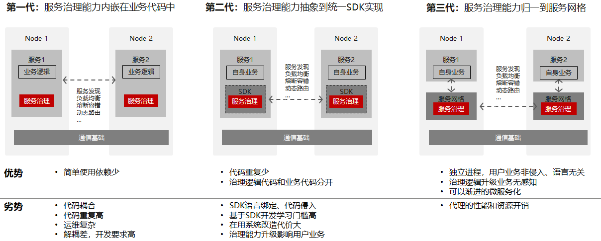
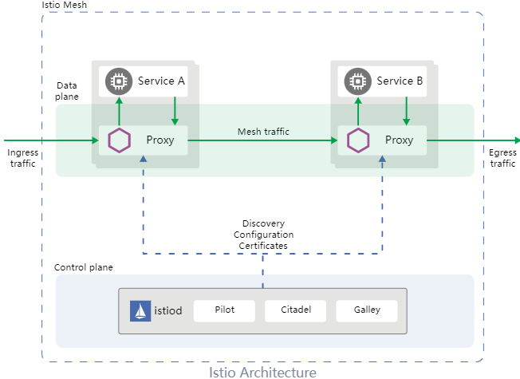
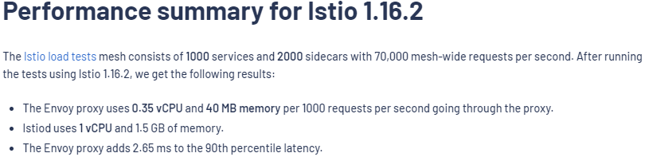
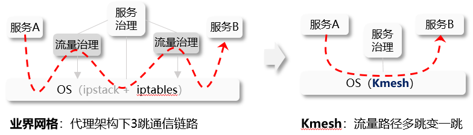

## 什么是服务网格

服务网格的概念最初由开发 Linkerd 软件的公司 Buoyant 在 2016 年提出。Linkerd 的 CEO Willian Morgan 给出了服务网格的最初定义：

> 服务网格是专门用于处理服务间通信的一个层。它负责在构成现代云原生应用的复杂服务拓扑中可靠地传递请求。实际上，服务网格通常通过部署在应用代码旁边的一组轻量级网络代理来实现，而应用程序本身无需感知这一层。

简单来说，服务网格是一层处理服务间通信的机制。它通过部署一组轻量级网络代理，为现代云原生应用提供透明且可靠的网络通信。

服务网格的本质在于解决微服务如何高效通信的问题。通过实现负载均衡、金丝雀路由和熔断等治理规则，服务网格能够协调流量，最大化服务集群的能力。这是服务治理演进的产物。

<!-- truncate -->

我们可以将服务治理的演进分为三代，并进行比较。从这一演进中可以看出，服务治理能力逐步从业务逻辑中剥离，并下沉到更低层次。

作为处理服务间通信的一层，服务网格有效弥补了 Kubernetes（k8s）中微服务治理的不足。作为云原生环境的下一代技术，它已成为云计算的关键组件。

近年来，服务网格受到广泛关注，涌现出诸多服务网格软件解决方案，如 Linkerd、Istio、Consul Connect 和 Kuma。虽然它们在软件架构上可能存在细微差别，但以 Istio（最流行的服务网格项目之一）为例，可以说明服务网格的基本架构：

以 Kubernetes 集群为例，当创建一个 Pod 实例时，服务网格软件会透明地在应用代码旁边部署一个代理容器（也称为边车，Istio 默认的边车软件为 Envoy）。Pods 之间的基本通信流程如下：

- 流量通过 iptables 规则被透明拦截，并导向 Pod 内的代理组件。
- 代理组件应用流量治理逻辑（例如熔断、路由、负载均衡），确定目标服务实例并转发消息。
- 目标 Pod 内的代理组件拦截传入流量，应用基础流量治理逻辑（例如限流），然后将流量转发到 Pod。
- 处理完成后，响应沿原路径返回给请求的 Pod。

## 服务网格数据平面面临的挑战

正如前文所述，服务网格通过在数据平面中引入代理层来实现透明的服务治理。然而，这也带来了一个问题：代理层的引入不可避免地增加了服务通信的延迟并降低了性能。

以 Istio 官方网站提供的数据为例，在集群环境中，微服务之间每跳的平均延迟增加了 2.65 毫秒。考虑到在微服务集群中，外部请求往往涉及多个微服务之间的调用，因此服务网格引入的延迟开销十分显著。随着服务网格应用的不断增长，代理架构带来的额外延迟已成为一个关键挑战。

为了解决这一问题，我们对 HTTP 服务的 L7 负载均衡进行了性能测试，以分析服务网格的通信性能。时间消耗的细分如下：

从对网格流量的详细分析中可以看出，服务间通信从一次连接建立变为三次，从两次协议栈遍历变为六次。时间消耗主要集中在数据拷贝、连接建立、上下文切换等方面，而流量治理实际引入的开销相对较小。

这就引出了一个问题：在保持应用透明治理的同时，是否能降低服务网格的延迟开销？

## 高性能服务网格数据平面：Kmesh

基于上述性能分析，我们对服务网格数据平面进行了两阶段优化。

### Sockmap：利用 Sockmap 加速服务网格数据平面

Sockmap 是 Linux 4.14 引入的 eBPF 特性，它能够在节点内部在套接字之间重定向数据流，而无需经过复杂的内核协议栈，从而优化了网络路径上套接字之间数据转发的性能。

在服务网格场景中，Pod 内业务容器与本地代理组件之间的默认通信需要经过完整的内核协议栈，从而产生不必要的开销。通过 Sockmap 可以优化这一开销。下图展示了这一概念：

利用 Sockmap 加速服务网格数据平面的基本步骤如下：

- 在连接建立过程中，附加一个 eBPF 程序（类型为 BPF_PROG_TYPE_SOCK_OPS）拦截所有 TCP 连接建立动作：
  - 在 BPF_SOCK_OPS_ACTIVE_ESTABLISHED_CB 状态下，添加客户端侧的 Sockmap 记录。
  - 在 BPF_SOCK_OPS_PASSIVE_ESTABLISHED_CB 状态下，添加服务端侧的 Sockmap 记录。
  - 将双方的套接字信息存储到 Sockmap 表中。
- 在 sendmsg 过程中，附加一个 eBPF 程序（类型为 BPF_PROG_TYPE_SK_MSG）拦截消息发送动作：
  - 程序根据当前套接字信息查找 Sockmap 表，并将其与目标方的套接字信息关联，直接将流量重定向到目标套接字的接收队列。

通过利用 Sockmap 加速服务网格数据平面，我们在 60 个长连接场景下观察到服务访问的平均延迟降低了 10% 到 15%。

虽然 Sockmap 是优化服务网格数据平面的常用方案，但它并未完全解决服务网格延迟相关的性能挑战。

### Offload：利用可编程内核将流量治理卸载至操作系统

基于前述性能分析，显而易见服务网格引入的额外开销中有很大一部分花费在将流量重定向到代理组件上，而实际执行流量治理的开销相对较小。这就引出了一个问题：是否可以绕过代理组件，直接在内核中进行流量治理，而内核本身就是网络通信的天然参与者？

Kmesh 正是我们提出的高性能服务网格数据平面解决方案，它利用可编程内核将流量治理卸载到操作系统中。通过 Kmesh，数据平面不再经过代理组件，服务间通信从三跳降低到一跳，实现了沿流量传输路径的流量治理。下图展示了 Kmesh 中微服务之间的流量流程：

Kmesh 的软件架构包括以下组件：

- **kmesh-controller**：负责 Kmesh 生命周期管理、XDS 协议集成、可观察性等功能的管理程序。
- **kmesh-api**：Kmesh 提供的 API 接口层，包括由 XDS 转换而来的编排 API 以及可观察性通道。
- **kmesh-runtime**：在内核中实现的运行时，支持 L3-L7 流量编排。
- **kmesh-orchestration**：基于 eBPF 实现的 L3-L7 流量编排，包括路由、金丝雀发布、负载均衡等。
- **kmesh-probe**：提供端到端可观察性能力的探针。

我们在 Istio 网格环境中进行了对比测试，使用 Fortio 测试工具对 HTTP 服务的 L7 负载均衡进行性能测试，结果显示 Kmesh 在服务间通信方面比 Istio 原生数据平面（Envoy）提升了 5 倍的性能。

值得注意的是，我们还测试了基于 Kubernetes 的非网格环境下的服务间通信性能，其性能与 Kmesh 相当。这进一步验证了 Kmesh 的低延迟性能。（测试场景涉及实验室环境下的 L7 负载均衡，实际治理场景下的性能可能不尽相同，初步评估显示相比 Istio 有 2-3 倍的性能提升。）

## 结论

作为云原生环境的下一代技术，服务网格为应用提供了透明的服务治理。然而，代理架构引入了额外的延迟开销，这已成为服务网格大规模采用的一大挑战。Kmesh 通过将流量治理卸载至操作系统、利用可编程内核提出了一种全新的解决方案，大幅提升了服务网格数据平面的性能，为服务网格数据平面的发展提供了全新的思路。

## 参考资料

[https://linkerd.io/2017/04/25/whats-a-service-mesh-and-why-do-i-need-one](https://linkerd.io/2017/04/25/whats-a-service-mesh-and-why-do-i-need-one)

[https://istio.io/latest/docs/ops/deployment/architecture](https://istio.io/latest/docs/ops/deployment/architecture)

[https://istio.io/v1.16/docs/ops/deployment/performance-and-scalability/#performance-summary-for-istio-hahahugoshortcode-s0-hbhb](https://istio.io/v1.16/docs/ops/deployment/performance-and-scalability/#performance-summary-for-istio-hahahugoshortcode-s0-hbhb)
