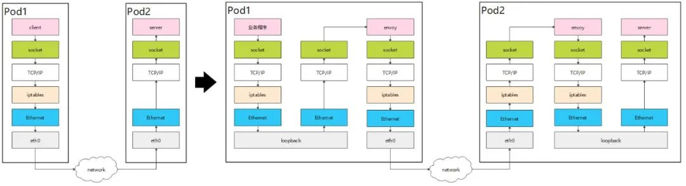
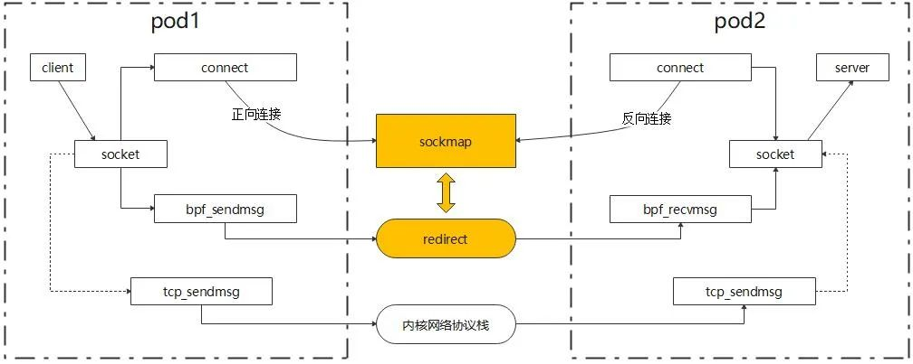
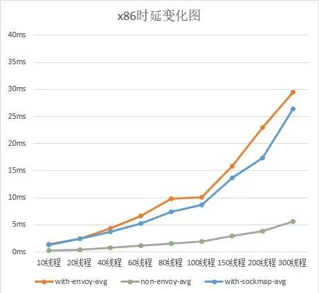

## 背景介绍

早期的微服务架构面临着服务发现、负载均衡以及认证/授权等诸多挑战。最初，微服务实践者们各自实现了分布式通信系统来应对这些挑战，但这种方式导致业务功能的重复造轮子。为了解决这一问题，提出了一种方案：将通用的分布式系统通信代码抽取成框架，并以库的形式供程序调用。然而，这个看似完美的方案存在几个致命的弱点：

- 框架需要对业务代码进行侵入式修改，迫使开发者学习如何使用该框架。
- 框架无法跨不同的编程语言使用。
- 在管理复杂的项目框架和库版本兼容性问题时，升级框架往往会迫使业务一同升级。

<!-- truncate -->

随着微服务架构的演进，第一代服务网格应运而生，其代表产品有 Linkerd/Envoy/NginxMesh 以及边车代理模式。作为一种基础设施层，边车代理与业务进程解耦，并与业务进程一起部署，接管了业务组件之间的通信，将网络数据传输抽象为一个独立的层。该层集中处理分布式系统所需的服务发现、负载均衡、认证/授权等功能，为微服务框架库遇到的问题提供了更为全面的解决方案。

然而，软件开发没有万全之策。虽然服务网格带来了诸多便利，但它也不可避免地存在一些问题。在传统的方式中，客户端与服务端之间传递消息只需经过一次内核协议栈即可完成。但在边车代理模式中，业务流量通常利用内核的 iptables 能力被拦截，导致业务数据多次经过内核协议栈。这就增加了延迟，并降低了吞吐量。

我们对服务网格性能进行了基准测试，发现边车模式（使用 Envoy）的延迟明显比非边车模式（无 Envoy）更高。

## 基于 eBPF 能力加速 ServiceMesh

是否有方法可以在享受 ServiceMesh 带来的便利的同时减少乃至消除网络延迟的影响？在这里，不得不提 eBPF 技术。eBPF 是内核中的一项革命性技术，旨在更安全高效地扩展内核功能，而无需修改内核代码或加载内核模块。利用 eBPF 绕过内核网络协议栈，可以降低网络延迟，从而提升 ServiceMesh 的用户体验。这也是当前业界的普遍做法。

为了实现绕过内核网络协议栈的目标，我们需要利用 eBPF 提供的两个能力：sockops 和套接字重定向。

- **Sockops** 提供了在创建 TCP 连接时识别并将套接字（通常由四元组标识）存储到 sockmap 数据结构中的能力。
- **套接字重定向** 支持在传输 TCP 数据时，根据关键字在 sockmap 中引用套接字。当匹配成功时，可以直接将数据转发到对应的套接字。
- 对于在 sockmap 中未找到的套接字，数据包将照常通过内核网络协议栈发送。

通过结合这两种能力，我们可以直接将数据包转发到对应的套接字，而无需经过内核网络协议栈，从而减少在内核网络协议栈中花费的时间。

在建立 TCP 套接字连接的过程中，实际上存在两个连接建立过程：正向连接和反向连接。通常在正向和反向连接建立过程中，会利用 iptables 信息获取实际的 IP 地址和端口号。通过调用 bpf_get_sockopt，在 eBPF 函数中可以主动获取经过 iptables 转换后的地址信息。这使得我们可以建立一个辅助映射，用于存储正向和反向连接之间的对应关系。在进行套接字重定向时，我们首先从辅助映射中查找对端的连接信息；如果成功找到，则执行套接字转发操作。其原理如下图所示：

我们在 openEuler 21.03 上进行了实际测试，以评估通过 sockmap 能力实现加速的效果。测试环境为 openEuler-21.03 / 5.10.0-4.17.0.28.oe1.x86_64，网络配置为 fortio-envoy-envoy:80 到 fortio_server:80。

根据测试结果，与不使用 ServiceMesh 的情况相比，在利用 sockmap 加速后，QPS 提升了约 18%，平均延迟降低了 15%。

## 服务网格的性能开销能否完全消除？

然而，尽管利用 sockmap 为 ServiceMesh 带来了显著加速，但与不使用 ServiceMesh 相比，仍存在较大差距。这主要是因为当前服务网格代理架构引入了大量延迟开销。要完全消除服务网格带来的性能影响，关键在于从架构层面进行优化。

Kmesh 正在积极探索数据平面架构层面的新方法来解决这一挑战，业界在这方面也做出了大量努力。在后续文章中，我们将详细介绍这些举措和优化措施。
