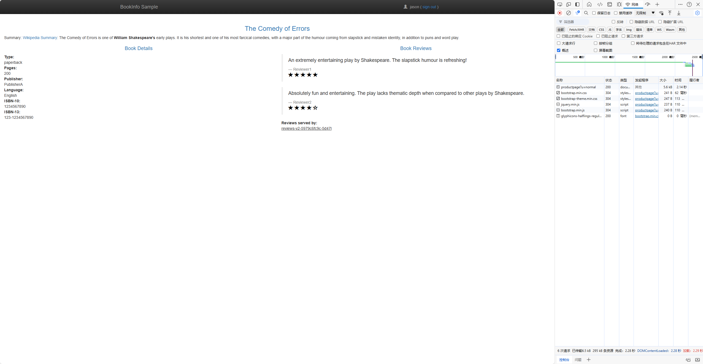
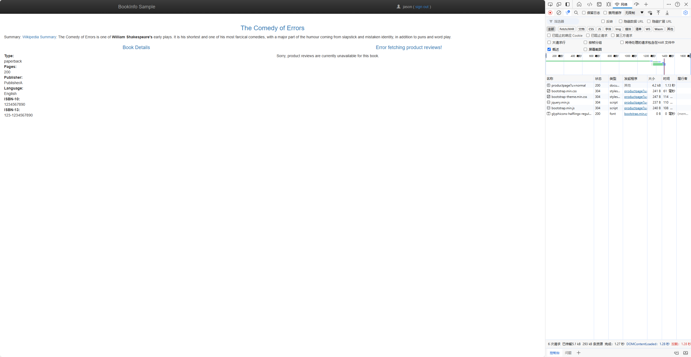

# 尝试请求超时

## 准备工作

1. **使默认命名空间由 Kmesh 管理**

2. **部署 Bookinfo 作为示例应用程序**

3. **为 reviews 服务安装服务粒度的 waypoint**

   _以上步骤可以参考 [安装 Waypoint | Kmesh](/i18n/zh/docusaurus-plugin-content-docs/current/application-layer/install_waypoint.md#准备工作)_

4. **为 ratings 服务安装 waypoint**

   ```bash
   istioctl x waypoint apply -n default --name ratings-svc-waypoint
   kubectl label service ratings istio.io/use-waypoint=ratings-svc-waypoint
   kubectl annotate gateway ratings-svc-waypoint sidecar.istio.io/proxyImage=ghcr.io/kmesh-net/waypoint:latest
   ```

## 请求超时

HTTP 请求的超时时间可以通过路由规则中的 `timeout` 字段指定。默认情况下，请求超时是禁用的，但在这个任务中，您将 `reviews` 服务的超时时间设置为半秒。为了观察其效果，您还需要在调用 `ratings` 服务时人为引入 2 秒的延迟。

1. **将请求路由到 reviews 服务的 v2 版本，即调用 ratings 服务的版本：**

   ```bash
   kubectl apply -f - <<EOF
   apiVersion: networking.istio.io/v1alpha3
   kind: VirtualService
   metadata:
     name: reviews
   spec:
     hosts:
       - reviews
     http:
     - route:
       - destination:
           host: reviews
           subset: v2
   EOF
   ```

2. **为调用 ratings 服务的请求添加 2 秒的延迟：**

   ```bash
   kubectl apply -f - <<EOF
   apiVersion: networking.istio.io/v1alpha3
   kind: VirtualService
   metadata:
     name: ratings
   spec:
     hosts:
     - ratings
     http:
     - fault:
         delay:
           percentage:
             value: 100
           fixedDelay: 2s
       route:
       - destination:
           host: ratings
           subset: v1
   EOF
   ```

3. **在浏览器中打开 Bookinfo 的 URL**  
   输入 `http://$GATEWAY_URL/productpage`，其中 `$GATEWAY_URL` 是 ingress 的外部 IP 地址（详见 Bookinfo 文档）。  
   您应该看到 Bookinfo 应用程序正常运行（显示评级星级），但每次刷新页面时会有 2 秒的延迟。  
   

4. **为 reviews 服务的调用添加半秒的请求超时：**

   ```bash
   kubectl apply -f - <<EOF
   apiVersion: networking.istio.io/v1alpha3
   kind: VirtualService
   metadata:
     name: reviews
   spec:
     hosts:
     - reviews
     http:
     - route:
       - destination:
           host: reviews
           subset: v2
       timeout: 0.5s
   EOF
   ```

5. **刷新 Bookinfo 网页**  
   您应该看到页面在大约 1 秒内返回（而不是 2 秒），并且评论不可用。  
   

## 理解发生了什么

在这个任务中，您使用 Kmesh 将 `reviews` 微服务的请求超时设置为半秒。默认情况下，请求超时是禁用的。由于 `reviews` 服务在处理请求时会调用 `ratings` 服务，您通过 Kmesh 在调用 `ratings` 时注入 2 秒的延迟，使 `reviews` 服务的完成时间超过半秒，从而触发超时效果。

您会观察到 Bookinfo 的产品页面（通过调用 `reviews` 服务来填充页面内容）显示消息：“抱歉，此书的评论当前不可用”，而不是显示评论。这是由于 `reviews` 服务返回了超时错误。

如果您查看 [故障注入任务](/i18n/zh/docusaurus-plugin-content-docs/current/application-layer/try-fault-injection.md)，会发现 `productpage` 微服务对 `reviews` 微服务的调用也有自己的应用级超时（3 秒）。请注意，在此任务中，您使用 Kmesh 路由规则将超时设置为半秒。如果您将超时设置为大于 3 秒（例如 4 秒），超时将不起作用，因为两者中更严格的超时（即 3 秒）会优先生效。

## 清理

1. **删除应用程序路由规则：**

   ```bash
   kubectl delete virtualservice reviews
   kubectl delete virtualservice ratings
   ```

2. **如果您不打算继续探索后续任务**  
   请参考 [安装 Waypoint/清理](/i18n/zh/docusaurus-plugin-content-docs/current/application-layer/install_waypoint.md#清理) 说明关闭应用程序。

## 演示

<div className="video-responsive">
  <iframe
    src="https://www.youtube.com/embed/aM53DZJxGag"
    frameborder="0"
    allowfullscreen
  ></iframe>
</div>
