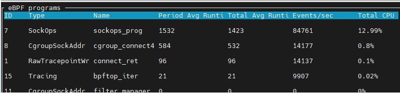
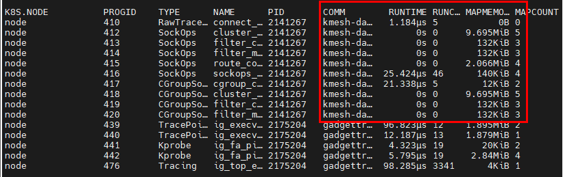

# Kmesh 资源消耗

## 背景信息

eBPF 程序在执行过程中会消耗 CPU 和内存资源。为了更好地了解 Kmesh 在不同负载下的资源消耗情况，我们进行了一系列 CPU 和内存压力测试。这些测试旨在评估 Kmesh 在实际使用场景中的资源消耗极限。

**注意：本文档基于 Kmesh 0.4 内核原生模式**

## 环境设置


| 组件          | 版本/详情                                                                                                       |
| ------------- | --------------------------------------------------------------------------------------------------------------------- |
| K8S           | v1.27                                                                                                                 |
| Kmesh         | 0.4 内核原生模式                                                                                                |
| 内核          | 5.10                                                                                                                  |
| 节点          | 8U16G                                                                                                                 |
| 测试工具      | fortio                                                                                                                |
| 指标收集      | [bpftop](https://github.com/Netflix/bpftop), [inspektor-gadget](https://github.com/inspektor-gadget/inspektor-gadget) |

## 测试用例 1：带 CPU 限制的 POD

### 场景 1.1：单个带 CPU 限制的应用程序


我们为应用程序 A（App A）设置了 1 个 CPU 的限制，并收集了 Kmesh eBPF 的 CPU 消耗数据。

:::note
系统共有 8 个核心，CPU 限制为 1，POD 最多可消耗总 CPU 的 12.5%。
:::

**测试步骤：**

1. 使用 fortio 客户端生成负载：

   ```bash
   # !/bin/bash

   client_address=`kubectl get pod | grep fortio-client | awk {'print $1'}`
   echo "$client_address" | xargs -P 0 -I {} kubectl exec -it {} -- fortio load -quiet -c 1500 -t 100s -qps 0 -keepalive=false fortio-server.default.svc.cluster.local:80
   ```

2. 使用 bpftop 收集 CPU 使用率：

   ```bash
   ./bpftop
   ```

**测试结果：**



图中显示的 12.99% 表示消耗了一个 CPU 核心的 12.99%。

**结论：**
当 App A 完全利用一个 CPU 核心时，eBPF 程序消耗了总 CPU 的 1.73%（即一个 CPU 核心的 13.9%，相当于 8 个核心的 1.73%），低于 POD 的 CPU 限制 12.5%。这表明 Kmesh eBPF 的 CPU 消耗受限于 POD 的 CPU 限制，或者其本身资源需求较小。

### 场景 1.2：多个带 CPU 限制的应用程序


我们部署了 4 个 App A 实例，每个实例的 CPU 限制为 250m，4 个实例总计 1 个 CPU。

**测试结果：**


图中显示的 13.42% 表示消耗了一个 CPU 核心的 13.42%。

**结论：**
当 App A 完全利用 1 个 CPU 时，eBPF 程序消耗了总 CPU 的 1.81%，仍低于 POD CPU 限制的 12.5%。这进一步验证了 eBPF 的 CPU 消耗受 POD 限制约束。

### 场景 1.3：修改 eBPF 代码以增加 CPU 使用率

我们修改了 eBPF 代码，通过添加循环降低性能，以观察其是否会超过 POD 的 CPU 限制。

**实现：**
在 Kmesh eBPF 代码中添加了 for 循环：

```c
SEC("cgroup/connect4")
int cgroup_connect4_prog(struct bpf_sock_addr *ctx)
{
    struct kmesh_context kmesh_ctx = {0};
    kmesh_ctx.ctx = ctx;
    kmesh_ctx.orig_dst_addr.ip4 = ctx->user_ip4;
    kmesh_ctx.dnat_ip.ip4 = ctx->user_ip4;
    kmesh_ctx.dnat_port = ctx->user_port;

    if (handle_kmesh_manage_process(&kmesh_ctx) || !is_kmesh_enabled(ctx)) {
        return CGROUP_SOCK_OK;
    }

    // 添加 for 循环以增加 CPU 使用率
    int i;
    for (i = 0; i < 65535; i++) {
        bpf_printk("increase cpu usage");
    }

    int ret = sock4_traffic_control(ctx);
    return CGROUP_SOCK_OK;
}
```

**测试结果：**


当 App A 完全利用 1 个 CPU 时，eBPF 程序消耗了总 CPU 的 12.1%，仍低于 POD CPU 限制的 12.5%。多轮测试显示，eBPF 的 CPU 消耗始终未超过限制。

**结论：**
Kmesh eBPF 与应用程序共享 POD 的 CPU 限制，其 CPU 消耗受限于 POD 的设定。

## 测试用例 2：无 POD CPU 限制的场景

### 场景 2.1：测试 eBPF CPU 消耗（无限制）


我们创建了 8 个 App A 实例，无 CPU 限制。逐渐增加负载生成进程数量，直到节点 CPU 使用率达到 100%，然后记录 Kmesh eBPF 的 CPU 使用率。

**测试结果（8 核 CPU 共 8000m）：**

| 线程数 | App A CPU 使用率 | eBPF CPU 使用率 |
| ------- | --------------- | -------------- |
| 100     | 12.3%           | 1%             |
| 500     | 35%             | 4.1%           |
| 1000    | 61.7%           | 8.8%           |
| 3000    | 67%             | 9.5%           |

在 3000 个并发进程时，节点 CPU 使用率达到 100%。此时，App A 消耗 67% 的 CPU，Kmesh eBPF 消耗约 9.5%。

**结论：**

- App A 的 CPU 消耗远高于 eBPF，难以使 eBPF 过载。在 fortio 测试场景中，Kmesh eBPF 最多消耗 9.5% 的 CPU。
- eBPF 的最大 CPU 消耗需进一步测试。

### 场景 2.2：eBPF CPU 压力测试

根据 [eBPF 官方文档](https://ebpf-docs.dylanreimerink.nl/linux/concepts/verifier/)，eBPF 程序具有安全机制，可检测无限循环并限制 for 循环迭代次数。在内核版本 5.10 中，for 循环最多支持 65,535 次迭代。

我们在代码中添加了 65,535 次迭代进行测试：

```c
SEC("cgroup/connect4")
int cgroup_connect4_prog(struct bpf_sock_addr *ctx)
{
    struct kmesh_context kmesh_ctx = {0};
    kmesh_ctx.ctx = ctx;
    kmesh_ctx.orig_dst_addr.ip4 = ctx->user_ip4;
    kmesh_ctx.dnat_ip.ip4 = ctx->user_ip4;
    kmesh_ctx.dnat_port = ctx->user_port;

    if (handle_kmesh_manage_process(&kmesh_ctx) || !is_kmesh_enabled(ctx)) {
        return CGROUP_SOCK_OK;
    }

    // 添加 for 循环以增加 CPU 使用率
    int i;
    for (i=0;i<65535;i++) {
        bpf_printk("increase cpu usage");
    }

    int ret = sock4_traffic_control(ctx);
    return CGROUP_SOCK_OK;
}
```

**测试结果：**


当节点 CPU 使用率达到 100% 时，Kmesh eBPF 消耗了约 99.3% 的 CPU。此测试运行 10 分钟，期间内核和集群服务保持稳定。

**结论：**
在最大迭代次数下，eBPF 可消耗几乎全部 CPU 资源，但内核安全机制确保系统稳定运行。

## Kmesh eBPF 内存限制测试

根据 [官方文档](https://ebpf-docs.dylanreimerink.nl/linux/concepts/resource-limit/)，eBPF 的内存消耗有上限，由 cGroup 的 `memory.max` 设置控制。但 Kmesh 当前实现中，内存于启动时分配，运行时不增加。

### 测试 1：不同服务数量下的内存使用

我们在集群中创建了 1、100 和 1000 个服务，使用 [inspektor-gadget](https://github.com/inspektor-gadget/inspektor-gadget) 记录 eBPF 内存消耗。

**监控命令：**

```bash
kubectl gadget top ebpf
```



**测试结果：**

| 服务数量 | eBPF 内存使用 |
| -------- | ------------ |
| 1        | 23 MB        |
| 100      | 23 MB        |
| 1000     | 23 MB        |

**结论：**
Kmesh eBPF 的内存消耗始终为 23 MB，与服务数量无关。

### 测试 2：负载下的内存使用

我们在集群中创建了一个服务（App A），生成负载并观察 eBPF 内存消耗。

**测试结果：**
Kmesh eBPF 内存消耗保持在 23 MB，不随负载变化。

**总结：**
Kmesh 在 CPU 和内存消耗方面表现稳定。CPU 消耗受 POD 限制约束，无限制时可达高负载但系统仍稳定；内存消耗固定为 23 MB，不受服务数量或负载影响。
