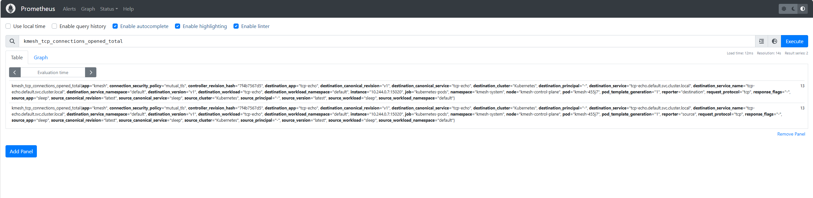

## 准备工作

### 1. 安装 Kmesh

请参阅[快速入门指南](/i18n/zh/docusaurus-plugin-content-docs/current/setup/quick-start.md)。

> **注意：** 以下内容应添加到 Kmesh 注解中：
>
> ```yaml
> annotations:
>   prometheus.io/path: "status/metric"
>   prometheus.io/port: "15020"
>   prometheus.io/scrape: "true"
> ```

### 2. 配置 Kmesh 管理 `default` 命名空间

```bash
kubectl label namespace default istio.io/dataplane-mode=Kmesh
```

**预期输出：**

```text
namespace/default labeled
```

### 3. 安装 Prometheus 插件

Istio 提供了一个基本的示例安装，以快速启动 Prometheus：

```bash
kubectl apply -f https://raw.githubusercontent.com/kmesh-net/kmesh/main/samples/addons/prometheus.yaml
```

### 4. 部署 `tcp-echo` 和 `sleep` 应用程序

```bash
# 部署 tcp-echo 应用程序
kubectl apply -f https://raw.githubusercontent.com/kmesh-net/kmesh/main/samples/tcp-echo/tcp-echo.yaml

# 部署 sleep 应用程序
kubectl apply -f https://raw.githubusercontent.com/kmesh-net/kmesh/main/samples/sleep/sleep.yaml

# 验证部署
kubectl get po -A
```

**预期输出：**

```bash
NAMESPACE            NAME                                          READY   STATUS    RESTARTS   AGE
default              sleep-bc9998558-pbfvk                         1/1     Running   0          7m
default              tcp-echo-7f676db574-mzmql                     1/1     Running   0          7m
```

> **重要：** 确认 `sleep` 和 `tcp-echo` 确实[由 Kmesh 管理](/i18n/zh/docusaurus-plugin-content-docs/current/setup/quick-start.md#部署示例应用)。

## 从 Prometheus 查询指标

### 可用指标

Kmesh L4 阶段监控的指标：

#### 工作负载指标

| 名称                                          | 描述                                    |
| --------------------------------------------- | --------------------------------------- |
| `kmesh_tcp_workload_connections_opened_total` | 打开到工作负载的 TCP 连接总数           |
| `kmesh_tcp_workload_connections_closed_total` | 关闭到工作负载的 TCP 连接总数           |
| `kmesh_tcp_workload_received_bytes_total`     | 通过 TCP 连接响应工作负载接收的总字节数 |
| `kmesh_tcp_workload_sent_bytes_total`         | 通过 TCP 连接响应工作负载发送的总字节数 |
| `kmesh_tcp_workload_connections_failed_total` | 失败的到工作负载的 TCP 连接总数         |

#### 服务指标

| 名称                                 | 描述                                |
| ------------------------------------ | ----------------------------------- |
| `kmesh_tcp_connections_opened_total` | 打开到服务的 TCP 连接总数           |
| `kmesh_tcp_connections_closed_total` | 关闭到服务的 TCP 连接总数           |
| `kmesh_tcp_received_bytes_total`     | 通过 TCP 连接响应服务接收的总字节数 |
| `kmesh_tcp_sent_bytes_total`         | 通过 TCP 连接响应服务发送的总字节数 |
| `kmesh_tcp_connections_failed_total` | 失败的到服务的 TCP 连接总数         |

### 查询步骤

以下是如何通过 Prometheus 查看这些指标：

#### 1. 验证 Prometheus 服务在集群中运行

在 Kubernetes 环境中，执行以下命令：

```bash
kubectl -n kmesh-system get svc prometheus
```

**预期输出：**

```bash
NAME         TYPE        CLUSTER-IP     EXTERNAL-IP   PORT(S)    AGE
prometheus   ClusterIP   10.96.18.252   <none>        9090/TCP   24h
```

#### 2. 在网格中的应用程序之间建立 TCP 连接

使用 `nc` 命令在 `sleep` 和 `tcp-echo` 之间创建 TCP 链接：

```bash
kubectl exec "$(kubectl get pod -l app=sleep -o jsonpath={.items..metadata.name})" \
  -c sleep -- sh -c 'echo "port 9000" | nc tcp-echo 9000' | grep "hello" && \
  echo 'connection succeeded' || echo 'connection rejected'
```

**预期输出：**

```text
hello port 9000
connection succeeded
```

#### 3. 打开 Prometheus UI

使用 port-forward 命令将流量转发到 Prometheus：

```bash
kubectl port-forward --address 0.0.0.0 svc/prometheus 9090:9090 -n kmesh-system
```

**预期输出：**

```text
Forwarding from 0.0.0.0:9090 -> 9090
Handling connection for 9090
Handling connection for 9090
```

#### 4. 执行 Prometheus 查询

在网页顶部的 "Expression" 输入框中，输入文本：

```text
kmesh_tcp_connections_opened_total
```

结果将类似于：



您还可以通过选择 "Execute" 按钮下方的 "Graph" 选项卡以图形方式查看查询结果。


## 清理

1. 禁用 port-forward。

2. 清理 Prometheus：

```bash
kubectl delete -f https://raw.githubusercontent.com/kmesh-net/kmesh/main/samples/addons/prometheus.yaml
```

如果您不打算探索任何后续任务，请参阅[快速入门清理](/i18n/zh/docusaurus-plugin-content-docs/current/setup/quick-start.md#清理)说明以关闭应用程序。
